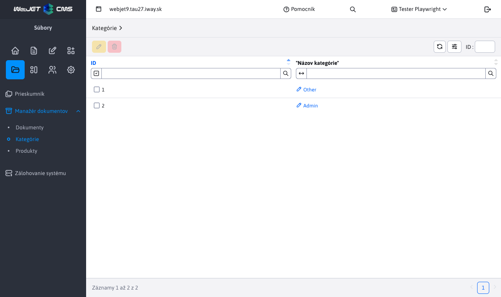

# Categories

The category section is used to manage **already existing** categories that have been defined in [Document managers](./README.md). Only 2 actions are allowed, namely **edit** a **lubrication**. To work with this section, you need the Document Manager-Categories right (`menuFileArchivManagerCategory`).

## Category modification

When editing a category, we are effectively renaming an existing category. This means that all documents with this category will have their value reset to the new one specified.

This is used when we want to globally change the name of an existing category in the entire document manager, without having to edit individual records.

## Deleting a category

By deleting the selected category(s), the action actually occurs **adjustments** when all records in the document manager are deleted from the set category. This category will also disappear from the table, as it will no longer be used anywhere.
