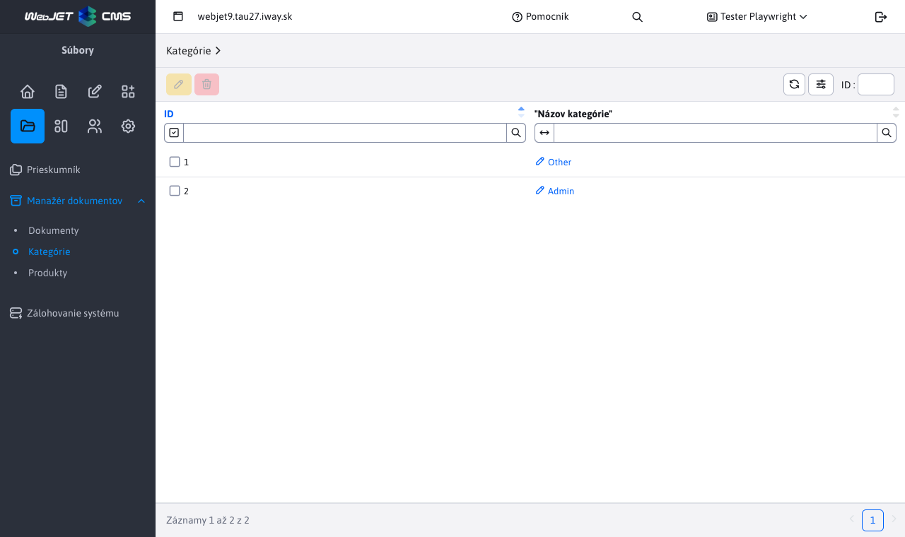

# Categories

The categories section is used to manage **existing** categories that have been defined in [Document Manager](./README.md). Only 2 actions are allowed, namely **edit** and **delete**. To work with this section, you need the Document Manager-Categories (`menuFileArchivManagerCategory`) right.

## Category editing

When editing a category, we are essentially renaming an existing category. This means that all documents with this category will have their value set to the new value.

It is used if we want to change the name of an existing category globally in the entire document manager, without having to edit individual records.

## Deleting a category

By deleting the selected category(ies), an **edit** action occurs, which deletes the given category from all records in the document manager. This category will also disappear from the table, as it will no longer be used anywhere.