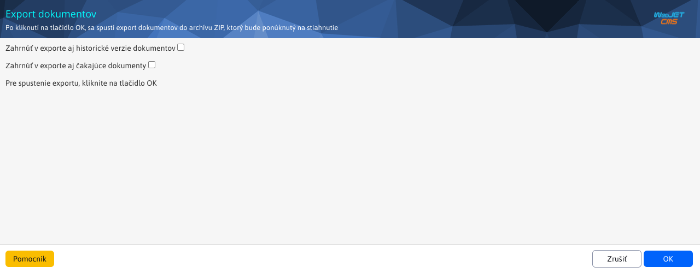
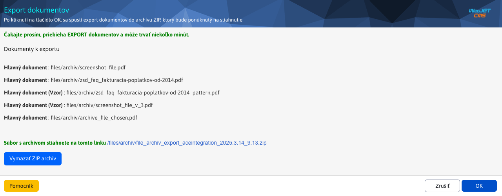
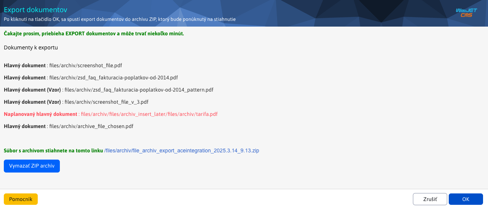
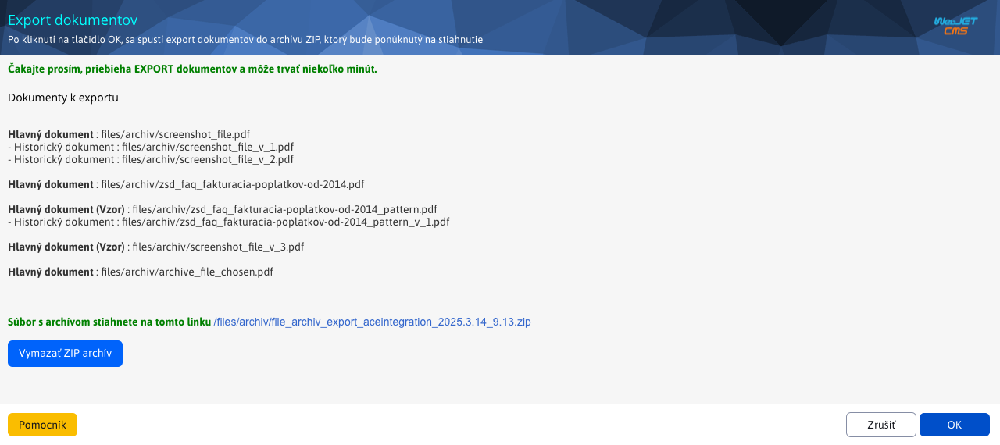
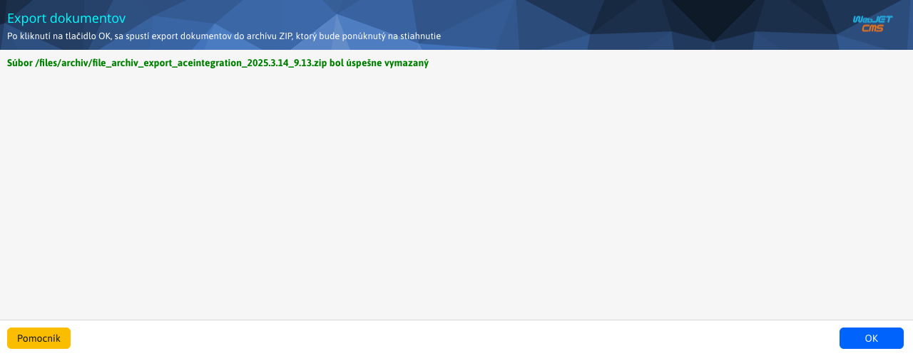

# Export of documents

Modified export is used to export documents from [Document Manager](./README.md) to `ZIP` file. Preset, exported **only** key documents, including templates. To work with the export, you need the right Document Manager-Export documents (`menuFileArchivExportFiles`).

## Exporting master documents/patterns

To export the main files (including patterns) you just need to press the button named `OK`. This starts a preconfigured export, which can take several minutes for large amounts of data. The window will list the individual exported **main** documents, including even main documents of the type **Sample**.

!>**Warning:** historical and pending versions of the documents are **do not export**

## Exporting master and pending documents/patterns

To export master documents/patterns **including those awaiting**, you must select the option **Include pending documents in the export** and then press the button named `OK`. This starts the export, which can take several minutes for large amounts of data. The window will list each exported document/pattern. the pending documents/patterns are highlighted in red for a better overview.

## Exporting master and historical documents/samples

To export master documents/patterns **including historical** versions, you must select the option **Include historical versions of documents in the export** and then press the button named `OK`. This starts the export, which can take several minutes for large amounts of data. The window will list the individual exported documents/samples so that the historical versions are visually associated with the main document.

## Exporting all documents/samples

To export all documents, you must select both options **Include pending documents in the export** a **Include historical versions of documents in the export**. Then press the button named `OK`. This starts the export, which can take several minutes for large amounts of data.

## Download the file

You can download the file by clicking on the attached link, which may look like `/files/archiv/file_archiv_export_aceintegration_2025.2.27_14.39.zip`.

## Deleting a file

As far as the formed `ZIP` the download file is created in the main location where the archive files start, you have the option to delete this created file by clicking on the button named **Delete ZIP archive**. After successful deletion, a message will appear.

