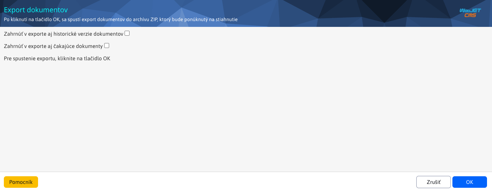
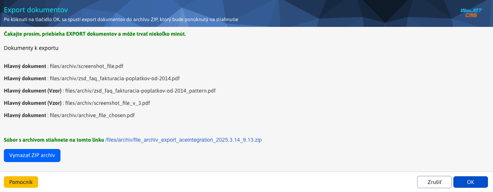
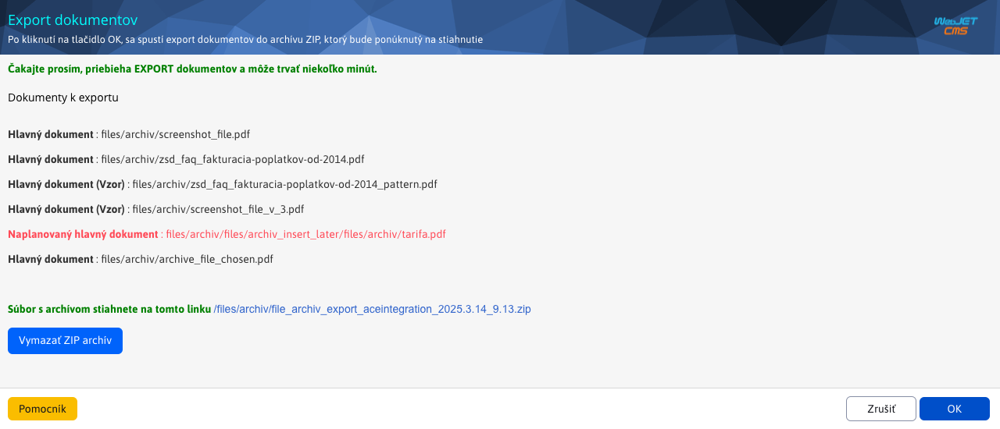
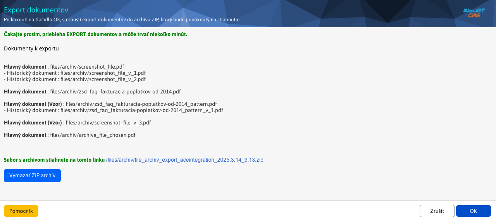
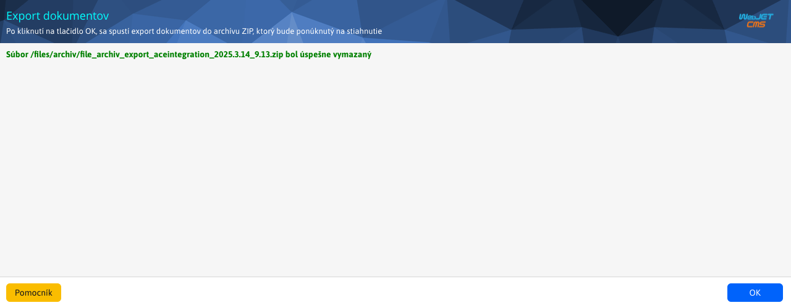

# Export documents

The modified export is used to export documents from [Document Manager](./README.md) to a `ZIP` file. By default, **only** main documents, including templates, are exported. To work with the export, you need the Document Manager-Export documents (`menuFileArchivExportFiles`) right.

## Exporting master documents/templates

To export the main files (including templates), simply press the button labeled `OK`. This will start the preset export, which may take several minutes for large amounts of data. The window will list the individual exported **main** documents, including **Template** main documents.

!>**Warning:** Historical and pending versions of documents are **not exported**

## Exporting master and pending documents/templates

To export main documents/templates **including pending ones**, you must select the **Include pending documents in the export** option and then press the button named `OK`. This will start the export, which may take several minutes with a large amount of data. A list of individual exported documents/templates will be displayed in the window. Pending documents/templates are highlighted in red for better overview.

## Exporting master and historical documents/templates

To export master documents/templates **including historical** versions, you must select the **Include historical versions of documents in the export** option and then press the button named `OK`. This will start the export, which may take several minutes with a large amount of data. The window will list the individual exported documents/templates so that the historical versions of the master document are visually associated with it.

## Exporting all documents/templates

To export all documents, you must select both **Include pending documents in export** and **Include historical versions of documents in export**. Then press the button labeled `OK`. This will start the export, which may take several minutes for large amounts of data.

## Download file

You can download the file by clicking on the attached link, which may look like `/files/archiv/file_archiv_export_aceintegration_2025.2.27_14.39.zip`.

## Deleting a file

Since the created `ZIP` download file is created in the main location where the archive files begin, you have the option to delete this created file by clicking on the button called **Delete ZIP archive**. After successful deletion, a message will be displayed.

