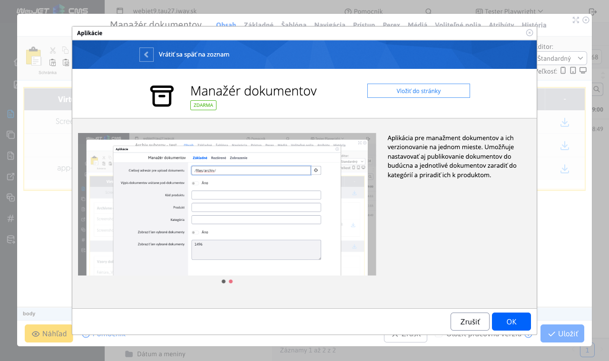
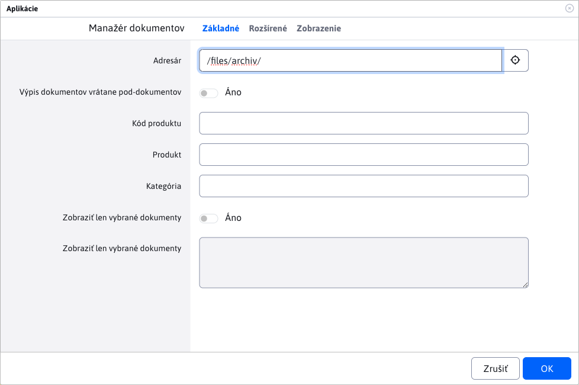
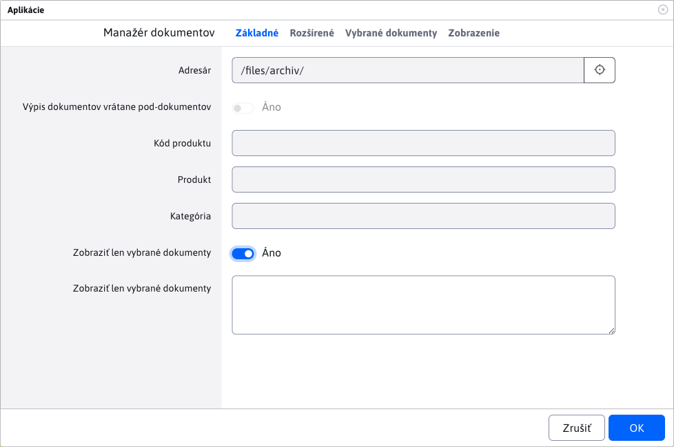
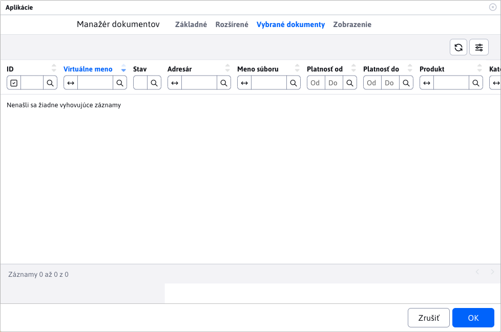
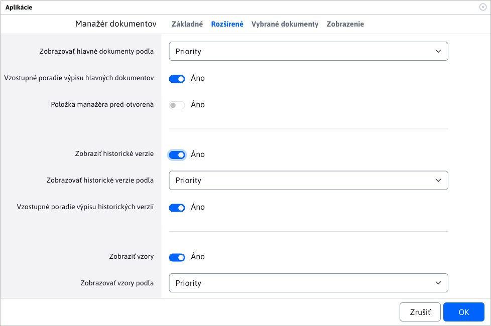
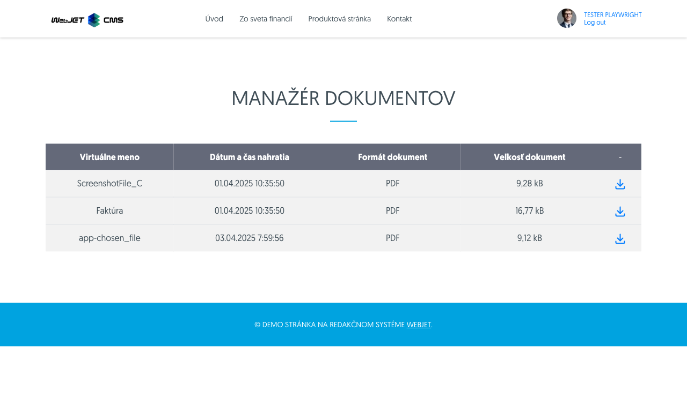
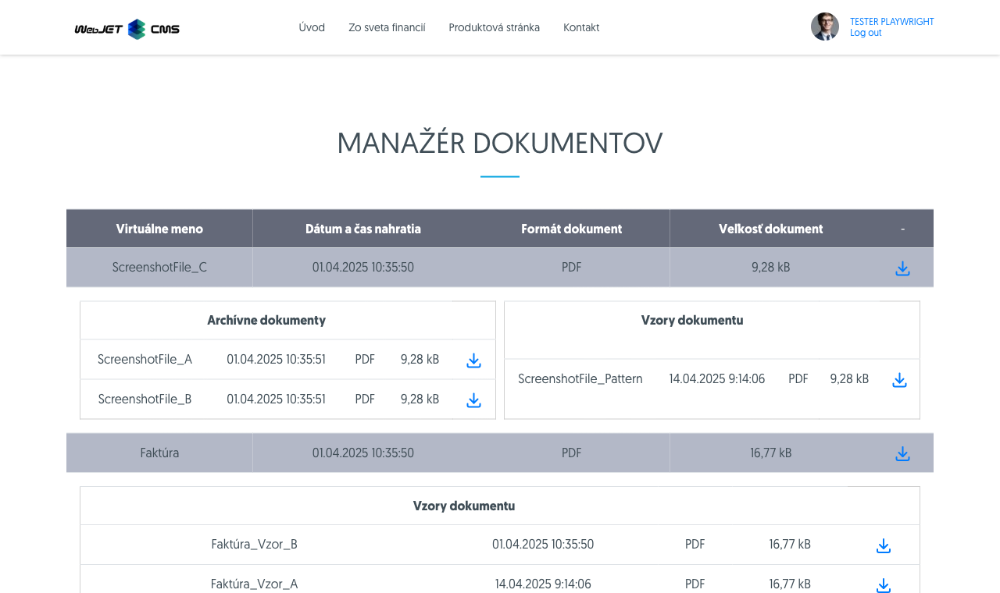
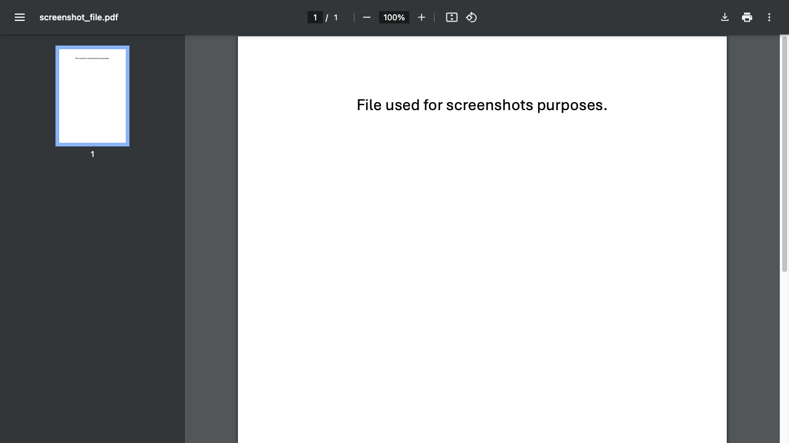

# Document Manager application

The application is used to clearly display selected (filtered) documents from [Document Manager](./README.md).

## Using the app

You can add the app to your site via the app store



or directly as code to the page

```html
!INCLUDE(sk.iway.iwcm.components.file_archiv.FileArchiveApp, dir=&quot;/files/archiv/&quot;, subDirsInclude=true, productCode=, product=, category=, showOnlySelected=false, globalIds=, orderMain=priority, ascMain=true, open=false, archiv=true, order=priority, asc=true, showPatterns=true, orderPatterns=priority, ascPatterns=true)!
```

in the code you can notice a number of parameters, which we will explain in the next section.

## Application settings

You can use the settings to filter the display of only certain documents as well as the style of how they should be displayed.

### Tab - Basic

Card **Basic** is used to set the filtering of documents for display.

!>**Warning:** documents that are still waiting to be uploaded are **do not display**.

- **Directory** - you can set to display documents only from a specific folder. The default value is the root folder for uploading documents. You can change this value, but you cannot go higher than the root folder.
- **Extract of documents including sub-documents** - document display is preset **IBA** from the selected (without subfolders). If you select this option, the **All** documents from the selected folder but **AJ** sub-causes.

!>**Warning:** by selecting the option **Extract of documents including sub-documents** on a folder that is high up in the tree structure, you run the risk of working with large amounts of data. Therefore, this option is recommended for smaller amounts or with narrower filtering.
- **Product code** - show only documents with given product code.
- **Product** - The automatic field offers defined products in the manager by which you can filter.
- **Category** - The automatic field offers defined categories in the manager by which you can filter.



**Show only selected documents** - this is a special option where all existing filters will be ignored as **Directory** / **Product code** etc., and only documents that have the specified `globalId` in the field **Show only selected documents**

All previous filters retain their values but have no effect and are locked. In addition, a new tab will be displayed **Selected documents**.



### Tab - Selected documents

The tab will only appear if the option **Show only selected documents**. There is a nested table in the tab that displays the defined documents from the field **Show only selected documents** via `globalId` values. This gives you a preview of the documents you have selected to view.



### Tab - Advanced

The tab is used to set the display style and sorting of documents.

- **View main documents by** - selecting the value by which the main documents are to be sorted
- **Ascending order of listing of main documents** - if selected, the main documents will be sorted in ascending order, otherwise vice versa
- **Manager item pre-opened** - if you select the option, the managed items are automatically opened when displayed

***

- **View historical versions** - selecting the option will enable the display of historical versions of documents (if any). It will also reveal options for sorting these historical versions
- **Show historical versions by** - selection of the value by which to sort the historical versions
- **Ascending order of listing of historical versions** - if selected, historical versions will be sorted in ascending order, otherwise vice versa

***

- **View patterns** - selecting the option will enable the display of the document templates (if any). Only the main patterns are displayed, not their historical versions. It also reveals options for sorting these patterns
- **Display patterns by** - selection of the value by which the patterns are to be sorted
- **Ascending order of listing patterns** - if the option is selected, the sample documents will be sorted in ascending order, otherwise vice versa



## Application

The application itself displays the entered or filtered main documents in the page.



If you have not selected the option **Manager item pre-opened**, the item is closed and only after clicking on it the available **Historical documents** a **Document templates**.



Of course, these tables will only be displayed if:
- option is enabled **View historical versions** Alternatively **View patterns**
- the master document in question has any historical documents or patterns

The main document can have both tables at the same time, or neither, depending on whether they are enabled or have any values.

**View patterns** shows only the main patterns, as patterns can also have historical versions.

Icon <i class="ti ti-download" style="color: #00a3e0;" ></i> is available for master documents, historical documents as well as patterns. Clicking on it will display the document in a new window where it can be viewed or downloaded.


