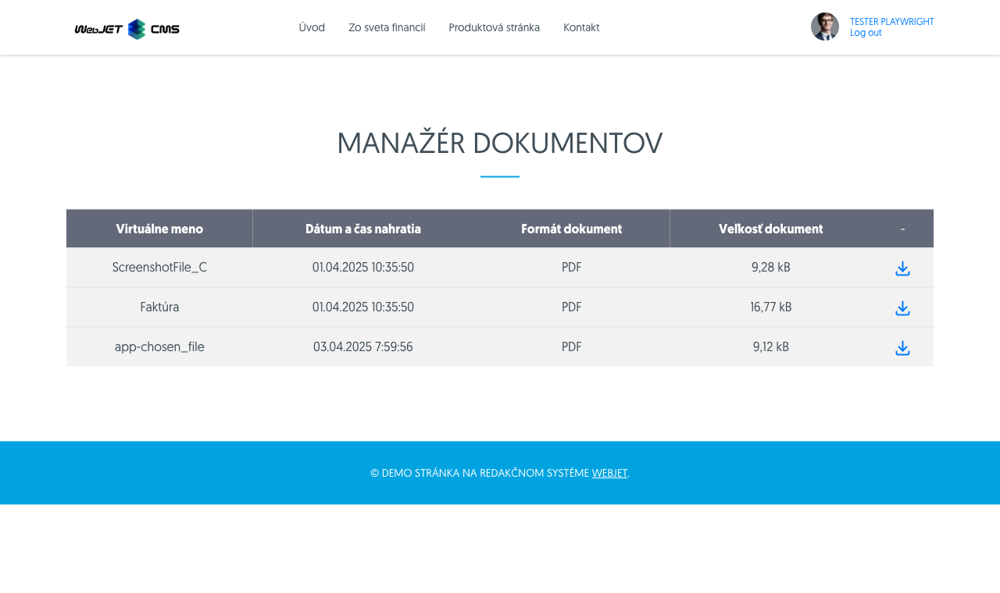
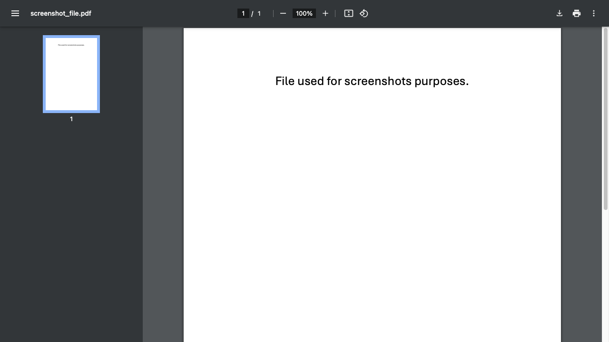

# Document Manager application

The application serves to clearly display selected (filtered) documents from the [Document Manager](./README.md).

## Using the app

You can add an app to your site through the app store


or directly as code into the page

```html
!INCLUDE(sk.iway.iwcm.components.file_archiv.FileArchiveApp, dir=&quot;/files/archiv/&quot;, subDirsInclude=true, productCode=, product=, category=, showOnlySelected=false, globalIds=, orderMain=priority, ascMain=true, open=false, archiv=true, order=priority, asc=true, showPatterns=true, orderPatterns=priority, ascPatterns=true)!
```

You may notice a number of parameters in the code, which we will explain in the next section.

## Application settings

Using the settings, you can filter the display of only certain documents as well as the style in which they should be displayed.

### Tab - Basic

The **Basic** tab is used to set document filtering for display.

!>**Note:** documents that are still waiting to be uploaded are **not displayed** in the application.

- **Directory** - you can set to display documents only from a specific folder. The default value is the root folder for uploading documents. You can change this value, but you cannot go higher than the root folder.
- **List documents including sub-documents** - the default is to display documents **ONLY** from the selected one (without sub-folders). If you select this option, **all** documents from the selected folder but **INCLUDING** sub-folders will be displayed.

!>**Warning:** Selecting the **List documents including sub-documents** option on a folder that is high in the tree structure exposes you to the risk of working with a large amount of data. Therefore, this option is recommended for smaller amounts or with narrower filtering.

- **Product code** - display only documents with the given product code.
- **Product** - the field automatically offers defined products in the manager, which you can filter by.
- **Category** - the field automatically offers defined categories in the manager that you can filter by.


**Show only selected documents** - this is a special option that will ignore all previous filters such as **Address book** / **Product code** etc., and only documents that have `globalId` entered in the **Show only selected documents** field will be displayed.

All previous filters will retain their values, but they have no effect and are blocked. In addition, a new [Selected Documents] tab will appear, where you can manage which files are selected for display (ideal if you don't know the necessary `globalId`).


### Tab - Selected documents

The tab will only appear if the **Show only selected documents** option is selected. The tab contains a nested table showing **ONLY** documents that can be used as selected documents. These documents must meet the following criteria:

- it must be the main document (not a historical version)
- it must not be a sample document
- it cannot be a document scheduled for upload in the future

You can mark and select documents in the table using the button <button class="btn btn-sm btn-success" type="button"><span><i class="ti ti-plus"></i></span></button> which writes the values ​​of their `globalId` (i.e. Global Id) into the **Show only selected documents** field in the **Basic** tab. Conversely, the button<button class="btn btn-sm btn-danger" type="button"><span><i class="ti ti-x"></i></span></button> the given document will be removed from the selection. Thanks to this tab, you can easily choose which documents you want to display without having to know their `globalId`. The logic is of course protected against duplication, etc.

Selected documents (whose value `globalId` is entered in the **Show only selected documents** field) are color-coded in the table.


### Tab - Advanced

The tab is used to set the display style and sorting of documents.

- **Show main documents by** - select the value by which the main documents should be sorted
- **Ascending order of main document list** - if the option is selected, the main documents will be sorted in ascending order, otherwise vice versa
- **Manager item pre-open** - if you select this option, managed items will be automatically opened when displayed

---

- **Show historical versions** - selecting this option will enable the display of historical versions of documents (if any). It will also reveal options for sorting these historical versions
- **Show historical versions by** - select the value by which historical versions should be sorted
- **Ascending order of historical versions list** - if the option is selected, historical versions will be sorted in ascending order, otherwise vice versa

---

- **Show templates** - selecting this option will enable the display of templates for the given document (if any). Only the main templates are displayed, not their historical versions. It will also reveal options for sorting these templates
- **Show patterns by** - select the value by which the patterns should be sorted
- **Ascending order of sample listing** - if the option is selected, sample documents will be sorted in ascending order, otherwise vice versa


## Application

The application itself displays the entered or filtered main documents on the page.



If you did not select the **Manager item pre-open** option, the item will be closed and only after clicking on it will the available **Historical documents** and **Document templates** be displayed.


Of course, these tables will only be displayed if:

- **Show historical versions** or **Show patterns** option is enabled
- the given main document has some historical documents or patterns

The main document can have both tables at the same time, or neither, depending on whether they are enabled or have any values.

**Show patterns** only shows the main patterns, as patterns can also have historical versions.

Icon<i class="ti ti-download" style="color: #00a3e0;"></i> It is available for main documents, historical documents, and templates. Clicking on it will display the document in a new window where we can view or download it.

