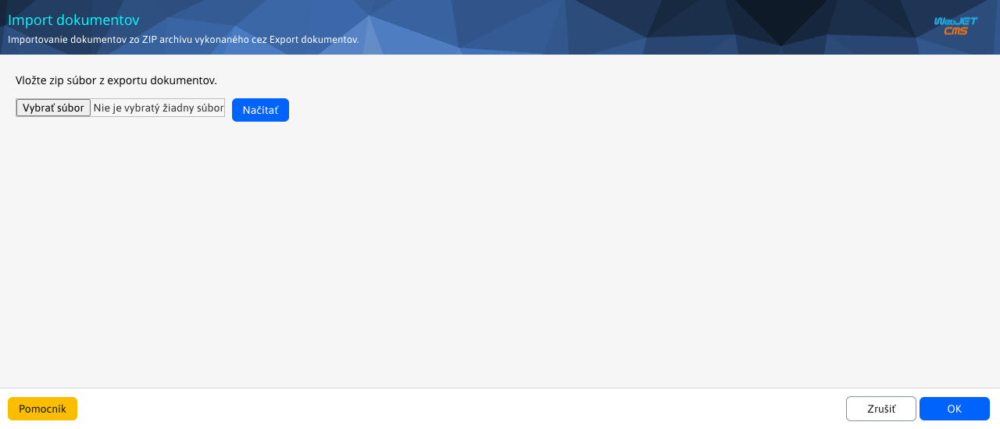
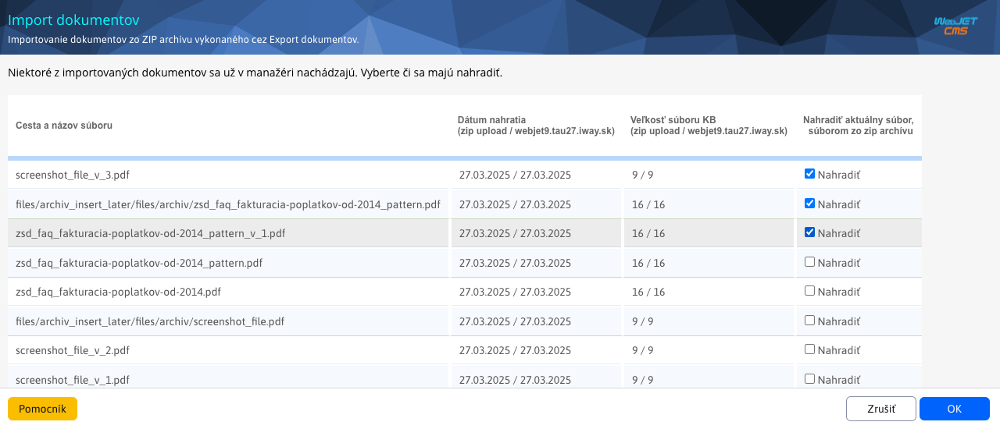

# Import of documents

Modified import is used to import documents/samples from `ZIP` file back to [Document Manager](./README.md). To work with the import, you need the Document Manager-Import Documents right (`menuFileArchivImportFiles`).

After removing `ZIP` file, start the process with the button **Retrieved from** (or by pressing `OK`). Since this process may take several minutes depending on the amount of data, a warning will be displayed.

The system will check if there are any documents/patterns among the imported documents/patterns that already exist. If so, it will display them. You then have the option to select the ones you want to replace. By default, all of them are selected, but you can select only a part or even none of them.

Continue by pressing the button `OK`, which then lists the documents/patterns that have been replaced (if you have selected any) and those that were not in the document manager at all and had to be imported.

