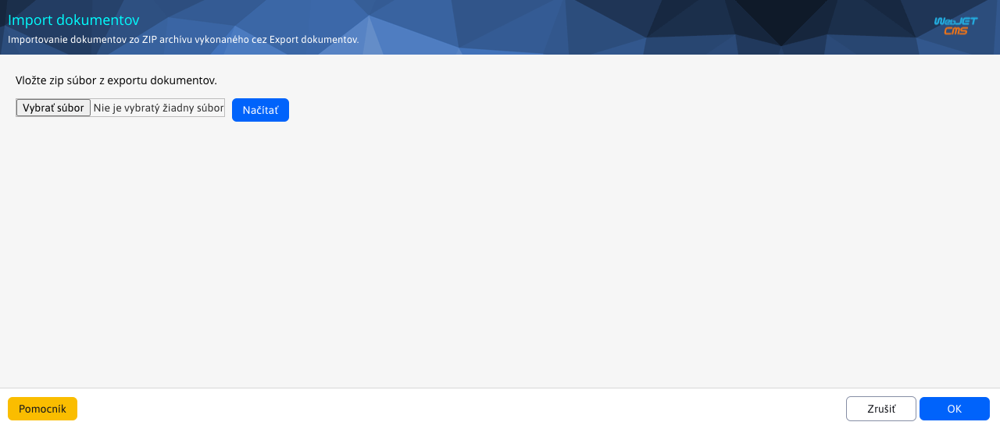
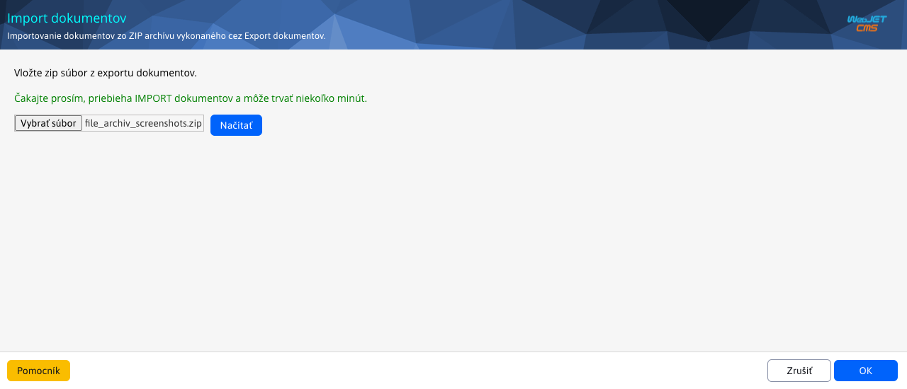
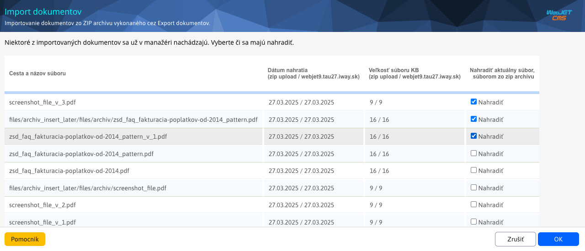
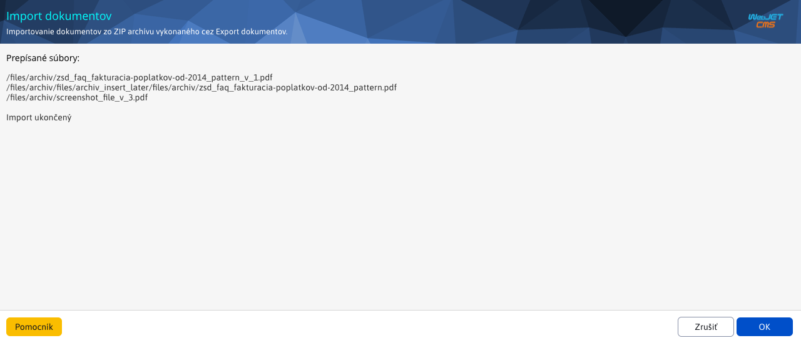

# Importing documents

The modified import is used to import documents/templates from the `ZIP` file back into the [Document Manager](./README.md). To work with the import, you need the Document Manager-Import documents (`menuFileArchivImportFiles`) right.

After selecting the `ZIP` file, start the process with the **Load** button (or the `OK` button). As this process may take several minutes depending on the amount of data, a warning will be displayed.

The system will check if there are any existing documents/templates among the imported documents/templates. If so, it will display them. You can then select the ones you want to replace. By default, all of them are selected, but you can select only some or none of them.

Continue by pressing the `OK` button, which will then list the documents/templates that were replaced (if you selected any) and those that were not in the document manager at all and had to be imported.

