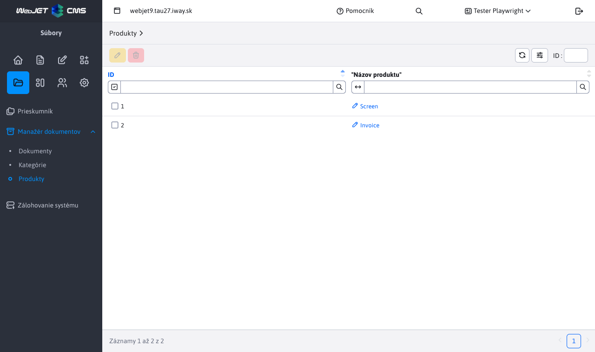

# Products

The products section is used to manage **existing** products that have been defined in [Document Manager](./README.md). Only 2 actions are allowed, namely **edit** and **delete**. To work with this section, you need the Document Manager-Categories right (`menuFileArchivManagerCategory`).

## Product modification

When editing a product, we are essentially renaming an existing product. This means that all documents with that product name will have their value reset to the new value.

It is used if we want to change the name of an existing product globally in the entire document manager, without having to edit individual records.

## Deleting a product

By deleting the selected product name(s), an **edit** action occurs, which deletes the given product value from all records in the document manager. This product will also disappear from the table, as it will no longer be used anywhere.