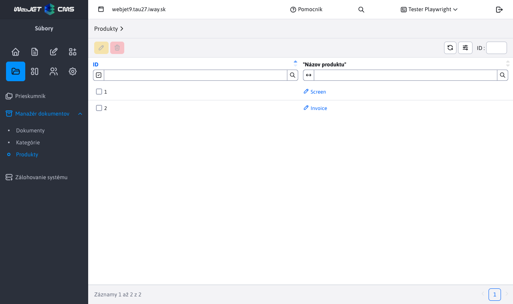

# Products

The products section is used to manage **already existing** products that have been defined in [Document managers](./README.md). Only 2 actions are allowed, namely **edit** a **lubrication**. To work with this section, you need the Document Manager-Categories right (`menuFileArchivManagerCategory`).

## Product modification

When modifying a product, we are practically renaming an existing product. This means that all documents with that product name are ground to the new value specified.

It is used if we want to globally change the name of an existing product in the entire document manager, without the need to edit individual records.

## Product deletion

By deleting the selected product name(s), the action actually occurs **adjustments** when all records in the document manager are cleared of the set product value. This product will also disappear from the table as it will not be used anywhere else.
