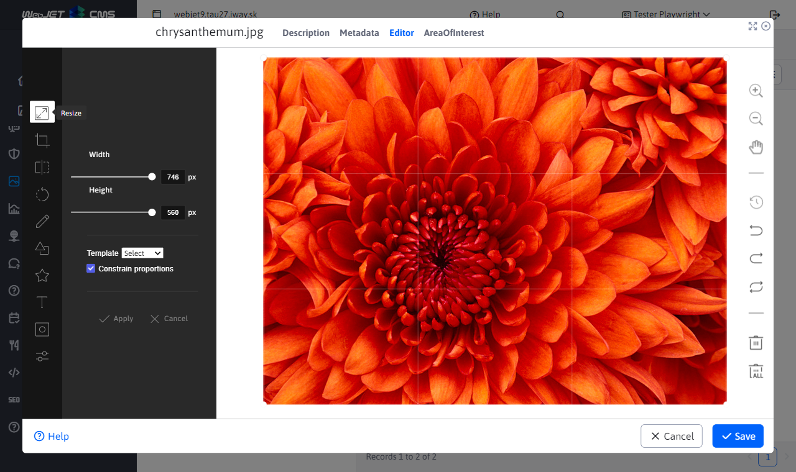
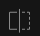
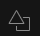
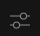

# Image Editor

The image editor allows you to make advanced edits to images on the server directly in the browser. It is used in the gallery, but can be invoked when editing a web page by clicking on the image and then clicking on the image edit icon, or from the explorer by right clicking on the image and selecting Edit.

The following tools are available:
- , **Resize**: you can adjust the image size. Please note that by default the image is displayed at a maximum size of 1000 pixels wide, so resizing may not be visible as the image may realistically be larger than the displayed size.
  - The size can be changed based on defined size templates (if you repeatedly need to set the exact size of the image). The list of options is set in the configuration variable `imageEditorSizeTemplates`, set by default to `80x80;640x480;800x600;`.
  - The bound dimensions option preserves the aspect ratio, if using a template the width is set and the height is calculated according to the aspect ratio of the current image.
- , **Crop**: Click this to crop the photo in the gallery.
  - The photo can be cropped into any rectangle, or you can choose from predefined aspect ratios: square, 3:2, 4:3, 5:4, 7:5, 16:9.
  - Aspect ratios can be defined in the configuration variable `imageEditorRatio`, set by default to `3:2, 4:3, 5:4, 7:5, 16:9`.
- , **Turn over**: This function allows you to flip the photo horizontally (Flip X) or vertically (Flip Y) to create a mirror image.
- , **Turn over**: In this function, you can use the slider to select a value in degrees from -360 to 360, or use the buttons to rotate the photo 30 degrees clockwise or counterclockwise.
- , **Draw** A: This function allows you to draw a free or straight line on the photo. You can choose the color and thickness of the line (range).
- , **Shape**: Use this feature to add different shapes to your photo, such as circles, rectangles, or triangles. You can change the stroke and fill color as you like, while specifying the thickness of the stroke. Created objects can be moved, scaled, zoomed, and rotated, including objects created using the Draw function.
- , **Icon**: The Icon function allows you to add various icons and stickers from a predefined library or your own uploaded icons to your photo. You can change the color as desired. Created objects can be moved, scaled, enlarged and rotated.
- , **Text**: Use this function to add text to a photo. You can format the text to bold, italic or underlined. Color and size can be selected.
- , **Mask**: The Mask function allows you to apply various masks to a photo, which can be used to hide or highlight parts of the photo.
- , **Filter**: Using this feature, you can apply various filters to your photo to modify its appearance. Filters to choose from include: black and white filter, sepia, blur, emboss, negative, focus. You can adjust white removal, brightness, noise, grain, and color filter. You can also set Tint, Multiply and Blend for each color.
  - **Tinting**: Allows you to apply a color tint to a photo. You can adjust the intensity of the color using opacity (transparency).
  - **Multiplication**: This effect increases the darkness of the image by combining the colors of the photo with a color layer. The resulting color is always darker.
  - **Stirring**: Allows you to combine two image layers using different modes:
    - **Add**: Adds the colors of the two layers. The result is brighter.
    - **Diff**: Shows the differences between the layers.
    - **Subtract**: Subtracts the colors of one layer from another. The result is darker.
    - **Multiply**: Combines layer colors to create a darker result.
    - **Screen**: Inverts colors, multiplies them, and then inverts again. The result is lighter.
    - **Lighten**: Displays lighter colors from two layers.
    - **Darken**: Displays the darker colours of the two layers.
