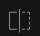
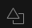
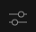

# Image editor

The image editor allows you to perform advanced editing of images on the server directly in the browser. It is used in the gallery, but it can also be called up when editing a web page by clicking on the image and then clicking on the image editing icon, or from the explorer by right-clicking on the image and selecting Edit.

The following tools are available:

- , **Resize**: you can adjust the size of the image. Note that by default the image is displayed at a maximum size of 1000 pixels wide, so adjusting the size may not be visible because the image may actually be larger than the displayed size.
  - The size can be changed based on defined size templates (if you repeatedly need to set the exact size of the image). The list of options is set in the configuration variable `imageEditorSizeTemplates`, set to the value `80x80;640x480;800x600;` by default.
  - The bound dimensions option will preserve the aspect ratio, if a template is used, the width will be set and the height will be calculated according to the aspect ratio of the current image.
- , **Crop**: After clicking this function, you can crop the photo in the gallery.
  - The photo can be cropped to any rectangle, or you can choose from predefined aspect ratios: square, 3:2, 4:3, 5:4, 7:5, 16:9.
  - Aspect ratios can be defined in the configuration variable `imageEditorRatio`, set to the value `3:2, 4:3, 5:4, 7:5, 16:9` by default.
- , **Flip**: This feature allows you to flip a photo horizontally (Flip X) or vertically (Flip Y), creating a mirror image.
- , **Rotate**: In this function, you can use the slider to select a value in degrees from -360 to 360, or use the buttons that rotate the photo by 30 degrees clockwise or counterclockwise.
- , **Draw**: This feature allows you to draw a freehand or straight line on the photo. You can choose the color and thickness of the line (range).
- , **Shape**: With this feature, you can add various shapes such as circles, rectangles, or triangles to your photo. You can change the stroke and fill color as needed, and you can specify the stroke thickness. The created objects can be moved, reduced, enlarged, and rotated, including objects created with the Draw feature.
- , **Icon**: The Icon function allows you to add various icons and stickers from a predefined library or your own uploaded icons to your photo. You can change the color as needed. The created objects can be moved, reduced, enlarged and rotated.
- , **Text**: Use this feature to add text to your photo. You can format the text to be bold, italic, or underlined. You can choose the color and size.
- , **Mask**: The Mask function allows you to apply various masks to a photo, which can be used to hide or highlight parts of the photo.
- , **Filter**: Using this function, you can apply various filters to a photo to modify its appearance. The filters you can choose from include: black and white filter, sepia, blur, emboss, negative, sharpen. You can set white removal, brightness, noise, graininess and color filter. You can also set Tint, Multiply and Blend for each color.
    - **Toning**: Allows you to apply a color tint to your photo. You can adjust the intensity of the color using the opacity (transparency).
    - **Multiply**: This effect increases the darkness of the image by combining the colors of the photo with a color layer. The resulting color is always darker.
    - **Blending**: Allows you to combine two image layers using different modes:
      - **Add**: Adds the colors of two layers. The result is lighter.
      - **Diff**: Shows differences between layers.
      - **Subtract**: Subtracts the colors of one layer from another. The result is darker.
      - **Multiply**: Combines the colors of the layers and creates a darker result.
      - **Screen**: Inverts the colors, multiplies them, and then inverts them again. The result is lighter.
      - **Lighten**: Displays the lighter colors from two layers.
      - **Darken**: Displays darker colors from two layers.
