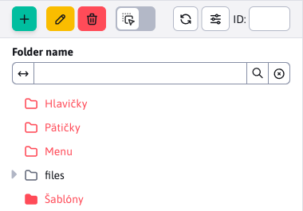
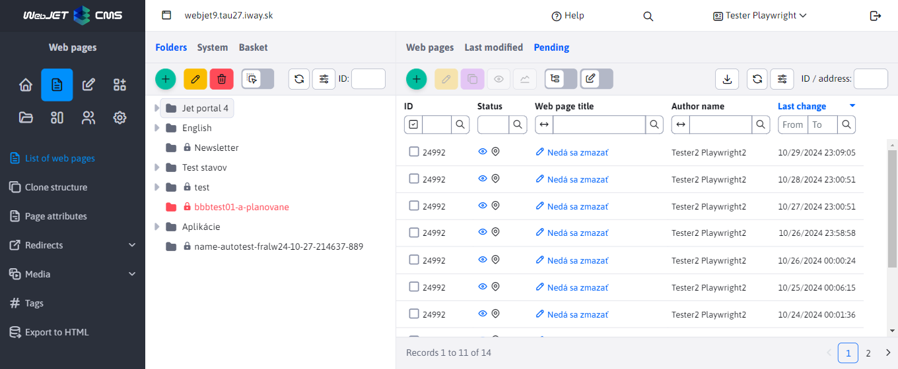
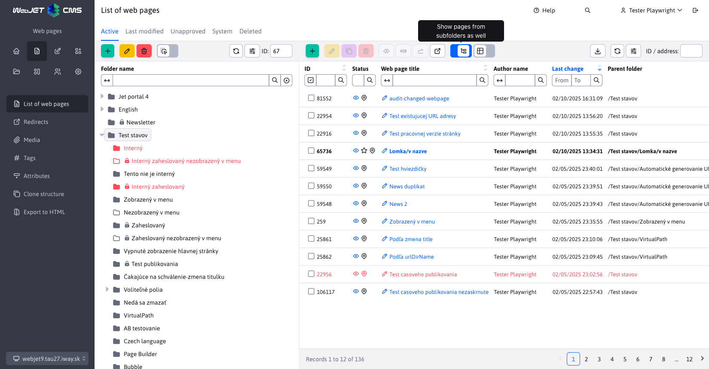
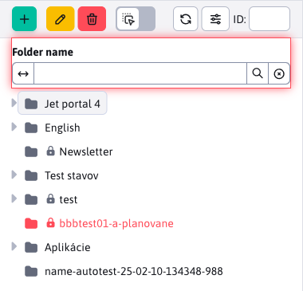

# Web pages

## Basic work

### Choosing a domain

For multi-domain web sites, the domain selection is displayed at the top. In the tree structure of the site, only folders with the selected domain and folders that do not have a domain set are displayed.

### Viewing the System and Trash folders

The special folders System (contains pages needed for the template such as header and footer) and Trash (contains deleted pages) appear in the System or Trash tab.

The display in the System tab depends on the WebJET configuration:
- displays the contents of the folder by default `/System` (global folder for all domains)
- if the mode is on **Local Folder System** (set configuration variable `templatesUseDomainLocalSystemFolder` at `true`) and a local System folder exists for the currently selected domain, the contents of the folder will be displayed
- if Folder System search mode is on **recursive in tree structure** (set configuration variable `templatesUseRecursiveSystemFolder` at `true`) displays the folder structure containing the System folder

In addition to the Folder System, this tab also displays the folder `/files` with a full-text index for searching files (if full-text search is active). This folder contains the text extracted from the files, and the text is used in the file search.

The Trash tab shows the contents of the folder `/System/Kôš`.

These folders do not appear in the Folders tab (they are filtered), but if for some reason you need to see the exact tree structure without filtering, click on the Folders tab with the `shift`. In this case, filtering is turned off and all folders in the currently selected domain and folders that do not have a domain set are displayed.

### Remembering the last folder you opened

The list of web pages remembers the last opened folder within one login, when you return to the list of web pages, the folder is reopened. Folder memory is deleted when switching domains or when entering an address `/admin/v9/webpages/web-pages-list/?groupid=0`, i.e. the address of the page with the parameter `groupid=0`.

At the same time, when browsing the tree structure, the address of the page is displayed in the browser address bar with the parameter `groupid`, which represents the folder ID. When the page is refreshed or a link is sent, the folder structure is opened according to the ID in the address bar. On the home page, you can add a bookmark to the Bookmarks block [add page address with folder ID](https://youtu.be/G5Ts04jSMX8) and create a link to the nested folder structure on the home page.

### Web site tabs

The following tabs can be viewed in the right section:
- **Web pages** - displays a standard list of web pages in the selected folder in a tree structure.
- **Last modified** - shows a list of your most recently edited pages.
- **Pending approval** - if you approve changes to web pages, the pages that are awaiting your approval will appear in this tab.
- **Folders** - switches the view from a list of web pages to a list of folders. Clicking on a folder in the tree structure displays the selected folder and its subfolders. If you select multiple folders in the tree structure (e.g. by pressing the `CTRL`), the marked folders are displayed. The tabular view of folders allows, for example, to perform bulk operations on folders (e.g., changing the template), to use the Edit function in the grid view, or to use the Duplicate function.

!>**Notice**: you must first enable folder view in [tree structure view settings](#setting-the-tree-structure-view).

### View pages also from subdirectories

If necessary, you can also view web pages from subdirectories by toggling the **View pages also from subdirectories** in the datatable header. When you switch to the mode of displaying pages from subdirectories, the pages from the currently selected directory are displayed in the tree structure, including its subdirectories. You can click on another directory in the tree structure, which again causes the pages from the selected directory and its subdirectories to be displayed.

In the table settings, you can turn on the display of the column **Parent folder** in which you will see the directory in which the page is located.

### Recovering web pages and directories from the Recycle Bin

The list of web pages also offers a special icon  to restore a web page or an entire folder from the Recycle Bin. These icons only appear in specific circumstances. For a more detailed explanation of the logic, see [Recovering web pages and folders from the Recycle Bin](./recover.md)

### Special icons

The Data table in the page list contains the following special icons:
- <i class="ti ti-eye fa-btn" role="presentation" ></i> - Show page - after selecting one or more lines and clicking on the icon, the selected web page will open in a new window/tab.
- <i class="ti ti-a-b fa-btn" role="presentation" ></i> - Save as AB test - creates a B version of the page for [AB testing](../apps/abtesting/README.md).
- <i class="ti ti-chart-line fa-btn" role="presentation" ></i> - Page Statistics - displays [traffic](../apps/stat/README.md) marked web page.
- <i class="ti ti-link-off fa-btn" role="presentation" ></i> - Check for links and blank pages - checks [validity of links](linkcheck.md) in the pages in the current folder and subfolders, displays pages that have no text entered.
-  - Show web pages from subdirectories - switch the switch to the on position to show web pages from subdirectories in the table

### Icons and colours in the tree structure and page list

The following types of icons and colors can be displayed in the folder and page tree structure:
- <i class="ti ti-folder-filled" role="presentation" ></i> full folder icon = folder is displayed in the menu
- <i class="ti ti-folder" role="presentation" ></i> empty folder icon = not shown in the menu
- <i class="ti ti-map-pin" role="presentation" ></i> the page is displayed in the menu
- <i class="ti ti-map-pin-off" role="presentation" ></i> the page is not displayed in the menu
- <i class="ti ti-folder-x" role="presentation" ></i> you don't have edit/delete permissions on the folder, you won't even see any list of web pages in that folder (even if the folder actually contains web pages). This is used when you only have permissions on any of the subfolders.
- <i class="ti ti-lock" role="presentation" ></i> lock = only available for logged in visitor
- red colour = unavailable to the public (internal directory) or page with display disabled
- <i class="ti ti-star" ></i>, **bold font** = main page of the directory
- <i class="ti ti-external-link" ></i> out arrow = page is redirected
- <i class="ti ti-eye-off" ></i> crossed out eye = page not searchable
- <i class="ti ti-a-b" ></i> B variant of the application page [AB testing](../apps/abtesting/README.md)

## Setting the tree structure view

If necessary, you can click on the icon in the tree structure <i class="ti ti-adjustments-horizontal" ></i> Settings to display the settings dialog box:
- **ID** - It will also display the directory ID in the form #ID before the name. This display is useful if you need to manually enter a folder ID into an application, or if you are migrating pages between environments and need to quickly check the settings of embedded applications.
- **Order of arrangement** - After the name, display the order of the arrangement in the form (order).
- **Website Pages** - It also displays web pages in the tree structure. **Warning:** reduces performance and data loading speed. We recommend enabling this option only if you need to move web pages using the `Drag&Drop`.
- **Tree structure folders as a table** - Displays the Folders tab in the datatable. Allows you to use datatable features such as bulk operations, duplicate, edit in grid view, etc. with tree structure folders.
- **Column width ratio tree:table** - Sets the ratio of the column widths of the displayed tree structure and datatable for better use of monitor width. The default ratio is 4:8. Warning: some ratios and inappropriate monitor size may cause the toolbar/buttons to display incorrectly.
- **Sort tree by** - Select the directory parameter by which to organize the folder tree. The selection field supports the following parameters
  - **Priority**
  - **Name**
  - **Date of creation**
- **Line up the tree in the direction** - Switching between folder tree layout directions. Selecting an option will apply the direction **Ascending (ASC)** and by not selecting the option, the direction will be used **Descending (DESC)**.

## Search in tree structure

The filter above the tree structure allows you to quickly search for folders by their name. The search works in **the whole tree structure**, so there is no need to open folders to scan them. Search between tabs **Folder** / **System** / **Basket** is separated, that is, in the tab **System** the search does not find folders belonging to the tab **Basket** etc.

After entering a value in the field, the filtering is started by pressing the `Enter` or icons . For a better overview of where the found folder is located, we show the full path to the root folder. Each folder matching the search term is highlighted.

To cancel the search, press the  or if you try searching for an empty string.

!>**Warning:** If you have an active search (you have just searched for a string) in one tab, switching to the other tab will cancel the search. That is, the search string e.g. "blog" will be removed from the field when you switch to another tab.
