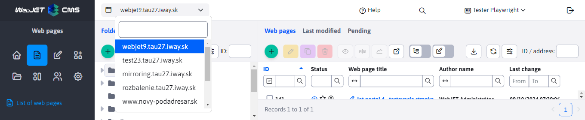
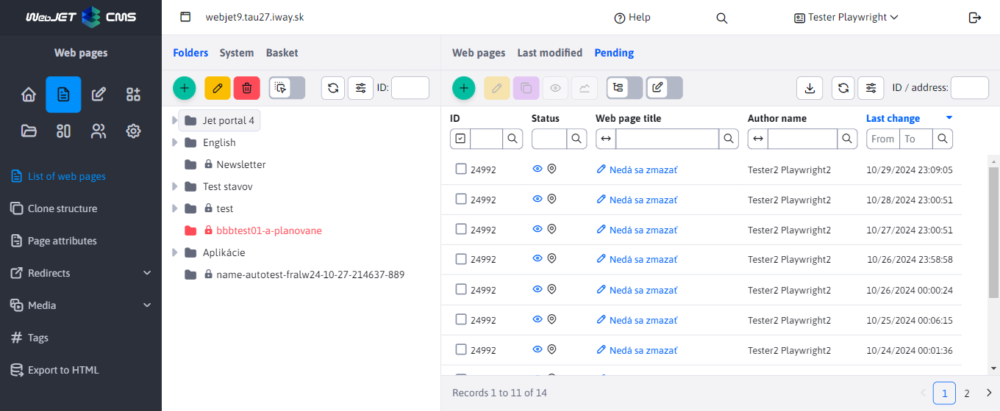
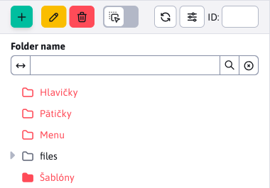
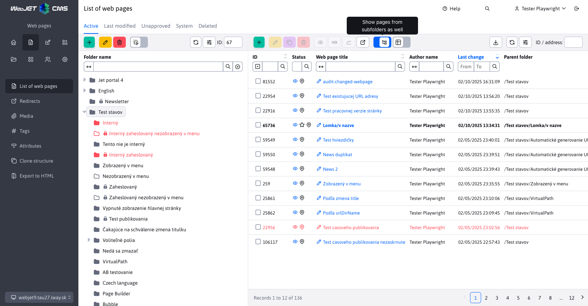
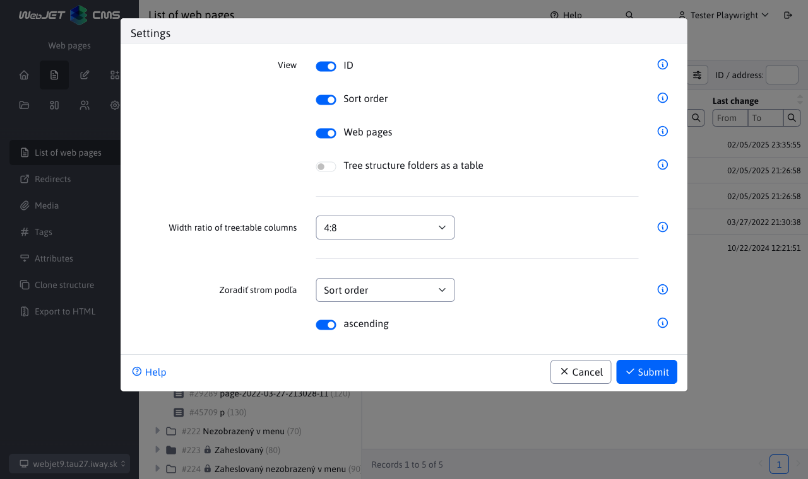
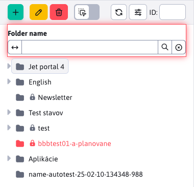
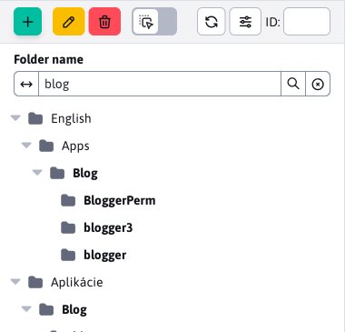

# Website

## Basic work

### Domain selection

The left menu displays the domain selection for multi-domain websites. The tree structure of the pages displays only folders with the selected domain and folders that do not have a domain set.

### Website tabs

The following tabs can be displayed in the right section:

- **Active** - displays a standard list of web pages in the selected folder in a tree structure.
- **Last modified** - shows a list of your most recently modified pages.
- **Unapproved** - if you approve changes to websites, pages awaiting your approval will appear in this tab.
- **System** - displays the template's system pages such as headers, footers, and the like.
- **Deleted** - displays a list of deleted folders and web pages.
- **Folders** - switches the view from the list of web pages to the list of folders. Clicking on a folder in the tree structure displays the selected folder and its subfolders. If you select multiple folders in the tree structure (e.g. by pressing the `CTRL` key), the selected folders will be displayed. The tabular view of folders allows, for example, to perform bulk operations with folders (e.g. changing the template), to use the Edit function in the grid view, or the Duplicate function.

!>**Warning**: You must first enable folder display in [tree view settings](#tree-view-settings).

The display in the System tab depends on the WebJET configuration:

- by default it will display the contents of the folder `/System` (global folder for all domains)
- if **local System Folder** mode is enabled (configuration variable `templatesUseDomainLocalSystemFolder` set to `true`) and a local `System` folder exists for the currently selected domain, its contents will be displayed
- if the search mode for the folder `System` is enabled **recursively in the tree structure** (configuration variable `templatesUseRecursiveSystemFolder` set to `true`) it will display the folder structure containing the folder `System`

In addition to the `System` folder, this tab also displays the `/files` folder with a full-text index for file search (if full-text search is active). This folder contains texts retrieved from files, which are used when searching files.

The Deleted tab displays the contents of the folder `/System/Kôš`.

These folders are not displayed in the Active tab (they are filtered), but if for some reason you need to see the exact tree structure without filtering, click the Active tab while holding down the `shift` key. In this case, filtering will be turned off and all folders in the currently selected domain and folders that do not have a domain set will be displayed.

### Remember the last opened folder

The website list remembers the last opened folder within a single login, and when you return to the website list, the folder will be opened again. The folder memory is deleted when you switch domains or when you enter the address `/admin/v9/webpages/web-pages-list/?groupid=0`, i.e. the page address with the parameter `groupid=0`.

At the same time, when browsing the tree structure, the browser address bar displays the page address with the parameter `groupid`, which represents the folder ID. When refreshing the page or sending a link, the folder structure is opened according to the ID in the address bar. On the home page, you can [add the page address with the folder ID](https://youtu.be/G5Ts04jSMX8) to the Bookmarks block and thus create a link to the nested folder structure on the home page.

### Show pages from subdirectories as well

If necessary, you can also display web pages from subdirectories by switching the **Display pages from subdirectories as well** switch in the data table header. After switching to the mode of displaying pages from subdirectories, pages from the currently selected directory will be displayed in the tree structure, including its subdirectories. You can click on another directory in the tree structure, which will again cause the pages from the selected directory and its subdirectories to be displayed.

In the table settings, you can enable the display of the **Parent folder** column, in which you will see the directory in which the page is located.

### Restoring web pages and directories from the trash

The website list also offers a special icon  to restore a website or an entire folder from the trash. These icons are only displayed under specific circumstances. A more detailed explanation of the logic can be found in the section [Restore websites and folders from the trash](./recover.md)

### Special icons

The data table in the page list contains the following special icons:

-<i class="ti ti-eye fa-btn" role="presentation"></i> - View page - after selecting one or more lines and clicking the icon, the selected web page will open in a new window/tab.
-<i class="ti ti-a-b fa-btn" role="presentation"></i> - Save as AB test - creates a B version of the page for [AB testing](../apps/abtesting/README.md).
-<i class="ti ti-chart-line fa-btn" role="presentation"></i> - Page statistics - displays [visitors](../apps/stat/README.md) of the selected web page.
-<i class="ti ti-link-off fa-btn" role="presentation"></i> - Check links and empty pages - checks [link validity](linkcheck.md) in pages in the current folder and subfolders, displays pages that do not have any text entered.
-  - Show pages from subdirectories as well - by switching the switch to the on position, you will also see web pages from subdirectories in the table

### Icons and colors in the tree structure and page list

The following types of icons and colors can be displayed in the folder and page tree structure:

-<i class="ti ti-folder-filled" role="presentation"></i> full folder icon = folder is displayed in the menu
-<i class="ti ti-folder" role="presentation"></i> empty folder icon = not displayed in the menu
-<i class="ti ti-map-pin" role="presentation"></i> the page is displayed in the menu
-<i class="ti ti-map-pin-off" role="presentation"></i> the page is not displayed in the menu
-<i class="ti ti-folder-x" role="presentation"></i> you do not have rights to edit/delete the folder, you will not see any list of websites in this folder (even if the folder actually contains websites). It is used in the case when you have rights allowed only for one of the subfolders.
-<i class="ti ti-lock" role="presentation"></i> lock = only available to logged in visitors
- red color = unavailable to the public (internal directory) or page with display disabled
-<i class="ti ti-star"></i> , **bold** = main page of the directory
-<i class="ti ti-external-link"></i> out arrow = page is redirected
-<i class="ti ti-eye-off"></i> crossed out eye = page cannot be searched
-<i class="ti ti-a-b"></i> B variant of the page for the application [AB testing](../apps/abtesting/README.md)

## Setting the tree structure view

If necessary, you can click the icon in the tree structure<i class="ti ti-adjustments-horizontal"></i> Settings display the settings dialog:

- **ID** - Displays the directory ID in the form #ID before the name. This is useful if you need to manually enter a folder ID into an application, or if you are migrating pages between environments and need to quickly check the settings of embedded applications.
- **Sort order** - Displays the sort order in the form (order) after the name.
- **Web Pages** - Displays web pages in the tree structure. **Warning:** reduces performance and data loading speed. We recommend enabling this option only if you need to move web pages using the `Drag&Drop` function.
- **Tree Folders as Table** - Displays the Folders tab in the datasheet. Allows you to use datasheet features like bulk operations, duplicate, edit in grid view, etc. with tree folders.
- **Tree:Table Column Width Ratio** - Sets the column width ratio of the displayed tree structure and data table to better utilize the monitor width. The default ratio is 4:8. Warning: with some ratios and inappropriate monitor size, the toolbar/buttons may not be displayed correctly.
- **Sort tree by** - Select the directory parameter by which the folder tree should be sorted. The selection box supports the following parameters
  - **Priority**
  - **Name**
  - **Date created**
- **Sort tree direction** - Toggles the direction of the folder tree. Selecting the option will use the **Ascending** direction, and not selecting the option will use the **Descending** direction.

## Searching in the tree structure

The filter above the tree structure allows you to quickly search for folders by their name. The search works in the **entire tree structure**, so there is no need to open folders to search them. The search between the individual **Active** / **System** / **Deleted** tabs is separate, so in the **System** tab you will not find folders belonging to the **Deleted** tab, etc.

After entering a value in the field, filtering is started by pressing the `Enter` key or the . For a better overview of where the found folder is located, we display the entire path up to the root folder. Each folder matching the search term is highlighted.

The search is canceled by pressing the  button or if you try to search for an empty string.

!>**Warning:** If you have an active search (you have just searched for a string) in one tab, the search will be canceled when you switch to another tab. This means that the search string, e.g. "blog", will be removed from the field when you switch to another tab.
