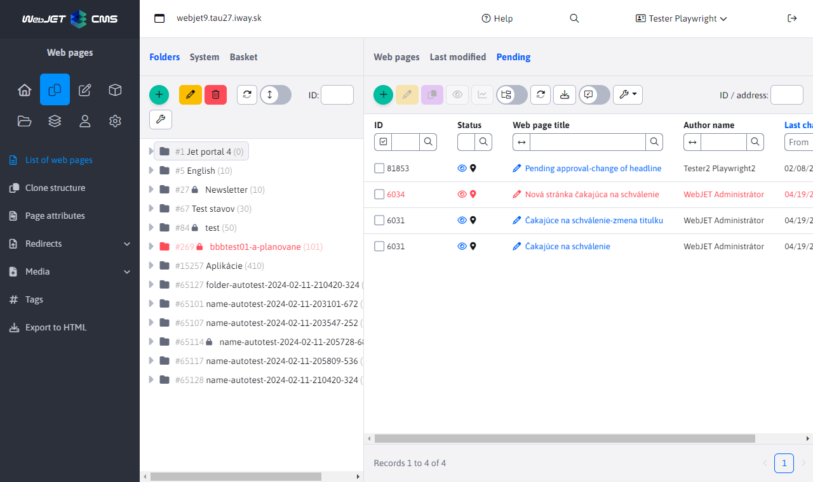

# Approval of changes

WebJET enables a mode in which changes to a web page are approved by defined users before being published to the public part.

The page will only appear on the site after it has been approved, and the author of the page is notified of the approval. If the approver does not approve the page, the author of the page will be notified by email, which will also contain comments on the page. Once the comments have been incorporated, he/she may reapply for approval.

The deletion process works similarly, if the user deletes the page a request is sent to the approver and the page continues to be displayed. Only after the deletion is approved is the page deleted (moved to the trash).

## Approval settings

Approval is set in the Users section. Click on the name of the approver to display the user settings window.

The Approvals tab defines the process for approving changes to pages. If you set an administrator to approve a certain directory and another administrator publishes a page in this directory, this change/page will not appear immediately on the public web site, but will remain pending for approval. The approver receives the approval request via email. If multiple administrators approve the directory, an email will come to all of them, and if one of them approves the page, the system will not allow another administrator to approve the page again (it will show that the page is already approved).

Clicking the Add button opens a window where you can select a directory for approval. In the Action field, you can set the following options:

- Approval - an email will be sent requesting approval
- Notification - an email will be sent to the user notifying them of the page change. If approval is also set for the directory, the notification will be sent after the page is approved. This action is useful if you don't require pages to be approved, but still want to be notified of any changes that happen to the pages.
- None - no action will be taken. This is used when multiple responsible administrators are defined in the system, with only one approving changes made by regular users. If another responsible administrator were to make a change, another administrator would have to approve it. This is sometimes unwanted, so the other responsible administrators need to be set to an approval directory with a None mode so that they can make changes to it without needing approval.
- Approval - second level - second level approval. An email will be sent requesting approval after the first level approval (by the user who has the approval option set).

The approvers are searched in the tree structure from the folder in which the change occurred to the root folder. The first folder with a defined approver is used. Thus you can define different approvers for subfolders (e.g. Products, News) and at the same time define an approver for the root folder for all other folders. If a change occurs in Products/WebJET CMS the approver for the Products folder is used, if a change occurs in Contacts the approver for the root folder is used.

## Approval process

When a change is made to a section that is being approved, an email is sent to the approver with a link to approve/disapprove the change.

Pages pending approval are also displayed to approvers in the Web Pages section of the Pending tab.

Click on the link in the email or the page title in the Pending tab to see a comparison of the current and changed page with the form to approve or deny the change. Text entered in the Comment field is emailed to the page author. Enter your comments there when the change is not approved.

