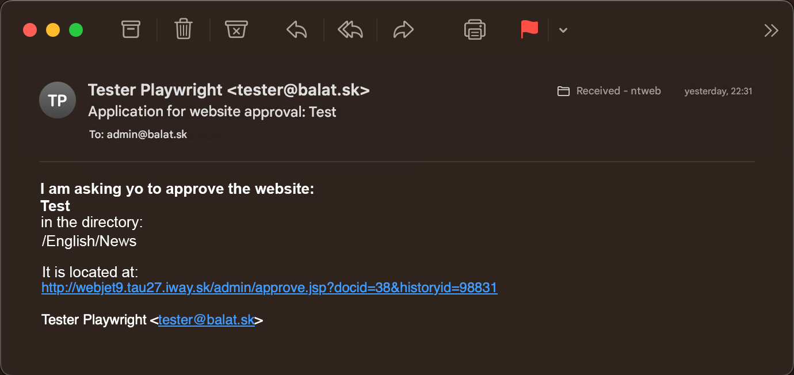
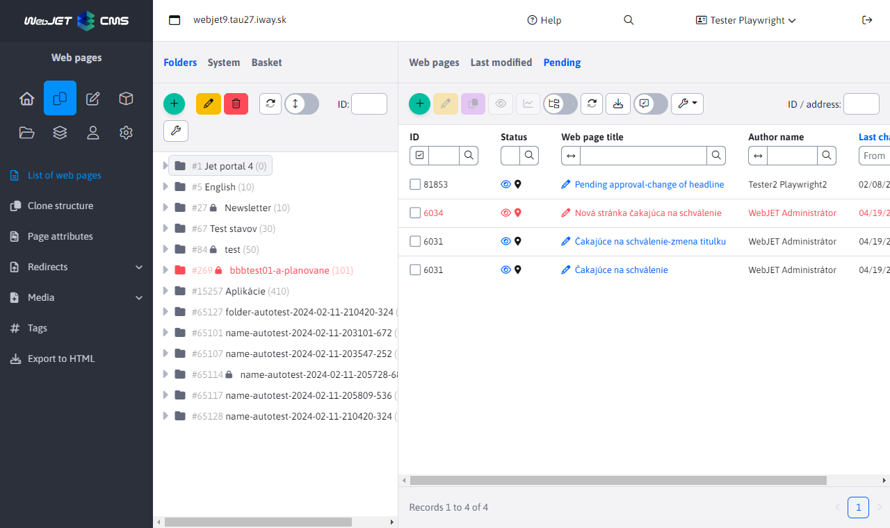

# Approving changes

WebJET enables a mode in which changes to a web page are approved by defined users before being published to the public part.

The page will only appear on the website after it has been approved, and the page author will also be notified of the approval. If the approver does not approve the page, the page author will be notified by email, which will also include comments on the page. After the comments have been incorporated, they can request approval again.

The deletion process works similarly, if a user deletes a page, a request is sent to the approver and the page continues to be displayed. Only after the deletion is approved is the page deleted (moved to the trash).

## Approval setup

Approval is set up in the Users section. Clicking on the approver's name will display the user settings window.

The Approval tab defines the process for approving page changes. If you set a specific directory for an administrator to approve and another administrator publishes a page in this directory, this change/page will not appear immediately on the public website, but will remain waiting for approval. The approver will receive an approval request via email. If the given directory is approved by multiple administrators, an email will be sent to all of them, and if one of them approves the page, the system will not allow another administrator to approve the page again (they will be informed that the page has already been approved).

Clicking the Add button opens a window where you can select a directory for approval. In the Action field, you can set the following options:

- Approval - an email will be sent requesting approval
- Notification - the user will be sent an email notifying them of a page change. If approval is also set for the given directory, the notification will only be sent after the page has been approved. This action is useful if you do not require pages to be approved, but still want to be informed about any changes that occur to the pages.
- None - no action is taken. This is used if there are multiple responsible administrators defined in the system, and only one approves changes made by regular users. If another responsible administrator made a change, another administrator would have to approve it. This is sometimes undesirable, so it is necessary to set the approval directory with the None mode for other responsible administrators so that they can make changes in it without requiring approval.
- Approval - second level - second level approval. An email requesting approval is sent after approval by the first level (to users who have the approval option set).

Approvers are searched in the tree structure from the folder in which the change occurred to the root folder. The first folder with a defined approver is used. You can define different approvers for subfolders (e.g. Products, News) and at the same time define an approver for the root folder for all other folders. If a change occurs in Products/WebJET CMS, the approver for the Products folder is used, if a change occurs in Contacts, the approver for the root folder is used.

## Approval process

When a change is made in a section that is being approved, an email is sent to the approver with a link to approve/reject the change.

Pages for approval are also displayed to approvers in the Web Pages section of the Pending Approval tab.

Clicking the link in the email or the page name in the Pending Approval tab will display a comparison of the current and changed page with a form for approving or rejecting the change. The text entered in the Comment field will be sent by email to the page author. Enter your comments there if the change is not approved.

