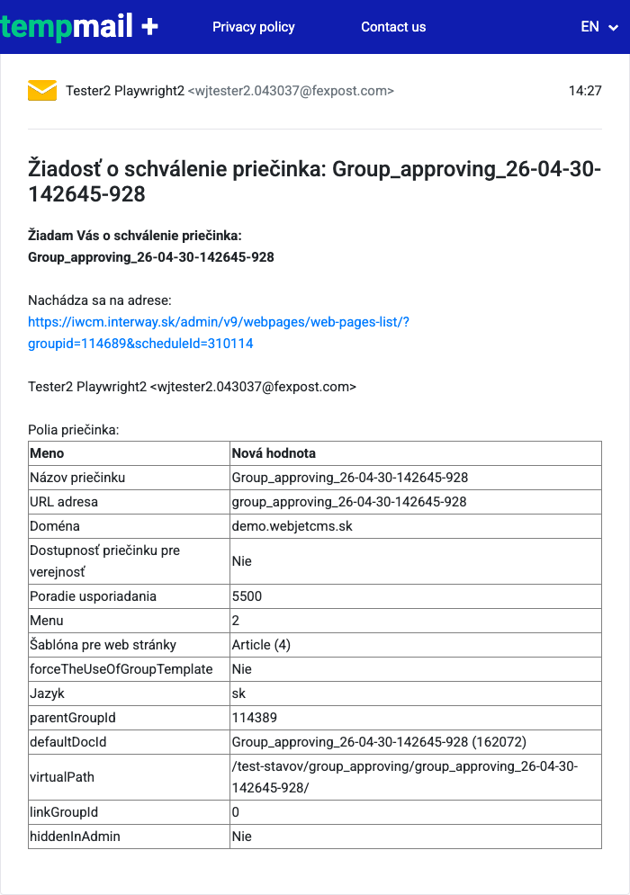

# Approving changes

WebJET CMS enables a mode in which changes to a website are approved by defined users before being published to the public part. This mechanism ensures content quality control and prevents publishing of unapproved changes.

The page will only appear on the website after it has been approved, and the page author will be notified of the approval result by email. If the approver does not approve the page, the page author will receive an email with comments on the page. After the comments have been incorporated, the author can request approval again.

The deletion process works similarly. If a user deletes a page, a request is sent to the approver and the page continues to appear on the public part of the site. Only after the deletion is approved is the page actually deleted (moved to the trash).

## Approval setup

Approval is set up in the **Users** section. Clicking on the approver's name will display the user settings window, where you can go to the **Approval** tab.

The **Approval** tab defines the approval process for page and folder changes. If you set a specific directory for an administrator to approve and another administrator publishes a page in that directory, the change will not appear immediately on the public website, but will wait for approval. The approver will receive an email requesting approval. If the given directory is approved by multiple administrators, the email will be sent to all of them, and if one of them approves the page, the system will not allow another administrator to approve the page again (they will be informed that the page has already been approved).

### Add a folder for approval

Clicking the **Add** button will open a window where you can select the directory for approval. In the **Action** field, you can set the following options:

- **Approval** - An email will be sent requesting approval. The change will not take effect until the approver approves the change.
- **Notification** - an email will be sent to the user notifying them of a page change. If approval is also set for the given directory, the notification will only be sent after the page has been approved. This action is useful if you do not require pages to be approved, but you want to be informed about all changes that occur to the pages.
- **None** - no action is taken. It is used if there are multiple responsible administrators defined in the system, and only one approves changes by regular users. If another responsible administrator made a change, another administrator would have to approve it for him. This is sometimes undesirable, so the other responsible administrators should set the approval directory with the **None** mode so that they can make changes in it without the need for approval.
- **Approval - second level** - second-level approval. The approval request is sent only after approval by the first level (by the user who has the **Approval** action set).

### Searching for approvers in the tree structure

Approvers are searched in the tree structure from the folder where the change occurred to the root folder. The first folder with a defined approver is used. This allows you to define different approvers for subfolders (e.g. Products, News) and at the same time define an approver for the root folder for all other folders.

**Example:** If a change occurs in folder `Produkty/WebJET CMS`, the approver defined for folder `Produkty` will be used. If a change occurs in folder `Kontakty`, the approver defined for the root folder will be used.

## Approval process

When a change occurs in a folder (or subfolder) that is subject to approval, the system verifies whether the currently logged in user is an approver of that folder. If they are an approver, the change is **automatically** approved and applied immediately. If they are not an approver, the change is **not applied** and awaits approval.

### Supported operations

The approval process applies to the following operations:

- **Creating** a new folder or page
- **Edit** an existing folder or page
- **Deleting** a folder or page

!>**Warning:** The action of **restoring** a folder/page from the trash to a folder that is subject to approval is not subject to the approval process. Restoring to such a folder can only be performed by an approver. If a user without the approver's permission tries to restore the item, a warning will be displayed that they do not have permission to restore to this folder and the action will not be performed.

### Approval process progress

**1. Notification of pending approval**

After making a change, the author will receive a notification that the change is awaiting approval, including information about who the approval request was sent to (this can include multiple approvers).

**2. Email requesting approval**

An email is sent to the approver requesting approval. The email contains details about the change and a link to the approval page. This applies to actions on folders as well as pages within those folders.

**3. Approval Page**

The approver uses the link in the email to go to the approval page. On this page, they can review the details of the change, add a comment, and **approve** or **reject** the change.

When approving pages, a comparison of the currently published version and the new version awaiting approval is displayed. The approver can highlight the differences between the versions, giving them a clear overview of the changes made. The right-hand section displays a list of the changed fields on the page.

**4. Result notification email**

After approval or rejection, an information email will be sent to the author about the approval result with any comments.

Throughout the approval process, the system verifies whether the user has permissions for the given action and whether the folder/page has not been approved by another approver in the meantime, to prevent duplicate approval.

## Folder approval

If an approver is set up for a given directory, changes to the directory will not take effect immediately, but will wait for approval.

### Creating a folder

When creating a new directory, the folder is created as **Unavailable** (internal) and awaits approval. If the option to generate a default page is set, the created page is preset with the display turned off. **Only** a request for approval of the directory creation is sent - the page is approved or rejected together with the directory.

After **approval**, the folder will automatically be set as available and the default page will be set as displayed.
After **rejecting**, the folder or page will not be deleted, they will only remain inaccessible/hidden.

### Editing a folder

When you edit an existing folder (e.g. change the name, template, URL, etc.), the changed version of the folder is saved as a **historical** version that awaits approval. The original folder remains unchanged until the approver approves the change.

After **approval**, the changes are applied and the historical version becomes the current version.
After **rejection**, the changes are not applied and the historical version remains in the **History** tab as an unapproved version.

### Deleting a folder

When deleting a directory that is subject to approval, the directory is not deleted immediately. A historical version is created with the prefix `[DELETE]` in the folder name to make it clear that this is a deletion request.

After **approval**, the folder will be moved to the trash.
After **rejecting**, the deletion request will be discarded and the folder will remain unchanged.

## Site approval

If an approver is set up for a given directory, changes to pages in the directory will not be reflected immediately, but will wait for approval. The changed version of the page will be saved as a historical version, and the original published page will remain unchanged.

### Create a page

When a new page is created in a directory that is subject to approval, the page is saved as unpublished and awaits approval. An email is sent to the approver requesting approval.

After **approval**, the page is automatically published.
After **rejection**, the page is not published and an email with any comments will be sent to the author.

### Page editing

When editing an existing page, the changed version is saved as a **historical** version that awaits approval. The original published version of the page remains unchanged until the approver approves the change. The approver is sent an email comparing the changes to the currently published version.

After **approval**, the changes are applied and the historical version becomes the current published version.
After **rejection**, the changes are not applied and the historical version remains in the **History** tab as an unapproved version.

### Deleting a page

When you delete a page in a directory that is subject to approval, the page is not deleted immediately. A historical version is created with the prefix `[DELETE]` in the page name. The page remains published until the approver approves its deletion.

After **approval**, the page will be moved to the trash.
After **rejection**, the deletion request will be discarded and the page will remain published.

## View folders/pages awaiting approval

Folders/pages awaiting approval are displayed in two places:

- In the **Unapproved** tab - only the current unapproved version of folders/pages will be displayed (according to the **Pages** / **Directories** sub-tab), without the history of unapproved versions.

- In the folder/page details in the **History** tab - historical versions awaiting approval are displayed along with information about the approval status, who approved/rejected them and when.

