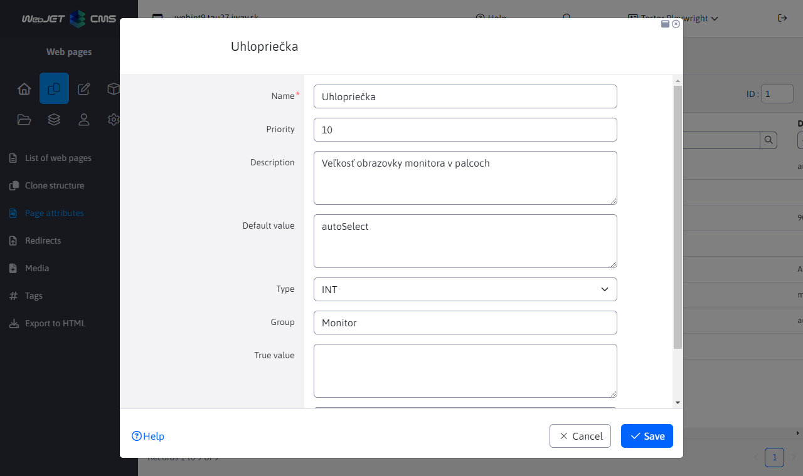
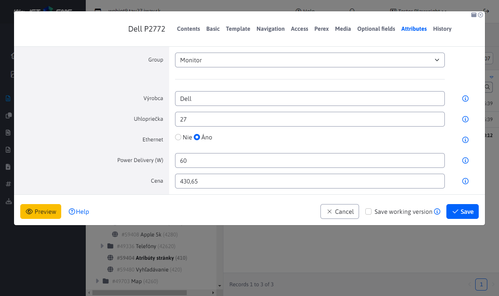
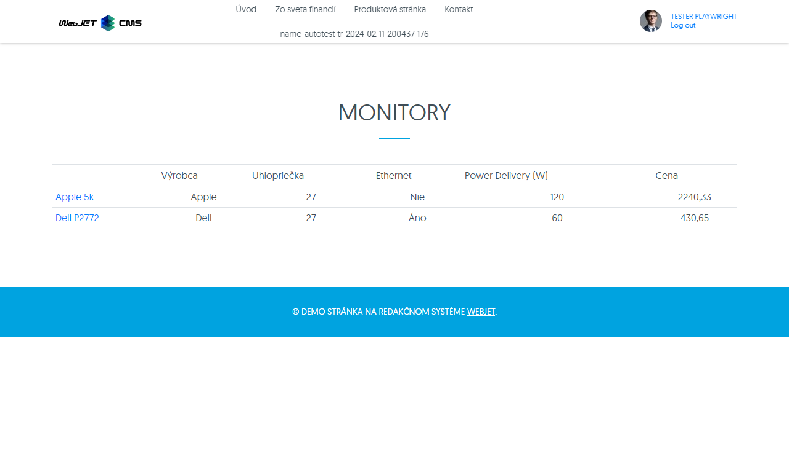

# Page attributes

> Page attributes allow you to define additional fields for the web page editor. They can be of different data types and can be organized into groups. They are usually used in e-commerce to define product parameters.

The advantage over optional fields is the theoretically infinite number of fields and the possibility to organize fields into groups. In the database, the values are stored in correct data types, which makes it possible to perform ordering using database queries (both the optional fields and the number data type are stored as a string).

  <iframe width="560" height="315" src="https://www.youtube.com/embed/e-K-6Z_m-hg" title="YouTube video player" frameborder="0" allow="accelerometer; autoplay; clipboard-write; encrypted-media; gyroscope; picture-in-picture" allowfullscreen></iframe>

## Definition of attributes

In the Page Attributes menu item, you can add/edit/delete attribute definitions. The attribute defined in this way can then be set on the web page.

The attribute has the following fields:
- Name - the name of the attribute. For multi-language display, the supported format is `JAZYK:hodnota|JAZYK:hodnota`, e.g. `SK:hmotnosť|CZ:hmotnost|EN:weight`.
- Priority - the order of the attribute in the attribute list.
- Description - extended description of the attribute, it is up to the designer where this description will be displayed on the web page.
- Default value - the default value of the attribute in the page editor (set for the new value).
- Type - data type of the attribute
  - `STRING` - text field
  - `INT` - integer value
  - `BOOL` - binary value yes/no
  - `DOUBLE` - numeric value with decimal place
- Group - the inclusion of the attribute in the group. E.g. for different groups of products like TV, refrigerators, computers you have different attributes.
- `True hodnota` - text displayed for type `BOOL` for the selected option (e.g. yes or includes).
- `False hodnota` - text displayed for type `BOOL` for an unselected option (e.g. no or does not contain).

Special values can be entered in the Default value for the text field:
- `autoSelect` - when entering an attribute in a page, existing values in other pages are automatically loaded and offered for selection. However, the editor can also enter a new value in the field.
- `hodnota1|hodnota2|hodnota3` - field is displayed as a selection field, the user can only select from the entered values (cannot enter a new value). As a delimiter it is possible to enter a character `|` or a character `,`. Example `Apple,Samsung,Xiaomi`.
- `multiline-w-h` - entering multi-line text (text area type field), value `w` represents the number of characters per line and the value `h` number of lines, example `multiline-80-10`. Technically, but for the sake of responsive display, the field is always displayed full width and thus the value `w` does not apply.

## Setting web page attributes

If attributes are defined, the Attributes tab will begin to appear in the Web Page Editor. The tab is not displayed when bulk editing multiple pages at once, when the attributes will be preserved for each page individually.

Use the Group selection box to select a group of displayed attributes. For an existing page, the group is preset by the first attribute that contains a text value in an attribute.

## Display attributes on a web page

The following applications are ready to display page attributes:

### Comparison table

The comparison table displays all pages in the specified folder (optionally including subfolders) with the attribute values of the specified group:

In the HTML code of the page, enter the application as:

`!INCLUDE(/components/attributes/atr_table.jsp, group="Monitor")!`

the application has the following parameters:
- `group` - group of attributes, by default `default`.
- `dirId` - The folder ID of the web site, if not specified, the current folder is used.
- `includeSub` - determines whether to also load pages from subfolders (by default `true`).
- `includeCurrentPage` - exclude the current page from the table (so that the current page is not displayed in the table), by default `false`.
- `sortBy` - the way pages are arranged, by default by page title (`title`), the options correspond to the attributes `DocDetails` with prefix `doc.` or attribute `AtrDocBean`.

### Searching/filtering displayed pages

The displayed table can be filtered (searched) using URL parameters. For example, when entering a URL `/apps/atributy-stranky/monitory/?atrs_GT_Power+Delivery+(W)=90` only monitors whose value in the attribute `Power Delivery (W)` is greater than 90. The format of the URL parameter is `atrs_TYP_MENO` where type can have values:
- `SS` (substring) - substring, i.e. search for a text value that contains the specified expression.
- `EQ` (equal) - search for an exact match of the specified expression.
- `LT` (less than) - search for a value that is less than the specified value.
- `GT` (greater than) - search for a value that is greater than the specified value.
- `GTLT` - search for a value in the specified interval `od:do`. The value is inclusive, e.g. `?atrs_GTLT_Power+Delivery+(W)=60:120` will also display pages that have a value of 60 or 120.

If the name contains a space, you can use the `+` to replace it. You do not need to use diacritics in the title, the title is compared with the diacritics removed.

### Attributes of the currently displayed page

Attributes of the currently displayed web page, e.g. as a list of product properties:

In the HTML code of the page (or ideally in one of the template fields, so that the application is used on every product page), enter the application as:

`!INCLUDE(/components/attributes/attributes.jsp, group="Monitor")!`

the application has the following parameters:
- `group` - group of attributes, by default `default`.

### Display the value of a specific attribute

If you need to display the value of a specific attribute somewhere in the page, you can use the application:

`!INCLUDE(/components/attributes/attribute.jsp, group="Monitor", name="Cena")!`

the application has the following parameters:
- `group` - group of attributes, by default `default`.
- `name` - attribute name.
