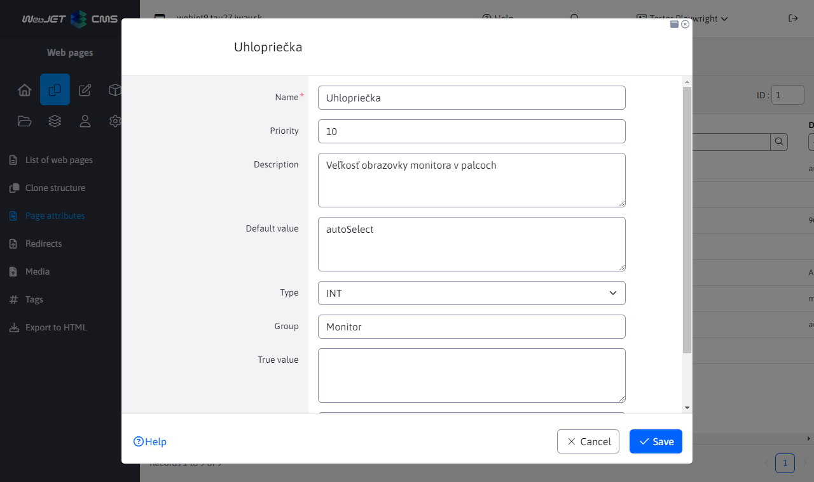

# Page attributes

> Page attributes allow you to define additional fields for the web page editor. They can be of different data types and can be organized into groups. They are typically used in e-commerce to define product parameters.

The advantage over optional fields is the theoretically infinite number of fields and the ability to organize fields into groups. In the database, values ​​are stored in the correct data types, which allows for sorting using database queries (optional fields also store the number type as a string).

<div class="video-container">
    <iframe width="560" height="315" src="https://www.youtube.com/embed/e-K-6Z_m-hg" title="YouTube video player" frameborder="0" allow="accelerometer; autoplay; clipboard-write; encrypted-media; gyroscope; picture-in-picture" allowfullscreen></iframe>
</div>

## Attribute definition

In the Page Attributes menu item, you can add/edit/delete attribute definitions. The attributes defined in this way can then be set on the web page.



The attribute has the following fields:

- Name - attribute name. For multilingual display, the format ```JAZYK:hodnota|JAZYK:hodnota``` is supported, e.g. ```SK:hmotnosť|CZ:hmotnost|EN:weight```.
- Priority - the order of the attribute in the attribute list.
- Description - an extended description of the attribute, it is up to the designer where this description will be displayed on the web page.
- Default value - the default value of the attribute in the page editor (set to a new value).
- Type - data type of the attribute
  - ```STRING``` - ​​text field
  - ```INT``` - ​​integer value
  - ```BOOL``` - ​​binary value yes/no
  - ```DOUBLE``` - ​​numeric value with decimal place
- Group - assigning an attribute to a group. For example, for different product groups such as TVs, refrigerators, computers, you have different attributes.
- ```True hodnota``` - ​​displayed text for type ```BOOL``` for the selected option (e.g. yes, or contains).
- ```False hodnota``` - ​​displayed text for type ```BOOL``` for an unselected option (e.g. no, or does not contain).

For a text field, special values ​​can be entered in the Default value:

- ```autoSelect``` - ​​when entering an attribute on a page, existing values ​​in other pages are automatically loaded and offered for selection. However, the editor can also enter a new value in the field.
- ```hodnota1|hodnota2|hodnota3``` - ​​the field is displayed as a selection field, the user can only choose from the entered values ​​(cannot enter a new value). The character ```|``` or the character ```,``` can be entered as a separator. Example ```Apple,Samsung,Xiaomi```.
- ```multiline-w-h``` - ​​entering multiple lines of text (text area field), the value ```w``` represents the number of characters per line and the value ```h``` the number of lines, example ```multiline-80-10```. Technically, however, due to responsive display, the field is always displayed in full width, so the value ```w``` does not apply.

## Setting website attributes

If attributes are defined, the Attributes tab will appear in the web page editor. The tab does not appear when editing multiple pages at once, when the attributes are preserved for each page separately.

Using the Group selection box, you can select a group of displayed attributes. For an existing page, the group is pre-set by the first attribute that contains a text value in an attribute.


## Displaying attributes on a web page

The following applications are ready to display page attributes:

### Comparison table

The comparison table shows all pages from the specified folder (optionally including subfolders) with the values ​​of the attributes of the specified group:


Enter the application in the HTML code of the page as:

```!INCLUDE(/components/attributes/atr_table.jsp, group="Monitor")!```

aplikácia má nasledovné parametre:

- ```group``` - skupina atribútov, predvolene ```default```.
- ```dirId``` - ID priečinka web stránok, ak nie je zadané, použije sa aktuálny priečinok.
- ```includeSub``` - určuje, či sa majú načítať aj stránky z pod priečinkov (predvolene ```true```).
- ```includeCurrentPage``` - vylúčenie aktuálnej stránky z tabuľky (aby sa v tabuľke nezobrazovala aktuálna stránka), predvolene ```false```.
- ```sortBy``` - spôsob usporiadania stránok, predvolene podľa názvu stránky (```title```), možnosti korešpondujú voči atribútom ```DocDetails``` s prefixom ```doc.``` alebo atribútom ```AtrDocBean```.

### Vyhľadávanie/filtrovanie zobrazených stránok

Zobrazenú tabuľku je možné filtrovať (vyhľadávať) pomocou URL parametrov. Napr. pri zadaní URL adresy ```/apps/atributy-stranky/monitory/?atrs_GT_Power+Delivery+(W)=90``` sa v tabuľke zobrazia len monitory, ktorých hodnota v atribúte ```Power Delivery (W)``` je väčšia ako 90. Formát URL parametra je ```atrs_TYP_MENO``` kde typ môže mať hodnoty:

- ```SS``` (substring) - pod reťazec, čiže vyhľadávanie textovej hodnoty, ktorá obsahuje zadaný výraz.
- ```EQ``` (equal) - hľadanie presnej zhody zadaného výrazu.
- ```LT``` (less than) - hľadanie hodnoty ktorá je menej ako zadaná hodnota.
- ```GT``` (greater than) - hľadanie hodnoty ktorá je viac ako zadaná hodnota.
- ```GTLT``` - hľadanie hodnoty v zadanom intervale ```od:do```. Hodnota je vrátane, teda napr. ```?atrs_GTLT_Power+Delivery+(W)=60:120``` zobrazí aj stránky, ktoré majú zadanú hodnotu 60 alebo 120.

Ak názov obsahuje medzeru, môžete použiť znak ```+``` na jej nahradenie. Pri názve nemusíte použiť diakritiku, názov sa porovnáva s odstránením diakritiky.

### Atribúty aktuálne zobrazenej stránky

Atribúty aktuálne zobrazenej web stránky, napr. ako zoznam vlastností produktu:


Do HTML kódu stránky (alebo ideálne niektorého poľa šablóny, aby sa aplikácia použila na každej stránke produktu) zadajte aplikáciu ako:

```!INCLUDE(/components/attributes/attributes.jsp, group="Monitor")!```

aplikácia má nasledovné parametre:

- ```group``` - skupina atribútov, predvolene ```default```.

### Zobrazenie hodnoty konkrétneho atribútu

Ak niekde v stránke potrebujete zobraziť hodnotu konkrétneho atribútu môžete použiť aplikáciu:

```!INCLUDE(/components/attributes/attribute.jsp, group="Monitor", name="Cena")!```

aplikácia má nasledovné parametre:

- ```group``` - skupina atribútov, predvolene ```default```.
- ```name``` - meno atribútu.