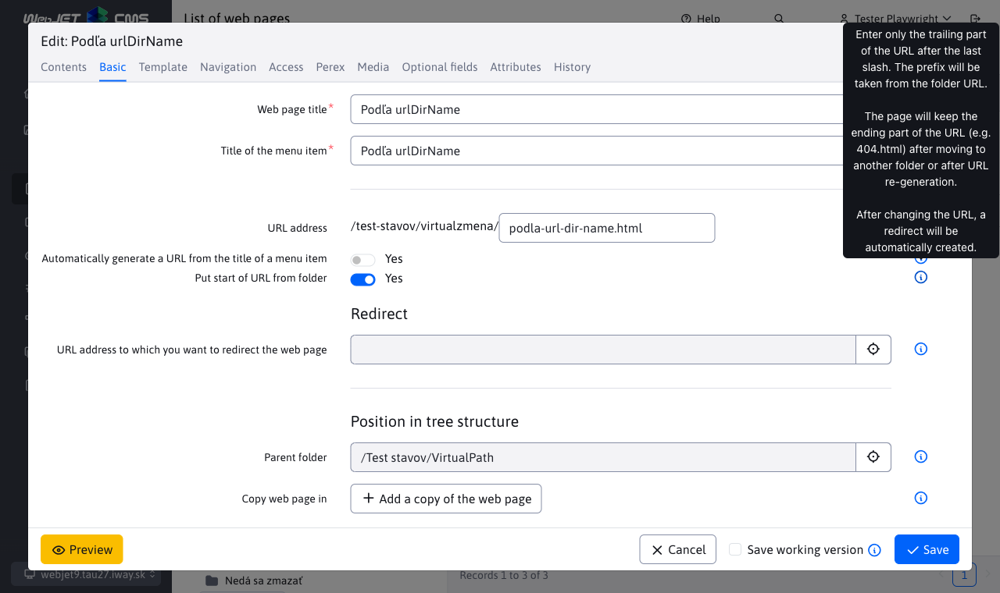
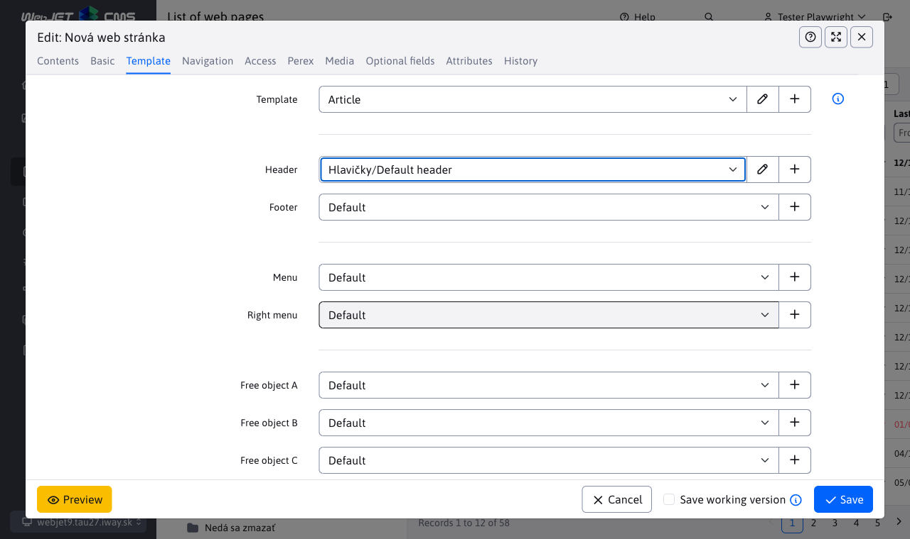

# Editing a web page

The web page editor is a versatile tool for editing and creating web pages. When you edit an existing web page, the content of the saved web page is loaded into the main editor window. When you create a new page, the editor window is empty and you can start writing the content.

If you go to create a new web page, you first need to set the correct directory in which the web page should be located and then click on the "Add" icon to display the editor window.

## Tab contents

In the "Content" tab you can edit the content of the web page itself. Page editing offers standard document content editing functions similar to those commonly used in MS Word and Excel. Most of the commands are accessed using the formatting buttons from the editor toolbar. Contextual functions are accessed by right-clicking over the appropriate page object, e.g. an image, table, selected block of text, etc.

Several types of editors are available depending on the setting of the template group or template (Page Editor Type field). The following editor types are currently supported:
- Standard - editor type `WYSIWYG`, a visual editor in which what you see on the screen is also saved. The work is similar to working in MS Word, where you can easily select text, set bold font, insert images, etc.
- HTML editor - when opened, the HTML code of the page is displayed. It is designed for special pages whose code would be broken with an editor like `WYSIWYG`, e.g. bulk email pages that contain all HTML code, including the header and footer. In this case, the code is typically supplied from an external agency and is just embedded into the page without the need to change it.
- Page Builder - mode of composing web pages from [prepared blocks](pagebuilder.md), allows you to easily edit blocks, add, move order, etc. It is designed to create complex web pages.

## Basic card

The most important parameter of every web page is its title (headline). The title is entered in the text field in the Basic tab. If you create a new web page in an empty folder, the system automatically takes the title from the name of this folder. Otherwise, when you create a new web page, the text "New Web Page" is there, which of course you must change to a meaningful title that defines the content of the web page. The title is normally entered with both accents and spaces as plain text.

The folder home page has synchronized by default [the name of the web page with the name of the folder](group.md#synchronisation-of-folder-name-and-web-page).

Every page that is to be publicly viewable on the website must have "Yes" entered in the **View**. If it does not have this setting, it is unavailable to the visitor. It will only be available for the logged in administrator to see how the web page will actually look like during the creation process.

### Inclusion in the tree structure

You can save the web page to **multiple folders**, a list of which can be found in the Classification section of the tree structure. The main folder is labeled as the Parent Folder, additional folders are in the Web Page Copy v. Technically, copies of the web page will be created in all the selected folders. When any page is saved, all data is copied to the other copies of the web page except:
- URL address - the page and its copies can have their URL address modified if necessary (unless the Automatically generate URL from menu item name option is selected)
- Layout order - if necessary, you can set the appropriate layout order for the page copy

In the event that **delete a copy of the web page** so it will be moved to the trash. While this copy is in the recycle bin, the original page from the parent folder will have its copy folder address changed to the recycle bin when it is edited. Of course, you can continue to add more copies, even to the folder where we deleted the first copy from. Deleted copies of a web page will no longer appear as an existing copy when editing the original page, once permanently deleted from the trash.

In the event that **delete the original web page** from the parent folder, it will be moved to the Recycle Bin without affecting existing copies of that page. Note though that when editing the page it will have the Display attribute turned off, which of course you can turn back on to display the page. After permanent **deletion of the original** web pages from the trash with **permanently delete all copies of it**. This means that these copies will no longer be available (even in the Recycle Bin) and cannot be restored.

### URL address

In the URL address field, you set the address of the web page on the Internet (the part after the domain name), e.g. `/produkty/webjet-cms/funkcie.html`.

The field is **when you save a new web page, it automatically fills in** by the folder URL and the Item Name field in the menu, you don't have to fill it in manually.

From a search engine optimization perspective, the URL of the page should contain keywords. However, these should ideally also be in the page title, headings and page text.

If you change the page URL, a redirect is automatically created in the Path Redirects app. If another page links to the original URL it will be redirected to the new page address.

#### Automatically generate a URL from the menu item name

If you select this option, the URL of the page will change automatically:
- when changing the value of the field Name of the menu item
- when changing the value of the URL field, the address of the folder where the web page is located but also of the parent folders
- when moving a web page to another folder

When you change the URL of a page, a redirect is automatically created in the Path Redirects application from the old URL to the new one.

#### Inherit the beginning of a URL from a directory

With this option, you can specify the end URL of the web page, with the start URL taken from the parent directories. This is useful if you need the page to always have the same ending URL, for example `404.html` or `cta.html`.

The URL value will change when:
- when changing the value of the URL field, the address of the folder where the web page is located but also of the parent folders
- when moving a web page to another folder

while as written above the end part is taken according to the specified value.

When you change the URL of a page, a redirect is automatically created in the Path Redirects application from the old URL to the new one.

### Editor's note

In the Base tab, there is an Editor's Note field. The entered text will be displayed at the top of the editor as a warning for all editors/administrators when editing the web page. This is an internal attribute that is not displayed in the public part of the web site. The note is not stored in the page history, it is always updated with the entered/current value.

Allows you to display information such as: **Please note: there is a link to the site from the GTC, never change the address of the site**.

## Managing multiple domains

If WebJET [set up to manage multiple domains](../../frontend/setup/README.md#management-of-multiple-domains) so on the Basic tab, the Domain field is displayed for folders in the root folder.

### Creating a new domain

If you need to create a new domain, follow these steps:
- Click on the icon to add a new folder
- Enter the necessary data such as Folder Name, etc.
- Change the Parent Folder to the Root Folder.
- When set to the root folder, the Domain field appears, enter the domain name.
- Save the folder by clicking the Add button.

The folder is created and a new domain is created in WebJET CMS and the list of web pages is automatically switched to it. The available domains are displayed in the administration header in the domain selection box. You can switch between them via this selection box.

Note: in addition to adding the domain in WebJET CMS, you need to set it up on the application server. The application server only manages domains it knows. If you are using Tomcat, the server administrator in `conf/server.xml` Set up `defaultHost="domena.sk"` on the elements `<Engine` for routing all domains to `domena.sk`, or must implicitly define the domain using `<Alias>www.domena.sk</Alias>` for the respective `<Host` elements. Of course, we also recommend creating httpS certificates for individual domains.

### Renaming a domain

You rename the domain in the folder's edit window. In the Domain field, enter a new value and select **Change domain redirects, configuration variables and translation texts with domain prefix**. When this option is ticked, changes are made:
- The specified domain is also set for all subdomains.
- The domain is also set for the folder `Systém`.
- Changes the domain from the old value to the new value in path redirection, configuration variables, and translation texts.

If you have multiple root folders in your domain (for example, by language), make the domain change on all folders one at a time.

## Card Template

Each web page must have a design template set up. The correct setting of the template is taken care of by the administrator, who defines them for individual folders of the web site. When a new page is created in a folder, the template is set according to the folder settings. By default, you should not need to change the template of a web page during your work.

In the fields, you can change the header/footer/menu and free objects in the selected template if necessary (if you need a different footer or a specific menu on the page, for example).

The template selection box contains a pencil icon, clicking on it opens the template editing dialog (if you need to edit some of its properties, for example). Click on the + icon to create a new template.

For the header/footer/menu/free object fields, when a specific page is selected, a pencil icon will appear for the ability to edit the selected page. You can thus easily edit e.g. the header directly while editing the web page.

## Navigation tab

In the Navigation tab, you can edit additional options for displaying the page in tree structures (displaying the page in a menu, navigation bar, or sitemap). The display can be differentiated according to the user login.

The Arrangement Order field determines the order of the page in the menu and in the sitemap. The higher the number the lower the page will be placed.

## Card access

In the "Access" section, you can manage who can access the page and under what conditions. If the page is intended for a bulk email application, it is also possible to define the assignment to an email group (newsletter type).

## The perex card

In the Perex tab, you can set the validity of a page view, or set it to be delayed or changed. You can also assign appropriate tags to the page to categorize it.

Fields **Start date**, **End date** a **Date of the event** are usually only used for news, press releases, events and conferences. Field **Start date** a **End date** However, they also have a special feature if you want to time the publishing or cancellation of a page from a certain point in time in the future. This function is activated by checking the box **Schedule a page change after this date**, respectively. **Publish a page after this date**. The value of the fields **Start date** a **End date** must be filled in for all events and conferences in the event calendar. For news, just enter the start date.

Perex (Annotation) contains a brief description of what the page is about. It should be no longer than about 160 characters. Perex is mainly used when writing news, press releases, events and conferences, where it is a short description of the article that is displayed in the news list.

You can define the image via the icon behind the field **Image**.

### Publishing a web page

If you have timed the publication of a web page and want to be as **author of the page** informed, just set the configuration variable `webpagesNotifyAutorOnPublish`. The preset value is **true** that is, whenever a new version of the web page is published, the following information email is sent to its author.

The end of the email contains a link to a page where you can check the new version of the page. If you do not want these informational emails, you must set the value of the configuration variable `webpagesNotifyAutorOnPublish` at **false**.

This event will [Audited by](../../sysadmin/audit/README.md) where the audit type is `SAVEDOC` and the description of the audited action shall include information `publishStatus: Webpage was published` so you can easily find publishing actions.

## Media card

In the Media tab, you can manage documents and files related to the page. For more information, see [Media section](media.md).

Clicking on the "add" button will bring up a form to add a link.

In the "Link" field, you choose where the link should go. For Downloadable documents, the Select button selects the document, and for Related links, the specific Web page.

The title represents the text that will be displayed on the web page. Therefore, it should be defined as normal text (with accents and spaces).

In the Preview Image field, the link can be set to an appropriate preview image if the media application embedded in the page/template uses it.

The arrangement defines the order of the links. Media assigned to different groups do not affect each other. The order numbers can also be the same, in which case the system will sort the links alphabetically.

!>**Warning:** the newly added media will only start appearing on the web page after the web page has been saved. This way, you can time the addition of the media along with the web page if necessary, if you set the page to delay publishing.

## Optional fields tab

In the Optional Fields tab, you can set optional attributes (values, texts) for the web page and directory according to your needs. The values can then be transferred and used in the page template. Types (text, number, selection field, file selection...) and field names can be set as required, see the section [Optional fields](../../frontend/webpages/customfields/README.md).

## History tab

The History tab displays the published historical versions of the web page and the current versions in progress (not yet published). When publishing a work-in-progress version, the temporary/working versions of the page are deleted from the history, leaving only the published versions in the history.

In the case of approving/rejecting a page, the name of the user who approved or rejected the version is also displayed.

More information is in the section [History](history.md).

## Save working version

When you select Save working version before clicking Save, the modified web page is saved as a working version in the history. It will not be available to visitors of the web site.

This will allow you to spend several days preparing a new version of the web page text without affecting the currently published version for visitors. When you save the working version and reopen the web page editor, you will see a message that there is a work in progress version of the page. Go to the History tab, select the row in the table with the version you want to open in the editor (typically the latest version at the top) and click the yellow Edit Page icon.

Each time you save a working version, it will remain in the History tab, so you will have multiple entries there. For efficiency, however, clicking Save without the Save Working Version option selected (i.e., when you publish it to visitors to the website) will delete all of your working versions of the website.

At the same time, saving the working version does not close the editor window, so you can continue working.

## Page preview

Click on the button `Náhľad` in the footer of the editor window, a new tab opens in the browser with a preview of the complete page without the need to save it. You can make changes to the page and see how it will look after saving.

At the same time, if you do not close the preview window, the preview is automatically updated when you save the page. This is an advantageous use with the [Save working version](#save-the-working-version) where you can move the preview window to a second monitor and keep it open while you work. Each time you save, the preview is automatically updated.

  <iframe width="560" height="315" src="https://www.youtube.com/embed/6OSTrMJj8z4" title="YouTube video player" frameborder="0" allow="accelerometer; autoplay; clipboard-write; encrypted-media; gyroscope; picture-in-picture" allowfullscreen></iframe>

## Collaboration of several editors

To prevent two different users editing the same page at the same time, WebJET will notify you that someone is currently working on the page. This means that someone has already loaded the edited page in the editor. In such a situation, you have to leave the editor and wait until the user in question has finished their work so that you don't overwrite each other's edits.

We recommend that you leave the page editor when you have finished your work and saved/published the page, this will minimize the possibility of the report being displayed to another editor.

Applications have this property, so the workflow applies to all parts, not just the page editor.

## Toolbar

When you view the web page, the WebJET toolbar is displayed in the upper right corner:

In addition to the date of the last modification, the website offers the following options when you click on:
- DocID web page opens the page in the web page editor.
- The folder name will display the web page folder.
- The template name will open the page template in the editor.
- The name of the user who last changed the web page will open a new email message to that editor.

The toolbar displays:
- If you have visited the Web pages section in the administration before viewing the team page.
- Configuration variable `disableWebJETToolbar` is set to `false`.

In addition to these conditions, the panel can be displayed using the URL parameter `?NO_WJTOOLBAR=true` to turn it off or `?NO_WJTOOLBAR=false` to turn it on. When set to `true` will not be displayed until you log out of the administration.
