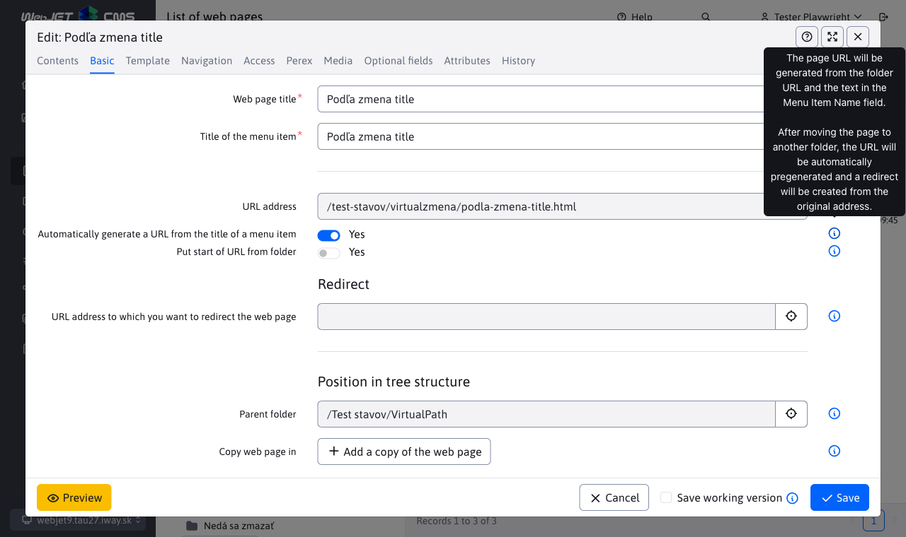
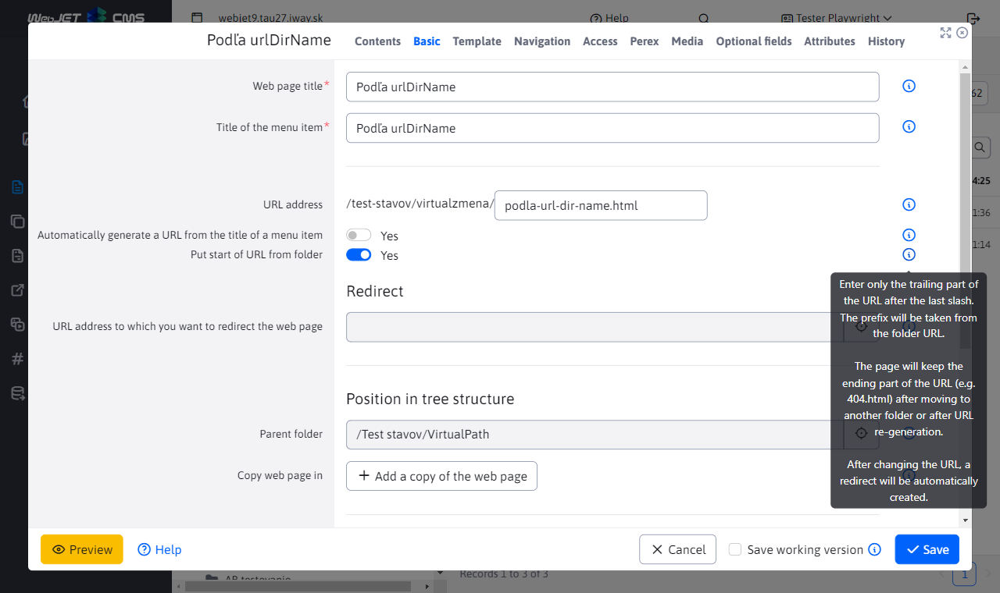
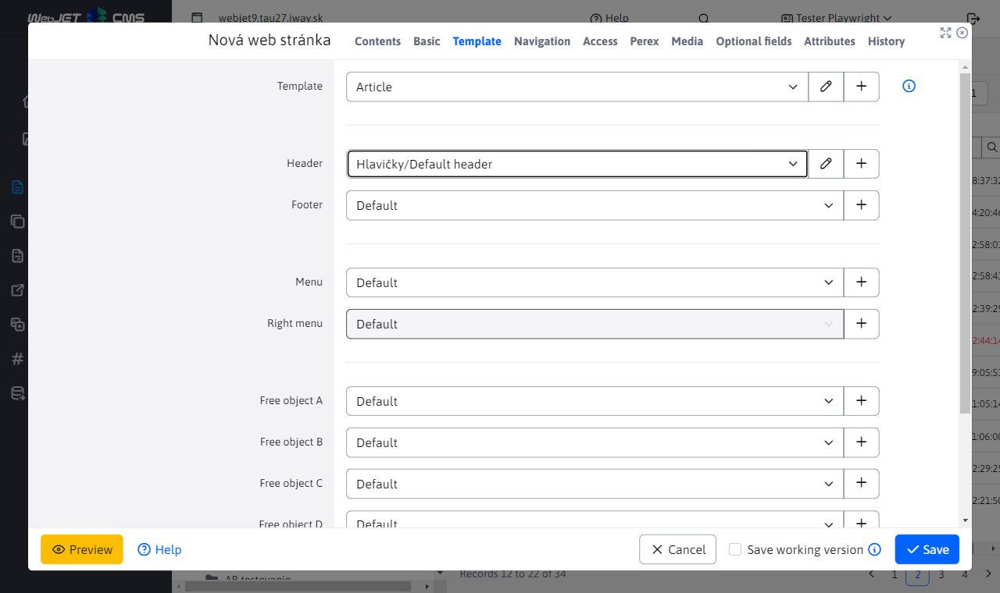
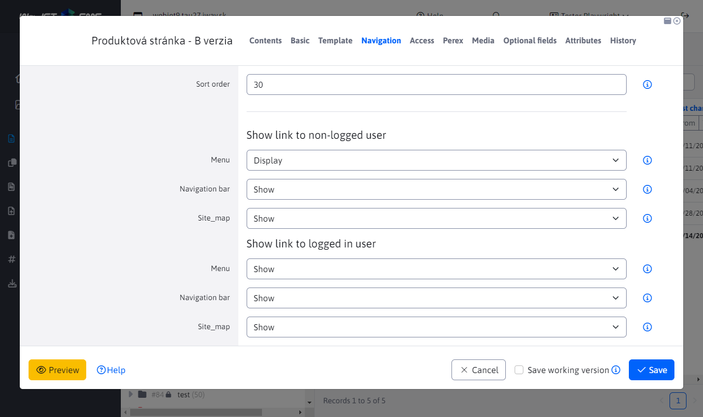
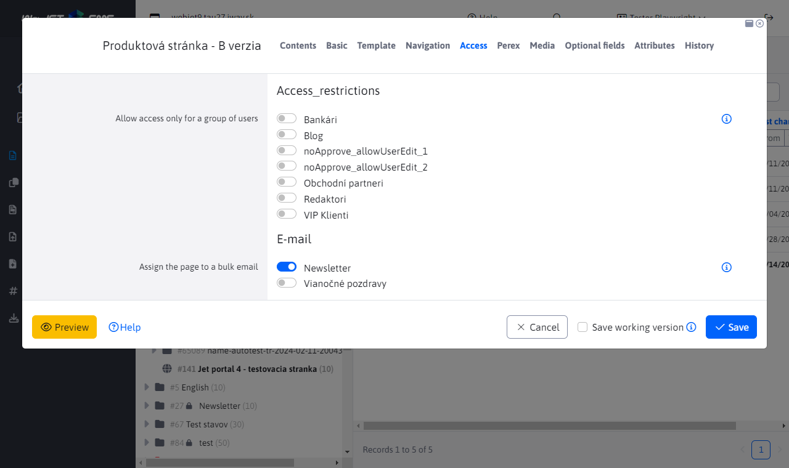
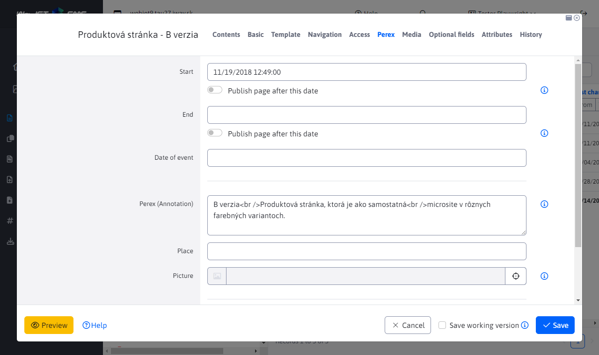
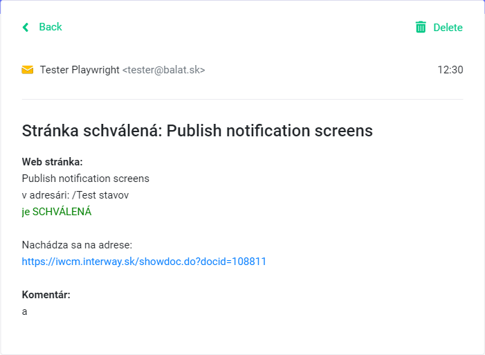
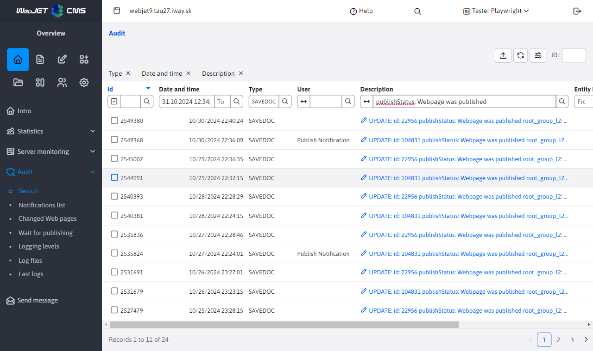

# Website editing

The website editor is a universal tool for editing and creating websites. When editing an existing website, the content of the saved website is loaded into the main editor window. When creating a new page, the editor window is empty and you can start writing its content.

If you are going to create a new website, you must first navigate to the correct directory where the website should be located and then click the "Add" icon to display the editor window.

## Contents tab

In the "Content" tab, you can edit the content part of the web page itself. Page editing offers standard document content editing functions similar to those commonly used in MS Word and Excel applications. Most commands are accessible using the formatting buttons from the editor toolbar. Contextual functions are accessible by right-clicking on the relevant page object, e.g. an image, a table, a marked block of text, etc.

Several editor types are available depending on the template group or template settings (Page Editor Type field). The following editor types are currently supported:

- Standard - `WYSIWYG` type editor, i.e. a visual editor in which what you see on the screen is also saved. The work is similar to working in MS Word, where you can easily highlight text, set bold font, insert images, etc.
- HTML editor - when opened, the HTML code of the page is displayed. It is intended for special pages whose code would be corrupted with an editor of the `WYSIWYG` type, e.g. pages for mass email, which contain the entire HTML code including the header and footer. In such cases, the code is typically supplied by an external agency and is simply inserted into the page without the need for any changes.
- Page Builder - a mode for composing a web page from [prepared blocks](../pagebuilder.md), allows you to easily edit, add, move the order of blocks, etc. It is designed for creating complex web pages.

## Basic tab

The most important parameter of each web page is its title (heading). The title is entered in the text field on the Basic tab. If you are creating a new web page in an empty folder, the system will automatically take the title from the name of this folder. Otherwise, when creating a new web page, the text "New web page" is there, which of course you must change to a meaningful name defining the content of the web page. The title is entered normally with accents and spaces as regular text.

The folder's main page has [website name with folder name] synchronized by default (../group.md#synchronizing-folder-name-and-website).


Every page that is to be publicly viewable on the website must have "Yes" set in the **View** section. If it does not have this setting, it is unavailable to visitors. It will only be available to the logged in administrator so that they can see what the website will actually look like while creating it.

### Classification in the tree structure

You can save a web page in **multiple folders**, which are listed in the Tree Structure section. The main folder is marked as Parent Folder, additional ones are in the Copy of Web Page in section. Technically, copies of the web page will be created in all selected folders. When you save any page, all data will be copied to the other copies of the web page, except:

- URL address - the URL address of the page and its copies can be modified if necessary (if the Automatically generate URL address from the menu item name option is not selected)
- Sort order - if necessary, you can set a suitable sort order for the page copy

If you **delete a copy of a web page**, it will be moved to the trash. While this copy is in the trash, the original page from the parent folder will have the address of the copy folder changed to the trash when editing. Of course, you can continue to add more copies, even to the folder from which we deleted the first copy. Deleted copies of a web page, after being permanently deleted from the trash, will no longer be displayed as an existing copy when editing the original page.

If you **delete the original web page** from the parent folder, it will be moved to the trash without affecting existing copies of this page. However, please note that when editing the page, the Display attribute will be disabled, which you can of course re-enable to display the pages. After permanently **deleting the original** web page from the trash, all its copies will be **permanently deleted**. This means that these copies will no longer be available (even in the trash) and cannot be restored.

### URL address

In the URL address field, you set the address of the web page on the Internet (the part after the domain name), e.g. ```/produkty/webjet-cms/funkcie.html```.

The field is **automatically filled in when saving a new web page** based on the folder URL and the Menu Item Name field, you do not need to fill it in manually.

From a search engine optimization perspective, the URL of the page should contain keywords. However, they must also ideally be in the page title, headings, and page text.

If you change the URL of a page, a redirect is automatically created in the Path Redirects application. If another page links to the original URL, it will be redirected to the new page address.

#### Automatically generate URL from menu item name

When you select this option, the page URL will automatically change:

- when changing the value of the Menu Item Name field
- when changing the value of the URL field, the address of the folder in which the website is located, as well as the parent folders
- when moving a website to another folder

When you change the URL of a page, a redirect is automatically created in the Path Redirections application from the old URL to the new one.



#### Inherit the beginning of the URL from the directory

This option allows you to specify the final URL of the web page, with the beginning taken from the parent directories. This is useful if you need the page to always have the same final URL, for example ```404.html``` or ```cta.html```.

The URL value will change when:

- when changing the value of the URL field, the address of the folder in which the website is located, as well as the parent folders
- when moving a website to another folder

where as written above the end part is taken according to the specified value.

When you change the URL of a page, a redirect is automatically created in the Path Redirections application from the old URL to the new one.



### Editor's note

The Basics tab contains the Editor's Note field. The entered text will be displayed at the top of the editor as a warning to all editors/administrators when editing the given web page. This is an internal attribute that is not displayed in the public part of the website. The note is not saved in the page history, it is always updated with the entered/current value.

It allows you to display information such as: **Warning: the page is linked from the GTC, never change the page address**.

## Managing multiple domains

If WebJET is [set up to manage multiple domains](../../../frontend/setup/README.md#manage-multiple-domains) then the Domain field is displayed in the Bases tab for folders in the root folder.

### Creating a new domain

If you need to create a new domain, follow these steps:

- Click on the icon to add a new folder
- Enter the necessary details like Folder Name etc.
- Change the Parent folder to Root folder.
- After setting to the root folder, the Domain field will appear, enter the domain name.
- Save the folder by clicking the Add button.

The folder will be created and a new domain will be created in WebJET CMS and the list of websites will automatically switch to it. Available domains are displayed in the administration header in the domain selection field. You can switch between them using this selection field.


Note: in addition to adding a domain in WebJET CMS, it is necessary to set it up on the application server. The application server only manages domains that it knows. If you are using Tomcat, the server administrator can set `conf/server.xml` on the `defaultHost="domena.sk"` element to route all domains to `<Engine`, or must implicitly define the domains using `<Alias>www.domena.sk</Alias>` for the corresponding `<Host` elements. Of course, we also recommend creating httpS certificates for individual domains.

### Domain renaming

To rename a domain, use the folder's edit window. In the domain field, enter a new value and select the **Change domain redirects, configuration variables, and translation texts with the domain prefix** option. Checking this option will make the following changes:

- The specified domain will also be set to all subfolders.
- The domain will also be set for the folder `Systém`.
- The domain will change from the old value to the new one in path redirects, configuration variables, and translation texts.

If you have multiple root folders in your domain (e.g. by language), change the domain one by one on all folders.

## Template tab

Every website must have a design template set. The administrator takes care of the correct template settings, who defines them for individual website folders. When creating a new page in a folder, the template is set according to the folder settings. Normally, you should not need to change the website template during your work.

In the fields, you can change the header/footer/menu and free objects in the selected template if necessary (if, for example, you need to have a different footer or a specific menu on the page).



The template selection field contains a pencil icon, clicking on it will open a dialog box for editing the template (if you need to adjust some of its properties, for example). You can create a new template by clicking on the + icon.

In the header/footer/menu/free object fields, when you select a specific page, a pencil icon will appear to allow you to edit the selected page. This way, you can easily edit, for example, the header directly while editing the web page.

## Navigation tab

In the Navigation tab, you can edit other options for displaying the page in tree structures (displaying the page in the menu, navigation bar, or site map). The display can be differentiated by user login.

The Sort Order field determines the order of the page in the menu and in the site map. The higher the number, the lower the page will be placed.



## Access card

In the "Access" section, you can manage who can access the page and under what conditions. If the page is intended for a mass email application, it is also possible to define inclusion in an email group (such as a newsletter).



## Perex card

In the Perex tab, you can set the page's display validity, or set its delayed publication or change. You can also assign appropriate tags to the page to categorize it.



The **Start Date**, **End Date** and **Event Date** fields are usually only used for news, press releases, events and conferences. However, the **Start Date** and **End Date** fields also have a special function if you want to schedule the publication or deletion of a page from a certain point in the future. This function is activated after checking the **Schedule page change after this date** or **Publish page after this date** checkboxes. The **Start Date** and **End Date** fields must be filled in for all events and conferences in the event calendar. For news, just enter the start date.

Perex (Annotation) contains a brief description of what the page is about. It should not be longer than about 160 characters. Perex is mainly used when writing news, press releases, events and conferences, where it is a short description of the article that is displayed in the news list.

You can define an image via the icon located behind the **Image** field.

### Publishing a website

If you have scheduled the publication of a web page and want to be informed about this publication as the **page author**, just set the configuration variable ```webpagesNotifyAutorOnPublish```. The default value is **true**, so every time a new version of the web page is published, the following information email will be sent to its author.



The end of the email contains a link to a page where you can check for a new version of the site. If you do not want these information emails, you must set the value of the configuration variable ```webpagesNotifyAutorOnPublish``` to **false**.

This action is [Audited](../../../sysadmin/audit/README.md) where the audit type is ```SAVEDOC``` and the audited action description contains the information ```publishStatus: Webpage was published```, making it easy to find publishing actions.



## Media card

In the Media tab, you can manage documents and files related to the page. For more information, see [Media section](../media.md).


By clicking the "add" button, you will be presented with a form to add a link.

In the "Link" field, you choose where the link should go. For Documents to download, use the Select button to select a document, and for Related links, use the Select button to select a specific Web page.

The title represents the text that will be displayed on the web page. Therefore, it should be defined as normal text (with accents and spaces).

In the Preview Image field, you can set a suitable preview image for the link, if the media application embedded in the page/template uses it.

The arrangement defines the order of the links. Media assigned to different groups do not affect each other. The sequence numbers can also be the same, in which case the system sorts the links alphabetically.

!>**Note:** newly added media will only start appearing on the website after the website is saved. This way, you can time the media addition with the website if necessary, if you set the page to delayed publishing.

## Optional fields tab

In the Optional Fields tab, you can set optional attributes (values, texts) for the website and directory according to your needs. The values ​​can then be transferred and used in the page template. The types (text, number, selection field, file selection...) and field names can be set as needed, more information is available in the [Optional Fields] section (../../../frontend/webpages/customfields/README.md).


## History tab

The History tab displays published historical versions of the website and current work-in-progress (not yet published) versions. When publishing a work-in-progress version, temporary/draft versions of the page are deleted from the history, leaving only published versions in the history.

In the case of page approval/rejection, the name of the user who approved or rejected the version is also displayed.

More information is in the [History](../history.md) section.


## Save working version

If you select the Save draft option before clicking the Save button, the edited web page will be saved as a draft in the history. It will not be available to website visitors.

This will also allow you to prepare a new version of the web page text for several days without affecting the currently published version for visitors. After saving the working version and reopening the web page editor, a message will appear that there is a working version of the page. Go to the History tab, select the row in the table with the version you want to open in the editor (typically the latest version at the top) and click the yellow Edit page icon.

Each time you save a draft, it will remain in the History tab, so you will have multiple entries there. For efficiency's sake, however, clicking Save without selecting the Save draft option (i.e. when publishing to website visitors) will delete all of your drafts of the website.

At the same time, when you save the working version, the editor window will not close, so you can continue working.


## Page preview

Clicking the ```Náhľad``` button in the footer of the editor window will open a new tab in your browser with a preview of the complete page without saving it. This way, you can make changes to the page and see how it will actually look after saving.

At the same time, if you do not close the preview window, the preview will automatically update when you save the page. This is convenient to use with the [Save working version](#save-working-version) function where you can move the preview window, for example, to a second monitor and keep it open while you work. The preview will automatically update every time you save.

<div class="video-container">
    <iframe width="560" height="315" src="https://www.youtube.com/embed/6OSTrMJj8z4" title="YouTube video player" frameborder="0" allow="accelerometer; autoplay; clipboard-write; encrypted-media; gyroscope; picture-in-picture" allowfullscreen></iframe>
</div>

## Collaboration of multiple editors

To prevent two different users from editing the same page at the same time, the WebJET system will notify you with a message that someone is currently working on the page. This means that someone else already has the edited page loaded in the editor. In such a situation, you must exit the editor and wait until the user in question has finished working so that you do not overwrite each other's edits.

We recommend that you exit the page editor after you finish working and saving/publishing the page, this will minimize the possibility of the message being displayed to another editor.

Applications also have this feature, so the workflow applies to all parts, not just the page editor.


## Toolbar

When viewing a web page, the WebJET toolbar appears in the upper right corner:


In addition to the last modification date, the website offers the following options when clicked:

- The DocID of the website opens the page in the website editor.
- The folder name will display the website folder.
- Template name opens the page template in the editor.
- The name of the user who last changed the web page will open a new email message to that editor.

The toolbar is displayed:

- If you visited the Websites section in the administration before viewing the page.
- Configuration variable `disableWebJETToolbar` is set to value `false`.

In addition to these conditions, the panel can be displayed using the URL parameter `?NO_WJTOOLBAR=true` to disable it or `?NO_WJTOOLBAR=false` to enable it. After setting it to `true`, it will not be displayed until you log out of the administration.