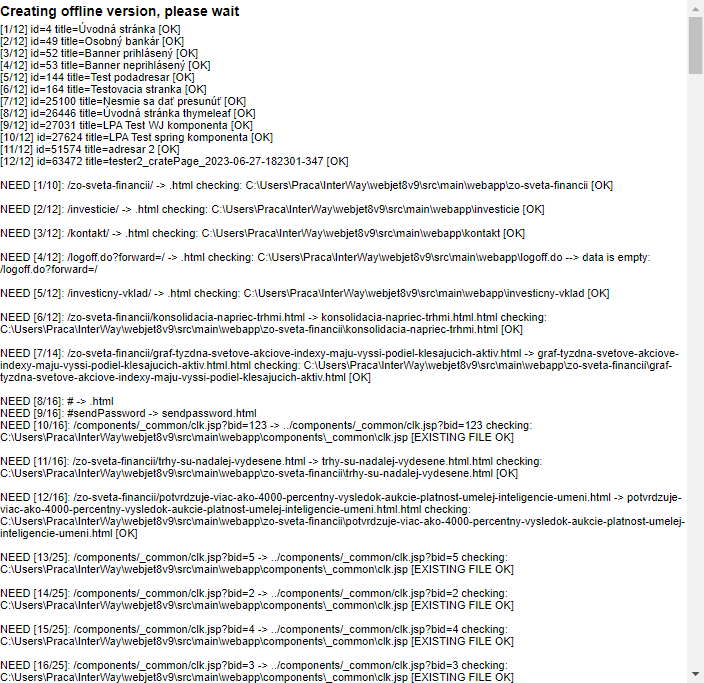
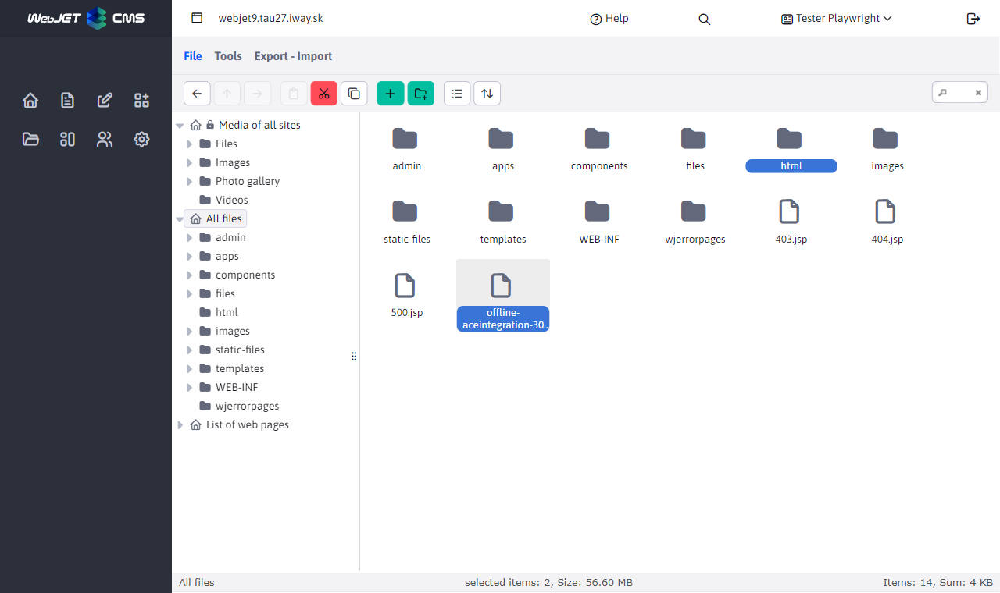

# Export to HTML

Through the app **Export to HTML** it is possible to export web pages to HTML format and then use them in a limited way in an offline environment. The export works on the principle of downloading the resulting web pages and saving them to an HTML file

The generated pages are saved in the folder `/html`.

## HTML file generation process

After entering the folder ID of the folder for which you want to create an offline version and clicking **OK** starts the process of generating HTML files. This process can take several tens of minutes depending on the number of pages in a given branch of the web site.

Wait for the whole process to finish. During this time, you should see information in the window about the number of pages already generated and the total number of pages. The result is a folder `/html` containing the HTML code of each page and possibly a ZIP archive with the selected folders (a folder is automatically added to the ZIP archive `/html`).

## Creating a ZIP archive

To create a ZIP archive, you need to select the option **System backup**, you can also select which folders to include in the ZIP archive. Please note that the amount of data in the selected folders can be large and the ZIP file may not be generated correctly (the limit is to a 2GB file).

## Exported files

The generated pages are saved in the folder `/html` and after selecting the System Backup option, the resulting ZIP file is saved to the root folder.

!> **Warning:** after creating the export, we recommend to delete the entire folder immediately `/html` and also a ZIP archive with a name starting with `offline-` in the root folder of the server.
