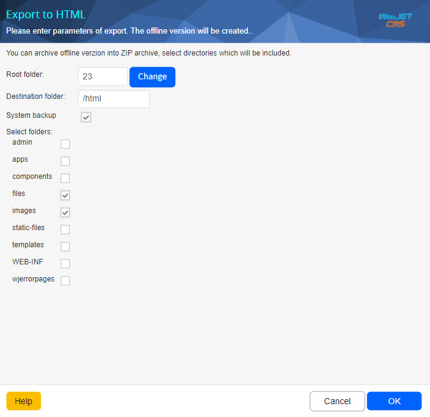
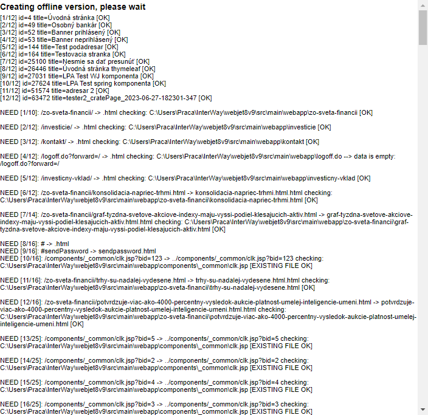
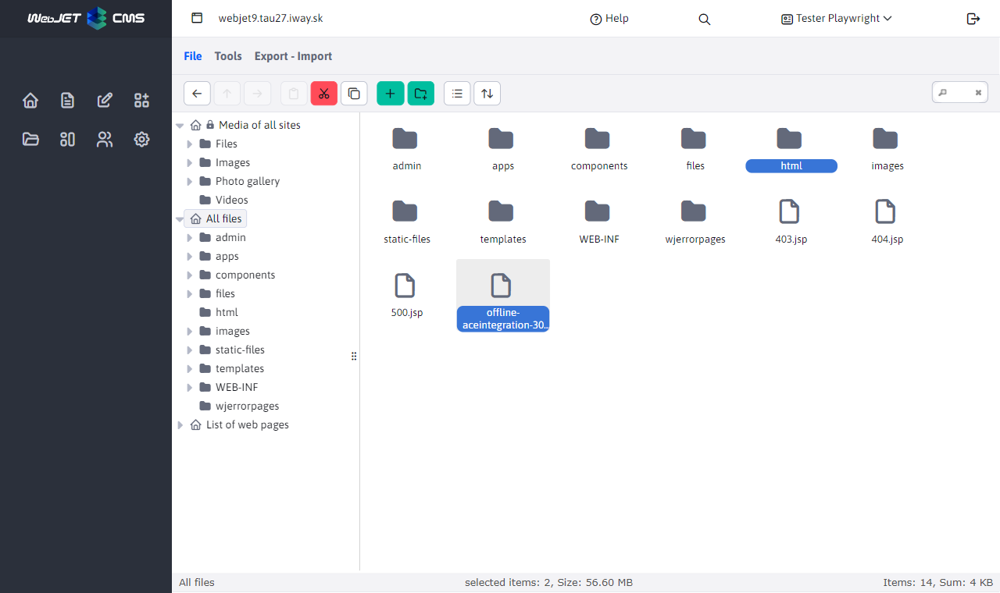

# Export to HTML

The **Export to HTML** application allows you to export web pages to HTML format and then use them to a limited extent in an offline environment. The export works on the principle of downloading the resulting web pages and saving them to an HTML file

The generated pages are saved in the `/html` folder.

## The process of generating HTML files

After entering the folder ID for which you want to create an offline version and clicking **OK**, the HTML file generation process will start. This process may take several tens of minutes depending on the number of pages in the given branch of the website.

Wait for the entire process to finish. During this time, the window should display information about the number of pages already generated and the total number of pages. The result is a folder `/html` containing the HTML code of each page and, if applicable, a ZIP archive with the selected folders (the folder `/html` is automatically added to the ZIP archive).

## Creating a ZIP archive

To create a ZIP archive, you need to select the **System Backup** option, you can also select which folders to include in the ZIP archive. Please note that the amount of data in the selected folders may be large and the ZIP file may not be generated correctly (the limit is 2GB file).

## Exported files

The generated pages are saved in the `/html` folder and after selecting the System Backup option, the resulting ZIP file is saved in the root folder.

!> **Warning:** after creating the export, we recommend immediately deleting the entire folder `/html` and also the ZIP archive with a name starting with `offline-` in the server root folder.