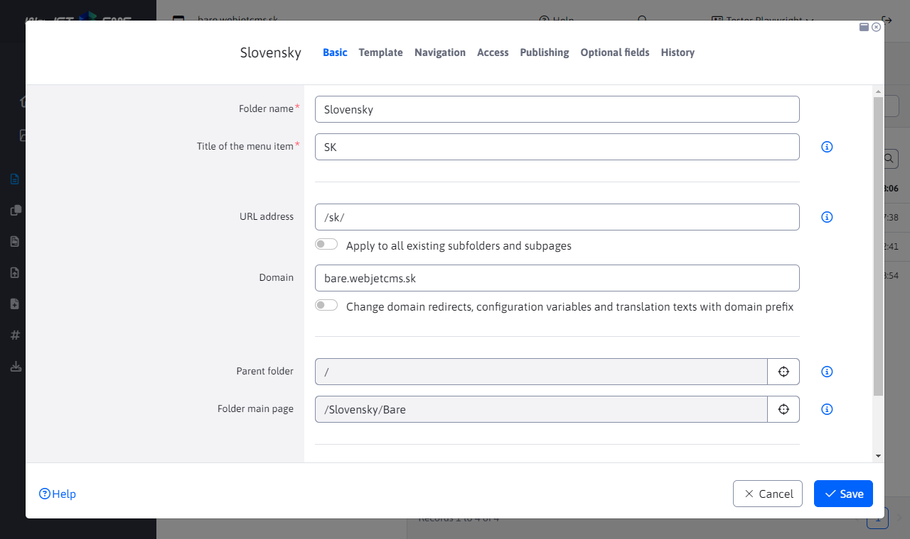
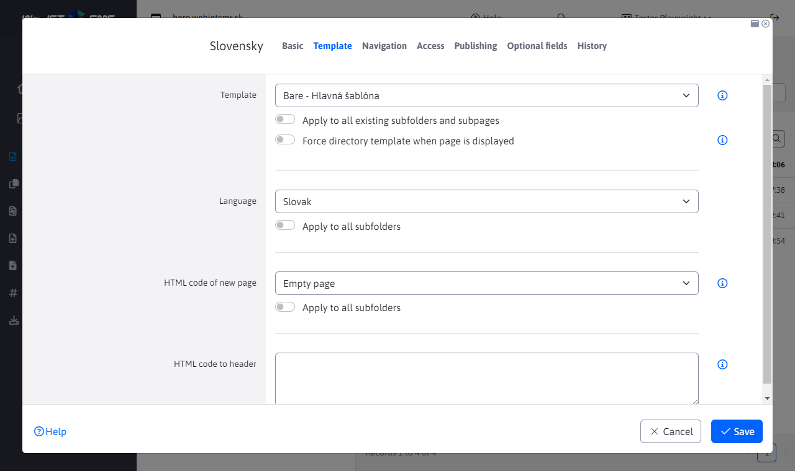

# Web page folder

All pages are arranged in folders and form the tree structure of the site. The folders are sorted according to the order they have set as one of their parameters. The basic structure consists of a main folder, often subdivided according to the language of the site, and can be subdivided arbitrarily by subfolders according to the logical structure of the site.

When you click a folder in the tree structure, the web pages in the selected folder are displayed.

# Basic tab

- Folder name
- Menu item name - the name that will be displayed in the navigation bar (breadcrumb navigation) and in the generated menu of the web page.
- URL - the name that will be used to generate the page address (URL) in this directory. If it contains a / at the beginning, the generated URL will start with the specified address regardless of the parent folder. If the value - is specified, the URL generation will skip that folder.
	- Apply to all existing subfolders and subpages - if you check and save a folder, a new URL will be generated for all subpages of that folder and subfolders.
- Domain - if you are using Multi Domain WebJET and you are editing the root directory, this is where you enter the domain for which the pages in this directory (and subdirectories) are displayed.
	- Change domain redirects, configuration variables, and translation texts with domain prefix - if you change the domain and select this option the domain will also change in existing redirects, configuration variables, and translation keys with the prefix of the original domain.
- Parent folder - the folder that is the parent of this folder. Specifies where this folder will be located in the tree structure.
- Folder home page - the web page that will be used as the main web page of the folder when you click on the folder name in the menu.
- Public folder availability-Specifies whether the folder is a public or nonpublic (internal) folder. The non-public folder is not displayed to normal visitors in the tree structure of the navigation (it is only displayed in the admin area). Pages in the non-public folder are not searchable and do not appear in the menu.

## Card Template

- Template - template for the folder, used to set the template when creating a new page in this folder.
	- Apply to all existing subfolders and subpages - if you check and save the folder, the selected template will be applied to all subpages and subfolders of this folder.
	- Force folder template on page view - if this option is selected, the set template will be ignored on the web page and the set template will be forced to be used in the folder.
- Language - the language of the pages in this folder. The default option is Language is taken from template, where the language setting is taken from the definition of the page template used.
	- Language affects the embedded applications - the texts that the application prints are controlled by the selected language.
	- WebJET also automatically searches for the language versions of the associated headers, footers and menus. If the template has a header named "default header" or "EN-default header", WebJET will automatically search for the "EN-default header" page when displaying a page with the EN language set to "EN-default header".
- HTML code of the new page - determines what will be displayed in the editor when you click the Add Web Page icon. It is either a blank page or a ready-made page from the /System/Templates folder.
- HTML code in subpage headers - optionally you can enter HTML code that will be directly inserted into the HTML code of the web page in this directory. For example, a specific META tag for search engines, or JavaScript code needed for this web page.

## Navigation tab

- Arrangement order - specifies the order in which folders are displayed within the parent folder (in a tree structure).
- Regenerate the order of pages and directories in this directory (including subdirectories) - if selected, adjusts the order of pages and folders to automatically have an incremented ordering value of 10.

- Menu - information how the directory should be displayed in the menu:
	- View - shows the main page and subfolders
	- Do not show - folder and subfolders will not be displayed in the menu
	- Without subfolders - only the main folder page is displayed in the menu
	- Show including web pages - both pages and folders will be displayed in the menu. For all folder pages, the Basic -> View in menu checkbox appears

- Navigation bar - a way to display a folder in the navigation bar (navbar/breadcrumb):
	- Same as the menu - the display is identical to the navigation menu.
	- Show - the folder will always be displayed.
	- Do not show - the folder will not be displayed.

- Sitemap - a way to display a folder in the sitemap:
	- Same as the menu - the display is identical to the navigation menu.
	- Show - the folder will always be displayed.
	- Do not show - the folder will not be displayed.
- Apply to all subfolders - the set value is also applied to existing subfolders.
The display method is divided into logged-in and non-logged-in visitor. You can hide individual menu items if the user is not logged in, or vice versa, e.g. do not show the Login item if the user is logged in.

## Card access

In the access tab, you set permissions for accessing pages in this folder. If you select a user group, the contents of the folder will not be publicly accessible. It will only be available to a logged-in visitor who belongs to one of the selected user groups. ATTENTION: this is not about setting permissions for administrators, but for creating a so-called password-protected section on the web page (for visitors of the page)

- Allow access for a group of users only - if you select a group of users, a user from that group will be required to be logged in to view the page. Assign the page to a bulk email - the page will be available to the bulk email of users in the selected group. It is possible to categorize the sent bulk emails in this way according to the visitors' preferences.
- Login form page - if you have created a special login form page, set it up here. The page is recursively searched to the root directory, so it doesn't need to be set for all folders, just for the root directory.
- Use Basic Setup - deletes the set login page and uses the standard/basic login form.

## Publishing tab

In this tab, you can set to publish the folder save changes to the future. If you set the date and time of the change and select Schedule changes to be made and save the folder, the changes you have made will not take effect immediately, but only after the specified date and time. For example, you can publish a new section of the site only at a certain time. The published version will have the Menu value set to Do not show, so it will not be displayed in the menu yet. In the timed version, for example for tomorrow morning, you set the value to Show. So tomorrow morning the directory will start showing in the menu.

If there is a version scheduled for publication in this tab you will see it and can delete it or load its values into the form.

## Optional Fields tab

Field A - Field D: [optional field](../../frontend/webpages/customfields/README.md) that can be used to pass values to the HTML template.

## History tab

Displays a history of changes to the folder settings with the date and name of the editor who made the change. Click the pencil icon to load the change into the folder editor.

## Synchronise folder name and web page

Configuration variable `syncGroupAndWebpageTitle` set to `true` synchronizes the folder name and the name of the **Main** web site. This means that if the folder name is changed, the main web page name is automatically changed to be the same and vice versa.

However, there are exceptions where this synchronization does not occur even if this configuration variable is enabled.

### Exception 1

An exception occurs for root folders where the folder and page name are not synchronized.

Example: we have a root folder SK and in it a page called Home, the folder name and the web page name are not synchronized.

### Exception 2

This exception occurs if the page is set as **Main** page for **multiple folders**.

Example: we have a folder Language. This folder contains a sub-folder called Slovak. Both folders have the same page set as the main web page (its location is not important). In this case, an exception occurs.

### Exception 3

This exception occurs if **Main** the folder page is not located directly in that folder.

Example: we have a Language folder that contains the Slovak and English pages. We have a second folder News. An exception occurs if the main page of the News folder is the Slovak page, which is located in another folder.
