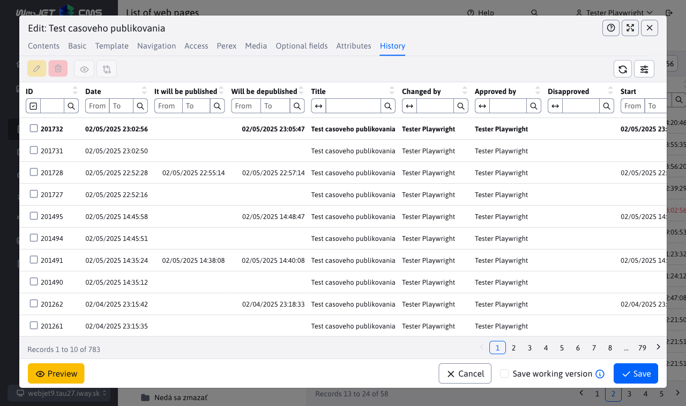
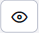
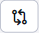

# History

The History tab displays published historical versions of the website and **currently in-progress (not yet published) versions**. When publishing a in-progress version, temporary/working versions of the page are deleted from the history and the published version is kept in the history.

Scheduled versions have the date that the version will/was published displayed in the **Will be published** column. If you have a page scheduled for publication and want to cancel it, simply delete it. Only pages scheduled for publication in the future can be deleted. If you save a new version of a page with the same publication date as an existing scheduled version, the originally scheduled version will be unpublished. Such versions have the date in the **Will be published** column displayed in strikethrough.

Pages that have the **Make page public after this date** option set will display a date in the **Will be disabled** column. At that time, the public view of the website will be disabled (the page will not be available to the public). If you need to cancel the page shutdown, you need to edit the given version and cancel the planned shutdown by saving it again.

The currently published version of the page is highlighted in bold.

The start date and end date columns display the data set in the Perex tab in the page editor.

In the case of page approval/rejection, the name of the user who approved or rejected the version is also displayed.

By selecting a row and clicking on the icon, you can perform the following actions:

-  - Edit page - the selected version is loaded from history into the editor. Allows you to republish an older version of the page.
-  - Delete - deletes the page from history, can only be used for pages with scheduled publishing (they have a filled-in date in **Will be published** and are marked as publishable).
-  - Show page - displays the selected web page from history. Please note that the text of the page is stored in the history, if the template is changed (e.g. in the footer of the page) this will not be reflected when displayed.
-  - Compare page - a new window will appear, divided into two parts with the content of the current and new versions of the page. Both parts are synchronized with each other, so they move simultaneously when you view the content. In the comparison window, you also have the option to highlight changes in the saved version from history compared to the current published version of the web page. This operation is performed by clicking the "Highlight differences" link at the top of the window.