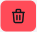
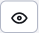
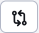

# History of the website

The History tab displays the published historical versions of the web page and **current versions in progress (not yet published)**. When publishing a work-in-progress version, the temporary/working versions of the page are deleted from the history and the published version is kept in the history.

Planned versions (future) have in the column `Bude publikované` the date when the version will be/was published. If you have a page scheduled for publication and want to cancel it, just delete it.

Pages that have the option set `Odverejniť stránku po tomto dátume` show the date in the column `Bude vypnuté`. At that time, the public display of the web page will be disabled (the page will be unavailable to the public). If you need to cancel the shutdown, you need to edit the version and cancel the scheduled shutdown by saving it again.

The bold font highlights the currently published version of the page.

The start date and end date columns show the data set in the Perex tab of the page editor.

In the case of approving/rejecting a page, the name of the user who approved or rejected the version is also displayed.

By selecting a row and clicking on the icon, actions can be performed:
-  - Edit page - the selected version is loaded from the history into the editor. Allows you to republish an older version of the page.
-  - Delete - deletes the page from history, can only be used for pages with scheduled publishing (have the date filled in `Bude publikované`).
-  - View page - displays the selected web page from the history. Please note that the history stores the text of the page, if the template is changed (e.g. in the page footer) this will not be reflected in the display.
-  - Compare page - you will see a new window that is divided into two parts with the content of the current and new version of the page. The two parts are synchronized with each other, so they move at the same time as you view the content. In the compare window, you also have the option to highlight changes to the saved version from the history against the current published version of the web page. This is done by clicking on the "Highlight Differences" link at the top of the window.
