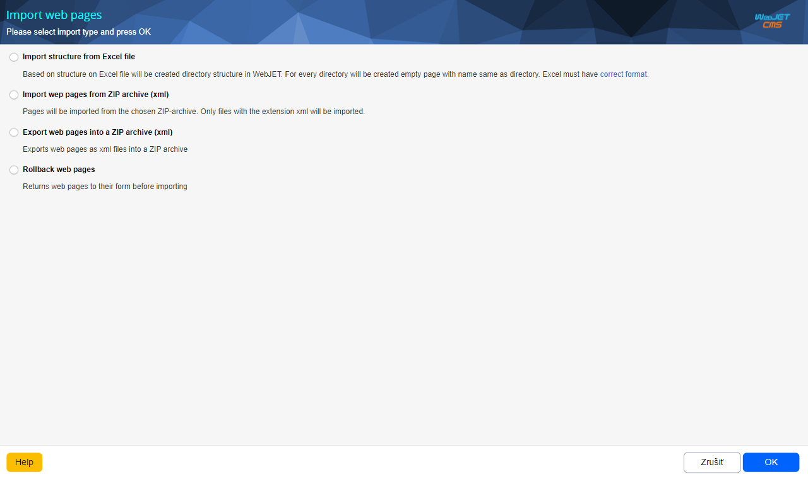
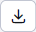
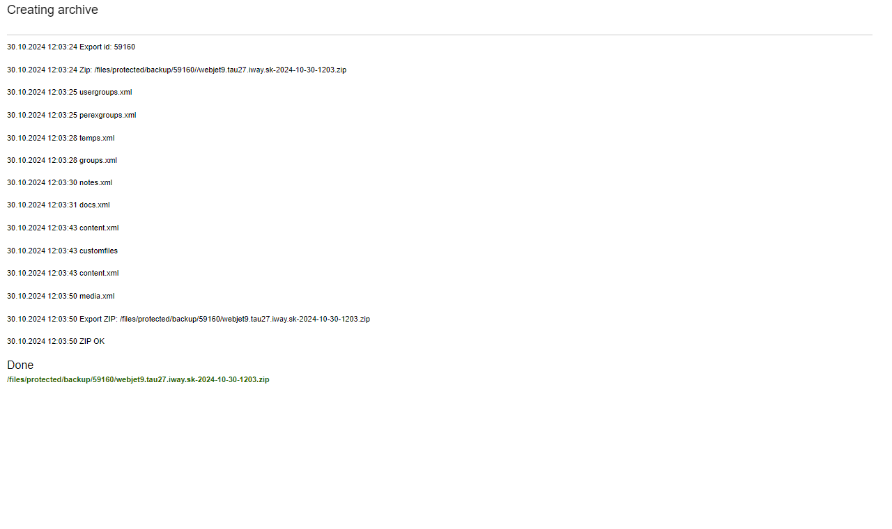
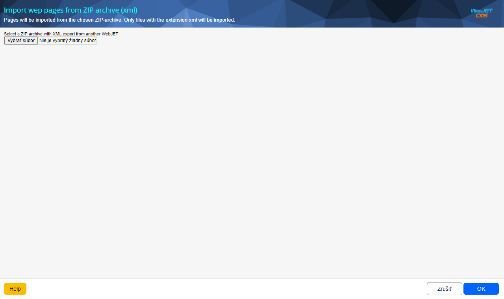
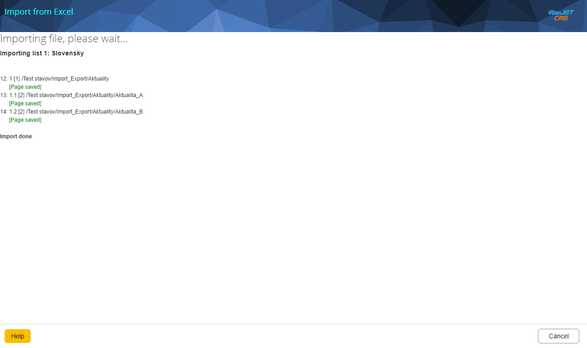

# Import and export of web pages

Export web pages exports web pages including their text, tree structure and embedded images and files. It allows you to easily transfer content between multiple WebJET CMS instances, e.g. between production and test environments. When importing, a window is displayed in which the individual pages are compared, with the option to select the pages that are actually imported. You can thus check and confirm the data before importing it.

If you are preparing a new website, you can prepare a tree structure of the website in advance and import it into WebJET CMS.

## Exporting web pages

First, make sure you are in the directory you want to export. Press  and wait for the window to appear. For standard export of content, select the option in this window **Export web pages to ZIP archive (xml)** and start the export in the selected branch of the page tree button with the text **OK**.

The output should look similar to the following figure. At the very end of the output you will see a link to the downloadable ZIP file. You will download the offered file to your computer. You will then be able to use this file to import on another WebJET CMS environment.

## Importing web pages from a ZIP archive

First, make sure you are in the directory you want to apply the import to. Press the button  and wait for the window to appear. In the window, select the option **Import web pages from ZIP archive (xml)** and press the button with the text **OK**. You will be prompted to upload the ZIP file, which should be in the same state as when it was exported via the **Export web pages to ZIP archive (xml)**. Any experimentation with its content may result in incorrect functioning of the import with the consequence of damaging the resulting content of the web site.

You also have the option to select a value **Sync pages by** to decide which parameter will be used to check whether the page already exists or not. You have the following options:
- **Page name or URL**, it is considered to exist if it is identical in name or URL to another existing page
- **URL addresses**, it is considered existing if it matches in URL with another existing page
- **None**, it doesn't matter the page, she will **always be considered as new**, so you can add duplicates of existing pages
- **Optional field A** / **Optional field B** / **Optional field C**, you have the option to compare pages according to specific values you specify, such as [specially generated ID](../../frontend/webpages/customfields/README.md#unique-identifier). If you set the Unique identifier option at the beginning of the web page creation. each page gets a unique comparison string.

After uploading the zip file and confirming the insertion, click the button with the text **OK** wait for the system to process the file until you see **comparison table for import**.

### Comparison table for import

In the table, the Web pages are listed first, then the Files, followed by other module data, if any were present in the export. The table contains 4 columns:
- **Remote address** - the name of the page/file in the ZIP file
- **Status** - information about whether the same object already exists in the target repository
- **Sync** - a checkbox that defines synchronization only to specific items in the list
- **Local address** - the name and location of the page/file on the target repository (in the WebJET I'm importing to)

There are two check boxes above the table:
- **Create missing templates**
- **Create missing user groups**

!> I leave their ticking up to consideration, but it is recommended to keep them ticked.

**Statistical header**

The header of the page contains an overview of import statistics. It shows an overview of how many folders/pages/files ... have been selected for synchronization. These stats are updated in every change. The header also offers some useful buttons like:
- , marks all available options in the table
- , un-checks all available options in the table
- , hides all web pages belonging to the folder in the table
- , reveals (shows) all web pages belonging to the folder in the table

Once you have scrolled through the entire list and selected the checkboxes on the items you want to sync, you can click the **Sync** at the bottom of the window. This will synchronize the data, publish the new content to the web pages, and overwrite the original files with the new ones.

Used images and files are also exported to the web page. If the Banner, Gallery or Poll application is used in the page, the basic data of these applications is also exported. You can select the data import options for the application.

## Import structure from Excel file

Before importing, make sure that you are in the directory to which you want to apply the import. Press  and wait for the window to appear. In the window, select the option **Import structure from Excel file** and press the button with the text **OK**. You will be presented with the import settings, which will prompt you to enter `XLS` file structure. Remember that **the file must be of type XLS**. It cannot be of the type `XLSX` nor `XLSM` only just XLS. You can download [sample file](import_struct.xls). Other import options are also available:
- Folder ID where to-import files, this option will be preset according to the previously selected folder, but can still be changed (change the destination folder)
- Set priority by level - the priority of the layout is set according to the nesting in the tree structure, the deeper the page is, the higher the priority number will be. The importance of this is when searching and arranging results by priority, so that lower level pages are earlier in the search results - it is assumed that a section page is more important than its sub-page.
- Download an existing page from the server - for created pages it is possible to download text from an existing web site. It is also possible to specify a start and end HTML trim code, by which the text of the page itself is identified in the downloaded HTML code. Only the text itself is downloaded without images and attached files.

Once the file is uploaded and the import settings have been modified, if necessary, the process is started by pressing the button with the text **OK**. According to the structure in the Excel file, the directory structure is imported and empty pages are created in each directory with the same name as the name of the directory.The individual created pages (including the entire address in the structure) are listed in turn. Wait until the entire process is complete and a message is displayed indicating that the import is complete.

