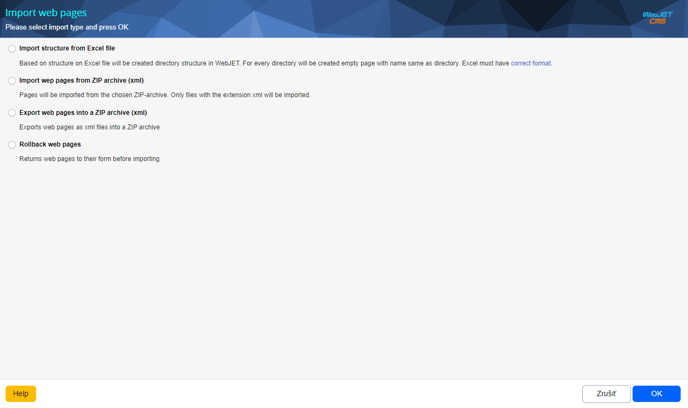
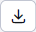
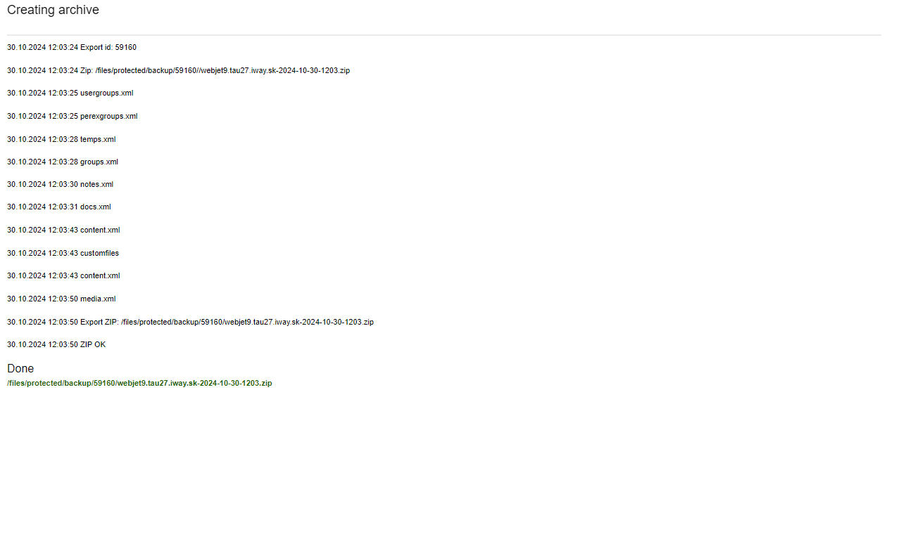
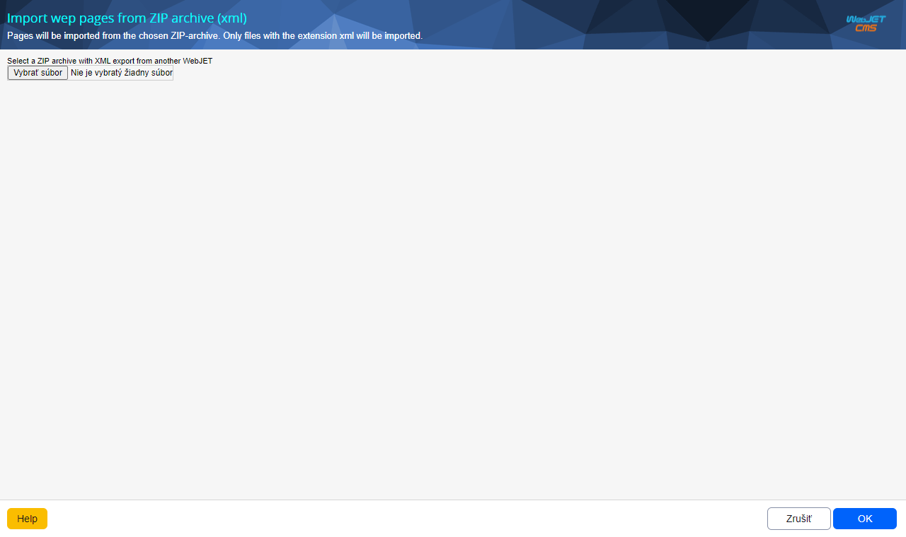
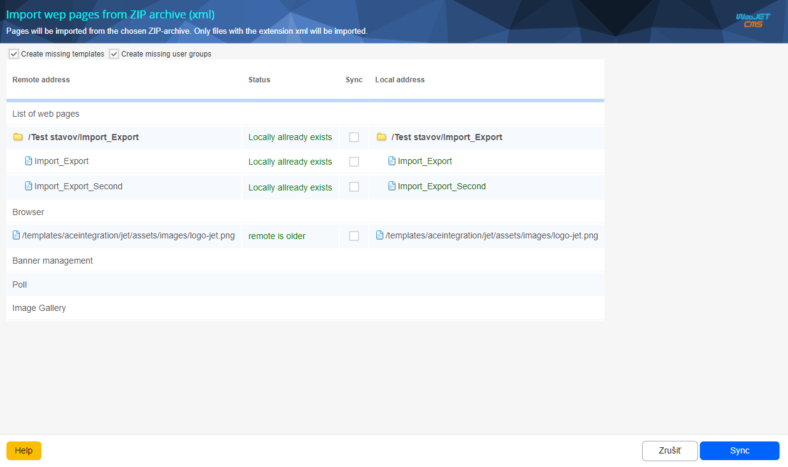
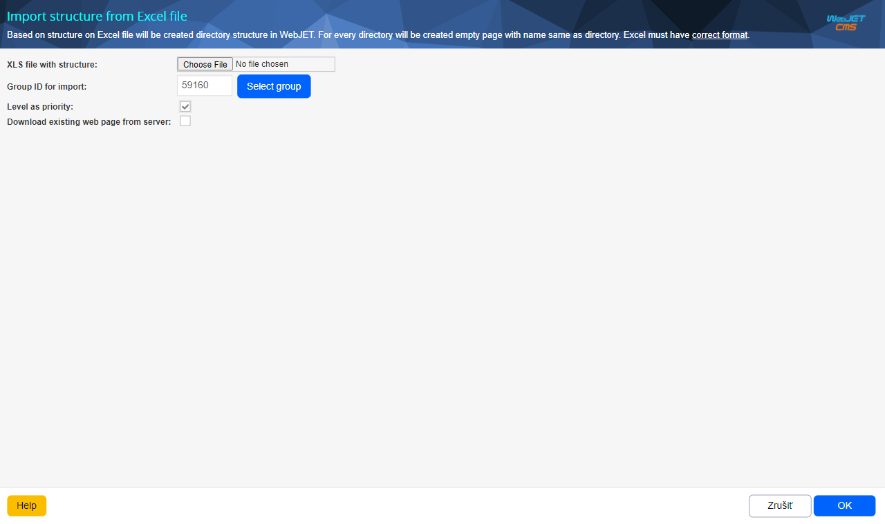
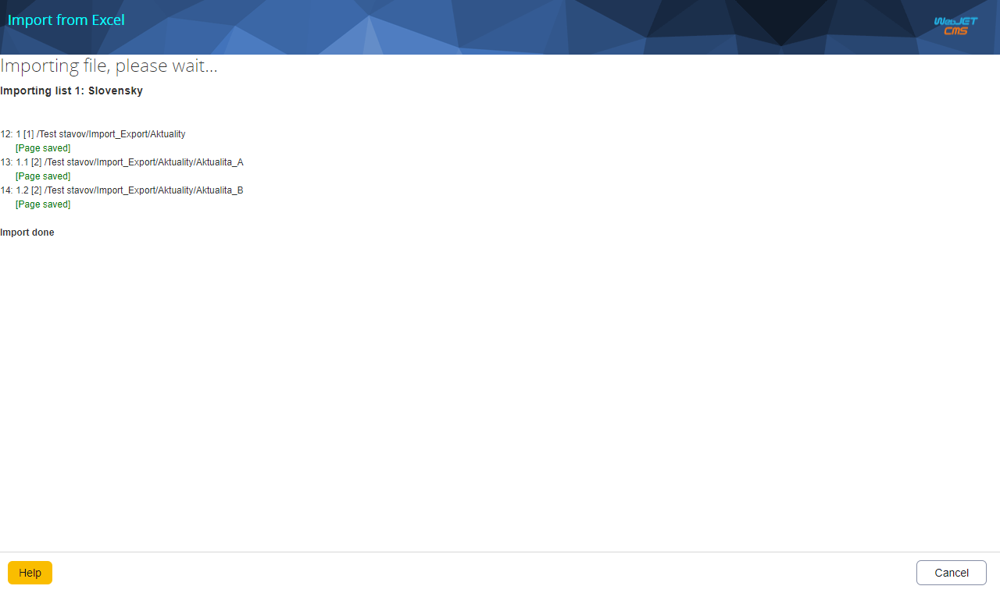

# Import and export of websites

Exporting web pages exports web pages including their text, tree structure and embedded images and files. It allows you to easily transfer content between multiple instances of WebJET CMS, e.g. between production and test environments. During import, a window is displayed in which individual pages are compared with the option to select the pages that will actually be imported. This allows you to check and confirm the data before importing them.

If you are preparing a new website, you can prepare a website tree structure in advance and import it into WebJET CMS.

## Exporting web pages

First, make sure you are in the directory you want to export. Press the  button and wait for the window to appear. For a standard content export, select the **Export web pages to ZIP archive (xml)** option in this window and start the export in the selected branch of the site tree with the button with the text **OK**.

The output should look similar to the following image. At the very end of the output, you will see a link to a downloadable ZIP file. You will download the file to your computer. You can then use this file to import it into another CMS WebJET environment.

## Importing websites from a ZIP archive

First, make sure you are in the directory where you want to apply the import. Press the  button and wait for the window to appear. In the window, select the **Import website from ZIP archive (xml)** option and press the **OK** button. You will be prompted to upload the ZIP file, which should be in the same state as when it was exported via the **Export website to ZIP archive (xml)** option. Any experimentation with its contents may result in the import not working properly, resulting in damage to the resulting website content.

You also have the option to select the value **Synchronize pages by**, which determines which parameter will be used to check whether the page already exists or not.
You have the following options:
- **Page name or URL**, is considered existing if it matches another existing page in name or URL
- **URL address**, considered existing if it matches another existing page in URL address
- **None**, it doesn't matter what page it is, it will **always be considered new**, so you can add duplicates of existing pages
- **Optional field A** / **Optional field B** / **Optional field C**, you have the option to compare pages according to specific values ​​you enter, such as [specially generated ID](../../frontend/webpages/customfields/README.md#unique-identifier). If you set the Unique identifier option at the beginning of creating web pages, each page will receive a unique comparison string.

After uploading the zip file and confirming the insertion with the **OK** button, wait for the system to process the file until it displays the **import comparison table**.

### Import comparison table

The table contains Web pages, then Files, followed by other module data, if any were present in the export. The table contains 4 columns:
- **Remote address** – name of the page/file in the ZIP file
- **Status** – information about whether the same object already exists in the target repository
- **Synchronize** – a checkbox that limits synchronization to only specific items from the list
- **Local address** – name and location of the page/file on the target storage (in WebJET, where I am importing)

There are two checkboxes above the table:
- **Create missing templates**
- **Create missing user groups**

!> I leave their checking for your consideration, but it is recommended to leave them checked.

**Statistical header**

The page header contains an overview of import statistics. It shows an overview of how many folders / pages / files ... have been selected for synchronization. These statistics are updated with each change.
The header also offers several useful buttons such as:
- , selects all available options in the table

- , deselects all available options in the table

- , hides all web pages belonging to a folder in the table

- , reveals (shows) all web pages belonging to a folder in the table

After going through the entire list and selecting the checkboxes for the items you want to synchronize, you can click the **Synchronize** button at the bottom of the window. This will synchronize the data, publish the new content to the website, and overwrite the original files with the new ones.

The images and files used on the website are also exported. If the Banner System, Gallery, or Survey application is used on the page, the basic data of these applications is also exported. You can select the data import options for the given application.

## Import structure from Excel file

Before importing, make sure you are in the directory where you want to apply the import. Press the  button and wait for the window to appear. In the window, select the **Import structure from Excel file** option and press the **OK** button. You will see the import settings, which will prompt you to enter the `XLS` file with the structure. Remember that **the file must be of type XLS**. It cannot be of type `XLSX` or `XLSM`, only XLS. You can download the [sample file](import_struct.xls). Other import options are also available:

- ID of the folder where the files are imported, this option will be preset according to the previously selected folder, but it can still be changed (change the destination folder)
- Set priority by level - the sorting priority is set according to the nesting in the tree structure, the deeper the page is, the higher the priority number will be. This is important when searching and sorting results by priority, so that pages at a lower level are earlier in the search results - it is assumed that a section page is more important than its sub-page.
- Download existing page from server - for created pages it is possible to download text from an existing website. It is also possible to enter the starting and ending HTML trimming code, according to which the text of the page itself is identified in the downloaded HTML code. Only the text itself is downloaded without images and attached files.

After uploading the file and possibly adjusting the import settings, the process is started by pressing the button with the text **OK**. According to the structure in the Excel file, the directory structure is imported and empty pages are created in each directory with the same name as the directory name. The individual created pages will be listed gradually (even with the entire address in the structure). Wait until the entire process is finished and a message is displayed stating that the import is complete.

