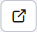

# Check for links and empty pages

> In the web pages, after selecting a folder and then pressing the button  will display a table with a list of broken links and empty pages.

The application will check links and web pages from the selected folder and also from all subfolders. The result will be displayed in 3 tabs:
- Broken links - links that do not exist. Only local links are checked, not links to external sites (starting with http).
- Disabled pages - pages that have their display disabled.
- Blank pages - pages that are blank (less than 100 characters, this number can be set in the conf. variable `linkCheckEmptyPageSize`).

All tabs contain a table showing the website and a description of the error. The table contains columns:
- ID - `id` website (`docid`).
- Page - path (folder structure) and name of the web page. Click on the link to display the editing web page.
- Error - description of the error found when checking the link and page.
- Url address - URL address of the broken link, or URL address of the page (in the Blank Pages tab). Clicking on the link opens the displayed Url address in a new window.
