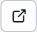
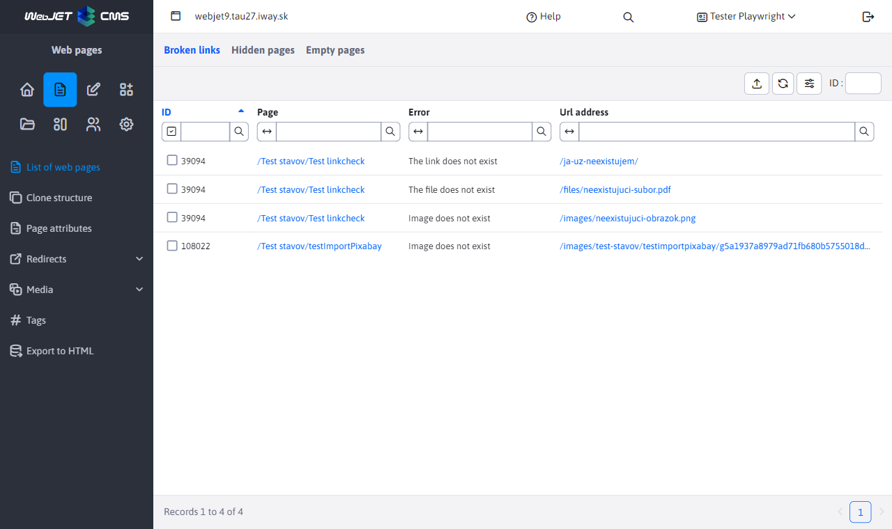

# Checking links and blank pages

> In web pages, after selecting a folder and then pressing the  button, a table with a list of broken links and empty pages will be displayed.

The application will check links and web pages from the selected folder and also from all subfolders. The result will be displayed in 3 tabs:

- Broken links - links that do not exist. Only local links are checked, not links to external sites (starting with http).
- Pages with display disabled - pages that have their display disabled.
- Empty pages - pages that are empty (have less than 100 characters, this number can be set in the config variable ```linkCheckEmptyPageSize```).



All tabs contain a table showing the website and a description of the error. The table contains the following columns:

- ID - ```id``` website (```docid```).
- Page - path (folder structure) and name of the web page. Clicking on the link will display the web page editing.
- Error - description of the error found when checking the link and page.
- Url address - URL address of the broken link, or URL address of the page (in the Empty Pages tab). Clicking on the link will open the displayed Url address in a new window.