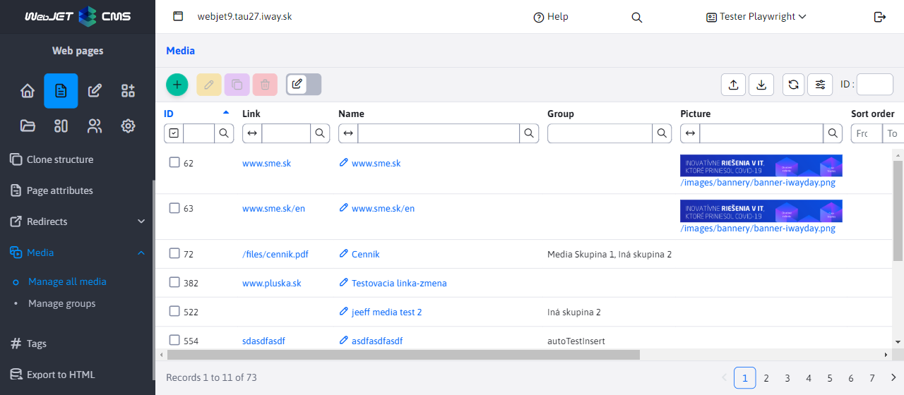
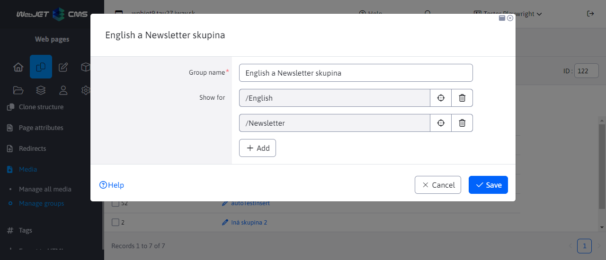

# Media

## Display on the website

Media is used to associate related files/images/links to the current page.

They are displayed in the web page editor in the media tab, where you can enter a Name, group (media can be sorted into multiple groups according to your needs), a link to the file/page, a preview image (if necessary), and the sorting priority.

Media can be used for various purposes:

- list of related files to the page
- list of related pages to the current page
- list of audio/video files for the page (images, animations, videos)


In a page/template, it is possible to get a list of media by page ID and media group in the Media application.

Warning: the media application only displays media:

- Referencing an existing file (if the file is deleted, the media will automatically stop displaying).
- Inserted before the date and time the web page was saved (after adding new media, save the web page to view it). This allows you to time the display of new media - simply add it to the web page, set its time display to the future, and the added media will only be displayed after the web page is published at the time.

## Manage all media

In the Web pages/Media/Manage all media menu, you can search and manage all media **across all web pages** in the currently displayed domain. When filtering, you can enter its name, or the full path, or even the page ID (docid) directly in the Web page field.



When editing/creating a new media, it is necessary to enter the media name and select a website using the tree structure.


Displaying this option **requires** the "Media - Manage all media" right.

## Media group management

Using media groups, you can organize your submitted media into groups. For example, "Downloads" or "Related Links". They are managed in the Web pages/Media/Group management menu and **require the right** "Media - Group management".

Using the Media application, you can then display the website's media according to the selected media group on the website (or in the template, e.g. in the right menu, or under the website text).

A media group can have a restriction set to display the group only in a certain website directory.



## Implementation details

All Media records are filtered by the currently selected domain.

In the case of records from **All media management**, the table name parameter is set to **documents** automatically in the background. To identify whether the data table is being called from this section, the url parameter ```isCalledFromTable=true``` is provided.