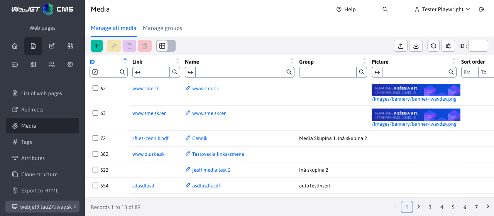
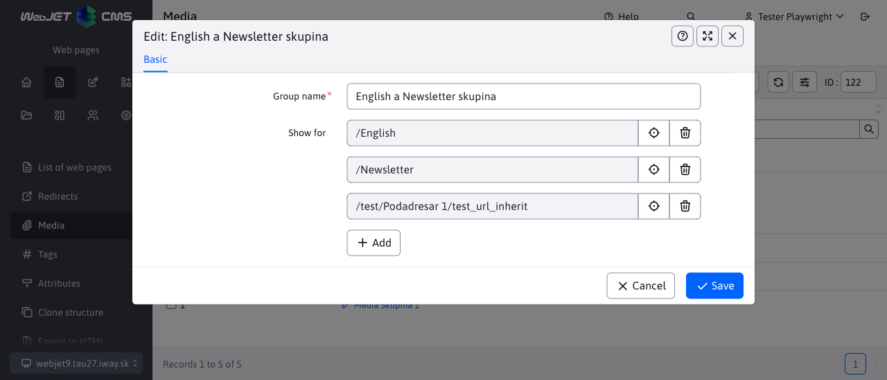

# Media

## Display in web page

Media is used to associate related files/images/links to the current page.

They are displayed in the media tab of the web page editor, where you can specify a Name, a Group (media can be sorted into multiple groups as needed), a link to the file/page, a thumbnail image (if needed), and a layout priority.

The media can be used for a variety of purposes:
- list of related files to the page
- list of related pages to the current page
- list of audio/video files for the page (images, animations, videos)

In the page/template, you can get a list of media by page ID and media group in the Media application.

Note: the media app only displays media:
- Referring to an existing file (if the file is deleted the media will automatically stop displaying).
- Inserted before the date and time the web page was saved (after adding new media, save the web page to view it). This allows you to time the display of new media - simply add it to the web page, set the timed display for the future, and the added media will be displayed after the web page is published on time.

## Manage all media

In the menu Web pages/Media/Manage all media you can search and manage all media **across all websites** in the currently displayed domain. When filtering, you can enter the name of the Web page, or the full path, or even the page ID (docid) directly.

When editing/creating a new media, it is necessary to enter a media name and select a web page using the tree structure.

View this option **required by law** "Media - Manage all media".

## Manage media groups

You can organize the media you enter into groups using Media Groups. For example, "Downloads" or "Related Links". They are managed in the menu Web pages/Media/Manage groups and **require the right** "Media - Group Management".

Use the Media application to display the media of the web page according to the selected media group (or in the template, e.g. in the right menu or below the text of the web page).

A media group can have a restriction set to show the group only in a specific directory of web pages.

## Implementation details

All Media records are filtered by the currently selected domain.

In the case of records from `Správa všetkých médií` the table name parameter is set to the value **documents** automatically in the background. The url parameter ensures that the datatable is called from this section `isCalledFromTable=true`.
