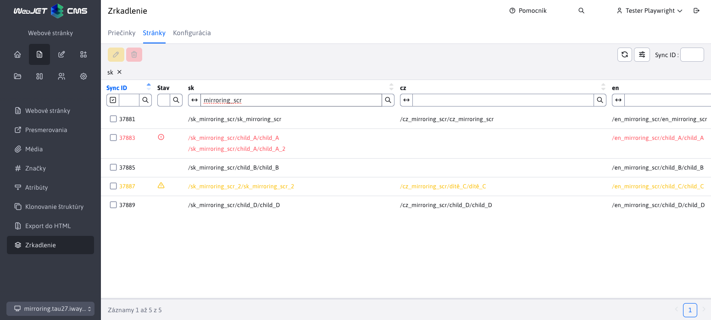
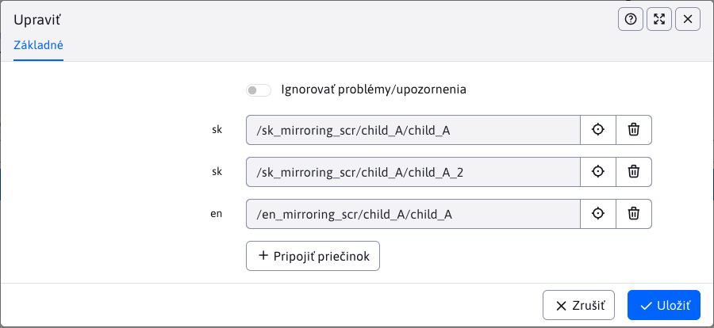
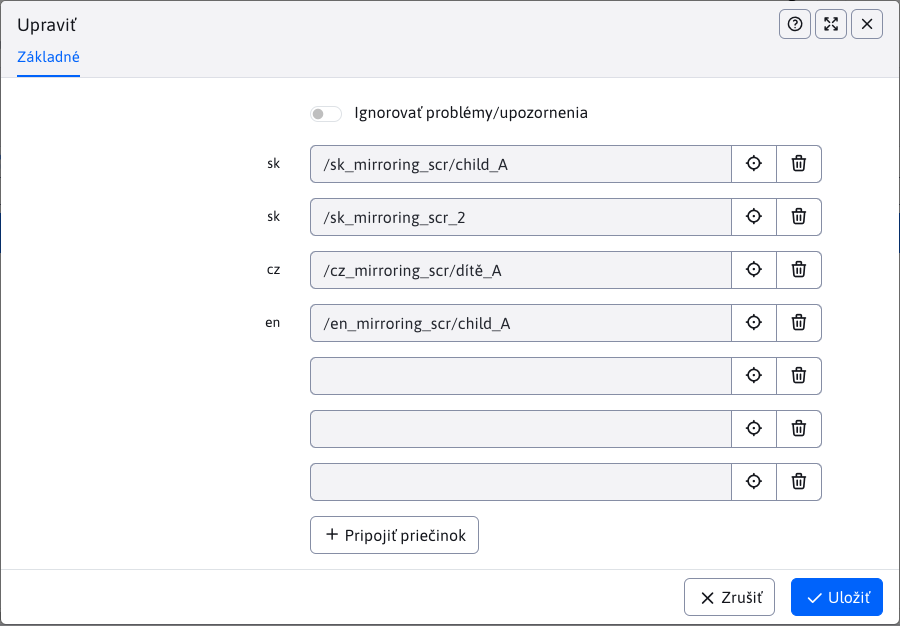

# Website

The section contains an overview of linked pages under a common synchronization identifier `syncId`.

## Table structure

To be able to read the table, we need to understand the structure of the table, where:
- **Lines**, each row contains all pages (more precisely, paths to pages) that are linked together by the same parameter value `syncId` (minimum one page)
- **Columns** are divided as follows:
  - **SyncID**, the value of the synchronization identifier by which the pages in the row are bound
  - **Status**, icons that draw attention to special states (see more in [the state of binding](./docs#the-state-of-binding))
  - **en, en, ...**, columns are automatically generated, where each column contains the pages for that language. This language is obtained from the page's parent folder or its template. The number of columns in the table varies dynamically and depends on how many language mutations the pages are linked in. If a value is missing in a column, it does not exist for that `syncId` a linked page in a given language.

!>**Warning:** in the case of multiple linked pages with the same value `syncId` and in the same language mutation, their values will be concatenated in the column for that language mutation, so that the value in the column will contain paths to multiple pages.

## Binding status

Column **Status** offers a quick overview of the binding status using icons. It supports the following states:
- <i class="ti ti-exclamation-circle" style="color: #ff4b58;" ></i>, the icon corresponding to the state **Bad mapping**. Page binding will take this state if multiple linked pages are found in the same language.
- <i class="ti ti-alert-triangle" style="color: #fabd00;" ></i>, the icon corresponding to the state **Uneven nesting**. Page rebinding takes this state if the depth of the rebound pages differs from the root folder.
- **nothing**, no icon is displayed if the binding is correct (does not fall into the preceding states)

### Bad mapping

Since only pages with the same content in a different language should be linked, it doesn't make sense to have multiple pages linked in the same language. Therefore, such bindings are evaluated as **poor mapping**.

### Uneven nesting

Since the same structures should be linked, different depths of the parent directories of the linked pages indicate an error between the structures. Compared to **poor mapping** it may not be a bug right away, such bindings are marked for better searching of possible bugs.

## Deleting/canceling a rebinding

When deleting/cancelling the entire binding, the existing synchronization parameter is lost `syncId` as he has nothing to tie up.

## Editing the binding

When editing a rebind, each rebinded page will be displayed as a page picker with the language abbreviation as a label.

In the following picture we can see an example **bad mapping** where multiple pages in the same language are linked, specifically in the case of `sk` Language.

### Change pages

When editing, the linked pages can be changed. In this case, the synchronization parameter will be removed from the replaced page `syncId` and a parameter is added to the newly selected page `syncId`.

For the selected site is not allowed:
- duplicate election of the same page
- selecting the page with the set `syncId` (other than the currently edited ones, of course). If you still insist on rebinding the page, you must first unbind the current page (remove `syncId`) and then you can link it to other pages (add new `syncId`).
- selection of multiple pages in the same language (error [poor mapping](./docs#poor-mapping))
- selection of pages at different depths (error [uneven nesting](./docs#uneven-nesting))

Each of these errors shall be checked. If such an error occurs when attempting to change, the action will be blocked.

!>**Warning:** editor provides the possibility **Ignore problems/warnings**. By selecting this option, you can also save records that contain errors **poor mapping** a **uneven nesting**. You can switch this protection off at your own risk if the situation requires it.

### Adding a page

The table does not allow the creation of a completely new binding (a new `syncId`), but allows adding (linking) new pages to existing ones. In the editor, when editing a record, there is a button

<button id="add-sync-btn" class="btn btn-outline-secondary" onclick="showNewSelector(groupsMirroringTable)">
  <i class="ti ti-plus" ></i>

   Attach folder 
</button>

which you can use to add new fields for selecting pages. When you display the maximum number of allowed fields (allowed bindings) the button will be hidden.

### Removing the rebinding

You can virtually remove the entire rebinding with a page change action. This situation occurs when you remove all the linked pages.
