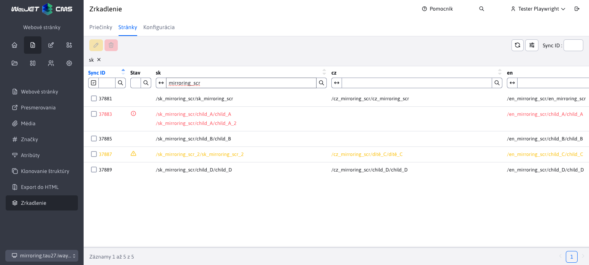
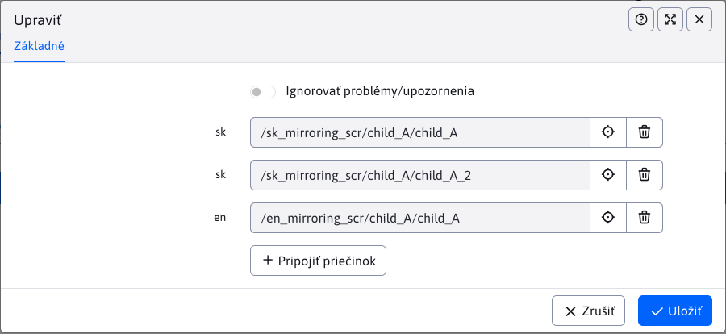

# Pages

The section contains an overview of linked pages under the common synchronization identifier `syncId`.

## Table structure

To be able to read a table, we need to understand the structure of the table, where:

- **Rows**, each row contains all pages (more precisely, paths to pages) that are linked to each other by the same value of the parameter `syncId` (at least one page)
- **Columns** are divided as follows:
  - **SyncID**, the value of the synchronization identifier by which the pages in the row are linked
  - **Status**, icons that indicate special states (more in the [binding status] section(./docs#binding-status))
  - **sk, en, ...**, are automatically generated columns, where each column contains pages for a given language mutation. This language is obtained from the page's parent folder or its template. The number of columns in the table changes dynamically and depends on how many language mutations the pages are linked to. If the value in the column is missing, then there is no linked page for the given `syncId` in the given language mutation.

!>**Warning:** If there are multiple linked pages with the same `syncId` value and in the same language mutation, their values ​​will be combined in the column for the given language mutation, so the value in the column will contain paths to multiple pages.

## Binding status

The **Status** column provides a quick overview of the binding status using icons. It supports the following states:

-<i class="ti ti-exclamation-circle" style="color: #E00028;"></i> , the icon responsible for the **Bad mapping** status. Linking pages will acquire this status if multiple linked pages in the same language mutation appear.
-<i class="ti ti-alert-triangle" style="color: #fabd00;"></i> , the icon responsible for the **Uneven nesting** status. Linking pages will acquire this status if the linked pages are at different depths from the root folder.
- **nothing**, no icon is displayed if the binding is correct (does not fall into the previous states)

### Bad mapping

Since only pages with the same content in a different language variant should be linked, it makes no sense to have multiple pages in the same language variant linked. Therefore, such linking is evaluated as **bad mapping**.

### Uneven nesting

Since the linked structures should be the same, different depths of the parent directories of the linked pages indicate an error between the structures. Unlike **bad mapping**, this may not necessarily be an error, such links are marked for better detection of potential errors.

## Delete/Unlink

When deleting/unlinking the entire binding, the existing synchronization parameter `syncId` disappears, as it no longer has anything to bind.

## Editing binding

When editing a link, each linked page is displayed as a page selection field with the language abbreviation as a label.

In the following image we can see an example of **bad mapping**, where multiple pages in the same language mutation are linked, specifically in the case of the `sk` language.

### Changing pages

When editing, linked pages can be changed. In this case, the synchronization parameter `syncId` will be removed from the replaced page and the parameter `syncId` will be added to the newly selected page.

The following is not allowed for the selected pages:

- duplicate selection of the same page
- selecting a page with `syncId` set (of course different from the one currently being edited). If you still insist on linking the given page, you must first cancel its current linking (remove `syncId`) and only then can you link it to other pages (add a new `syncId`).
- selecting multiple pages in the same language mutation (error [bad mapping](./docs#bad-mapping))
- selecting pages at different depths (error [uneven nesting](./docs#uneven-nesting))

Each of these errors is checked. If such an error occurs when attempting to make a change, the action will be blocked.

!>**Warning:** the editor provides an option to **Ignore issues/warnings**. By selecting this option, you can also save records that contain **bad mapping** and **uneven nesting** errors. You can disable this protection at your own risk if the situation requires it.

### Adding a page

The table does not allow you to create a completely new link (new `syncId`) but allows you to add (link) new pages to existing ones. In the editor, when editing a record, there is a button

<button id="add-sync-btn" class="btn btn-outline-secondary" onclick="showNewSelector(groupsMirroringTable)">
    <i class="ti ti-plus"></i>
    Attach folder
</button>

which allows you to add new fields for page selection. When you display the maximum number of fields allowed (allowed bindings), the button is hidden.

### Removing binding

By changing the page action, you can practically remove the entire link. This situation occurs when you remove all linked pages.