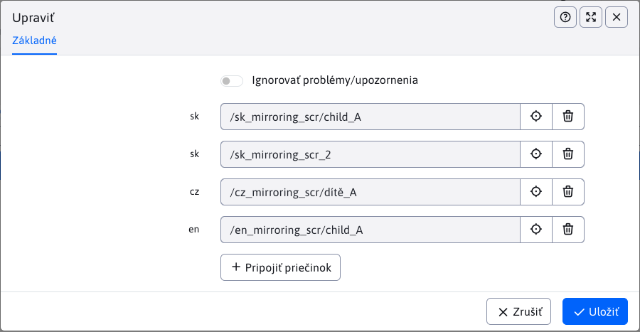

# Folders

The section contains an overview of linked folders under a common synchronization identifier `syncId`.

## Table structure

To be able to read the table, we need to understand the structure of the table, where:
- **Lines**, each row contains all folders (more precisely folder paths) that are linked together by the same parameter value `syncId` (at least one folder)
- **Columns** are divided as follows:
  - **SyncID**, the value of the synchronization identifier by which the folders in the row are bound
  - **Status**, icons that draw attention to special states (see more in [the state of binding](./groups#the-state-of-binding))
  - **en, en, ...**, columns are automatically generated, where each column contains folders for the given language mutation. This language is obtained from a folder or folder template. The number of columns in the table varies dynamically and depends on how many language mutations the linked folders are in. If a value is missing in a column, it does not exist for that `syncId` a linked folder in that language.

!>**Warning:** in the case of multiple linked folders with the same value `syncId` and in the same language mutation, their values will be concatenated in the column for that language mutation, so that the value in the column will contain paths to multiple folders.

## Binding status

Column **Status** offers a quick overview of the binding status using icons. It supports the following states:
- <i class="ti ti-exclamation-circle" style="color: #ff4b58;" ></i>, the icon corresponding to the state **Bad mapping**. A bind folder will take on this state if multiple bind folders in the same language are discovered.
- <i class="ti ti-alert-triangle" style="color: #fabd00;" ></i>, the icon corresponding to the state **Uneven nesting**. The rebinding folder acquires this state if the depth of the rebinding folder differs from the root folder.
- **nothing**, no icon is displayed if the binding is correct (does not fall into the preceding states)

### Bad mapping

Since only folders with the same content in a different language should be linked, it doesn't make sense to have multiple folders linked in the same language. Therefore, such bindings are evaluated as **poor mapping**.

### Uneven nesting

Since the interleaved structures should be the same, different depths of the interleaved folders indicate an error between structures. Compared to **poor mapping** it may not be a bug right away, such bindings are marked for better searching of possible bugs.

## Deleting/canceling a rebinding

When deleting/cancelling the entire binding, the existing synchronization parameter is lost `syncId` as he has nothing to tie up. For each folder that has been rebound, the action is performed **unbinding the folder**.

### Unbinding a folder

The unbind folder action cascades to remove the synchronization parameter `syncId` for the selected folder as well as each of its subfolders. This change also affects the pages in these folders, which also lose the set `syncId`.

## Editing the binding

When editing a rebind, each rebind folder will be displayed as a page directory selection box with the language abbreviation as a label.

In the following picture we can see an example **bad mapping** where multiple folders in the same language are linked, specifically in the case of `sk` Language.

### Change folders

When editing, the linked folders can be changed. In this case, the synchronization parameter will be removed from the replaced folder `syncId`, an action is invoked on the folder [unbinding the folder](./groups#unbinding-the-folder) and a parameter is added to the newly-selected folder `syncId`.

It is not enabled for the selected folders:
- duplicate election of the same folder
- selecting a folder with the set `syncId` (other than the currently edited ones, of course). If you still insist on rebinding the folder, you must first unbind the current rebinding (remove the `syncId`) and then you can bind it to another folder (add new `syncId`).
- selecting multiple folders in the same language (error [poor mapping](./groups#poor-mapping))
- selection of folders at different depths (error [uneven nesting](./groups#uneven-nesting))

Each of these errors shall be checked. If such an error occurs when attempting to change, the action will be blocked.

!>**Warning:** editor provides the possibility **Ignore problems/warnings**. By selecting this option, you can also save records that contain errors **poor mapping** a **uneven nesting**. You can switch this protection off at your own risk if the situation requires it.

### Adding a folder

The table does not allow the creation of a completely new binding (a new `syncId`), but allows adding (linking) new folders to existing ones. In the editor, when editing a record, there is a button

<button id="add-sync-btn" class="btn btn-outline-secondary" onclick="showNewSelector(groupsMirroringTable)">
  <i class="ti ti-plus" ></i>

   Attach folder 
</button>

which you can use to add new fields for selecting site directories. When you display the maximum number of allowed fields (allowed bindings) the button will be hidden.

### Removing the rebinding

You can virtually remove the entire rebinding with a folder change action. This situation occurs when you delete all of the rebound folders.
