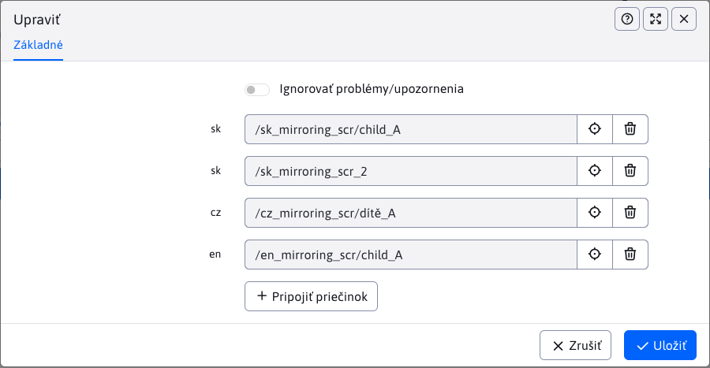
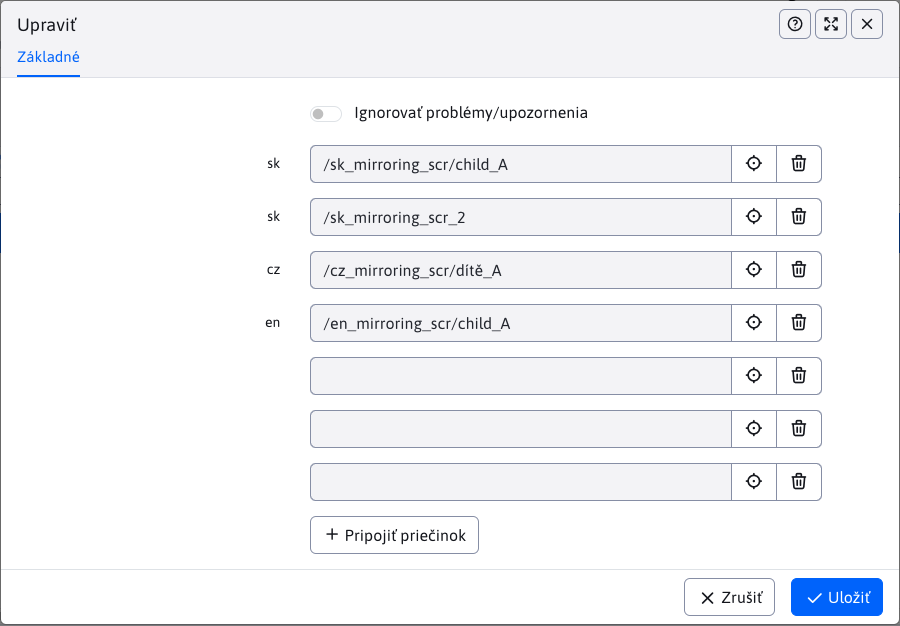

# Folders

The section contains an overview of linked folders under the common synchronization identifier `syncId`.

## Table structure

To be able to read a table, we need to understand the structure of the table, where:

- **Lines**, each line contains all folders (more precisely, folder paths) that are linked to each other by the same value of the parameter `syncId` (at least one folder)
- **Columns** are divided as follows:
  - **SyncID**, the value of the synchronization identifier by which the folders in the row are linked
  - **Status**, icons that indicate special states (more in the [link status](./groups#link-status) section)
  - **sk, en, ...**, are automatically generated columns, where each column contains folders for a given language mutation. This language is obtained from a folder or folder template. The number of columns in the table changes dynamically and depends on how many language mutations the linked folders are in. If the value in the column is missing, then there is no linked folder for the given `syncId` in the given language mutation.

!>**Warning:** if there are multiple linked folders with the same `syncId` value and in the same language mutation, their values ​​will be combined in the column for the given language mutation, so the value in the column will contain paths to multiple folders.

## Binding status

The **Status** column provides a quick overview of the binding status using icons. It supports the following states:

-<i class="ti ti-exclamation-circle" style="color: #E00028;"></i> , the icon responsible for the **Bad Mapping** status. A folder link will acquire this status if multiple linked folders in the same language mutation are found.
-<i class="ti ti-alert-triangle" style="color: #fabd00;"></i> , the icon responsible for the **Uneven nesting** status. A folder link will acquire this status if the depth of the linked folders from the root folder is different.
- **nothing**, no icon is displayed if the binding is correct (does not fall into the previous states)

### Bad mapping

Since only folders with the same content in a different language mutation should be linked, it makes no sense to have multiple folders in the same language mutation linked. Therefore, such links are evaluated as **bad mapping**.

### Uneven nesting

Since the same structures should be linked, different depths of linked folders indicate an error between the structures. Unlike **bad mapping**, this may not necessarily be an error, such links are marked for better detection of potential errors.

## Delete/Unlink

When deleting/unlinking the entire link, the existing synchronization parameter `syncId` is lost, as it has nothing to link anymore. For each folder that was linked, the **unlink folder** action is performed.

### Unlinking a folder

The unlink folder action will cascadely remove the `syncId` synchronization parameter for the selected folder as well as any of its subfolders. This change also affects pages in those folders, which will also lose the `syncId` setting.

## Editing binding

When editing a link, each linked folder is displayed as a page directory selection field with the language abbreviation as a label.

In the following image we can see an example of **bad mapping**, where multiple folders in the same language mutation are linked, specifically in the case of the `sk` language.

### Changing folders

When editing, linked folders can be changed. In this case, the synchronization parameter `syncId` will be removed from the replaced folder, the [unlink folder] action (./groups#unlink-folder) will be invoked on the folder, and the parameter `syncId` will be added to the newly selected folder.

The following is not allowed for the selected folders:

- duplicate selection of the same folder
- selecting a folder with `syncId` set (of course different from the one currently being edited). If you still insist on linking the given folder, you must first cancel its current link (remove `syncId`) and only then can you link it to another folder (add a new `syncId`).
- selecting multiple folders in the same language mutation (error [bad mapping](./groups#bad-mapping))
- selecting folders at different depths (error [uneven nesting](./groups#uneven-nesting))

Each of these errors is checked. If such an error occurs when attempting to make a change, the action will be blocked.

!>**Warning:** the editor provides an option to **Ignore issues/warnings**. By selecting this option, you can also save records that contain **bad mapping** and **uneven nesting** errors. You can disable this protection at your own risk if the situation requires it.

### Adding a folder

The table does not allow creating a completely new link (new `syncId`) but allows adding (linking) new folders to existing ones. In the editor when editing a record there is a button

<button id="add-sync-btn" class="btn btn-outline-secondary" onclick="showNewSelector(groupsMirroringTable)">
    <i class="ti ti-plus"></i>
    Attach folder
</button>

which allows you to add new fields for selecting site directories. When you display the maximum number of fields allowed (allowed bindings), the button is hidden.

### Removing binding

By changing the folder action, you can practically remove the entire link. This situation occurs when you remove all linked folders.