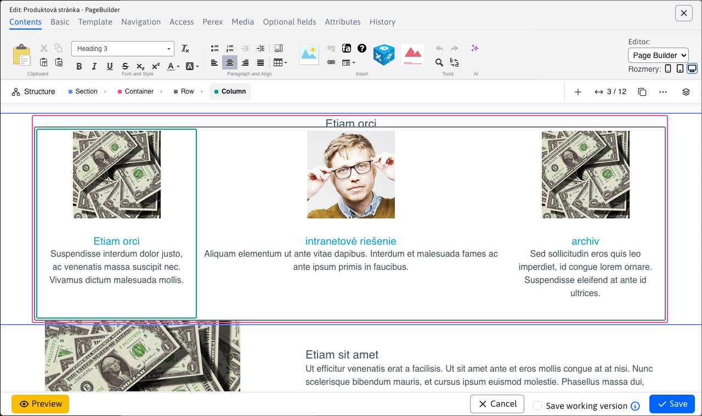
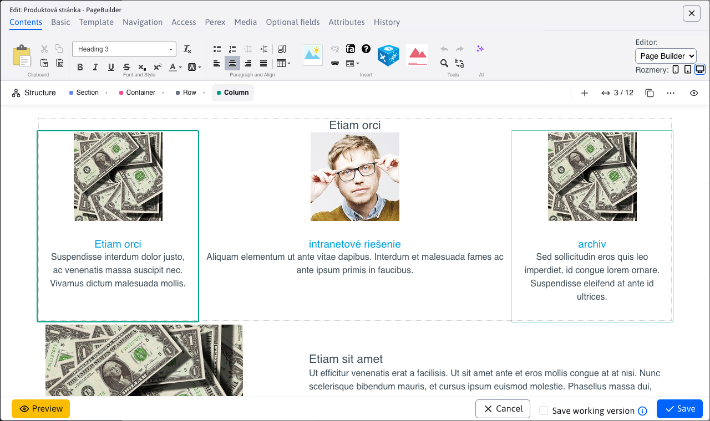
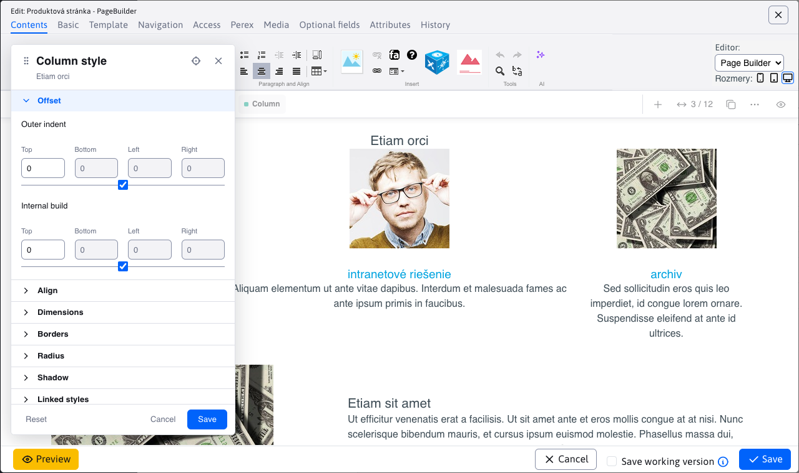
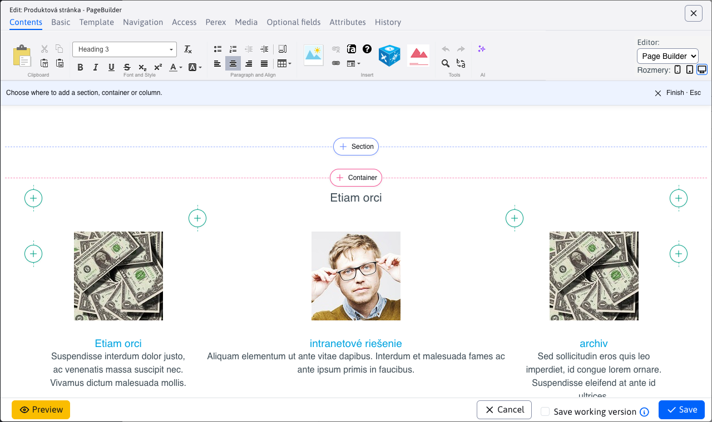
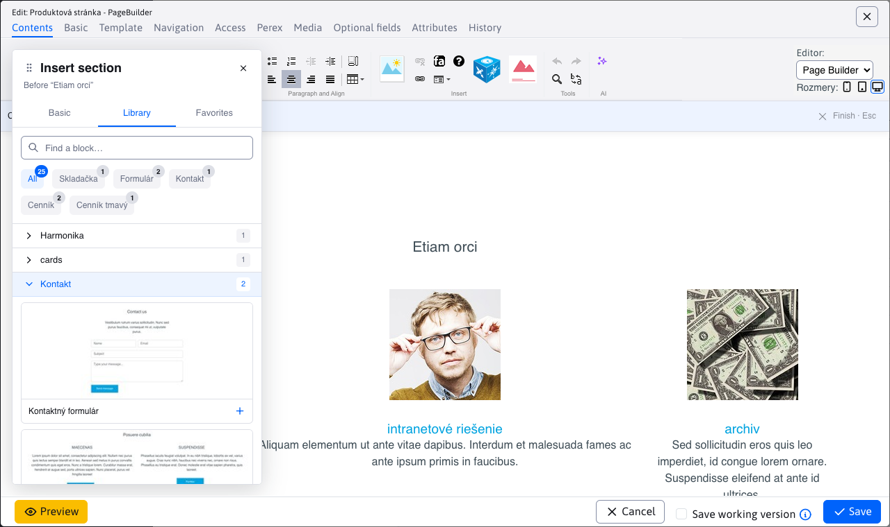
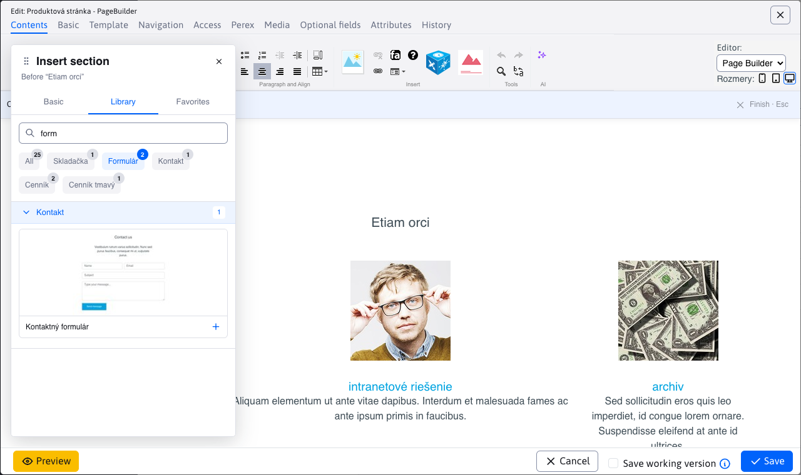
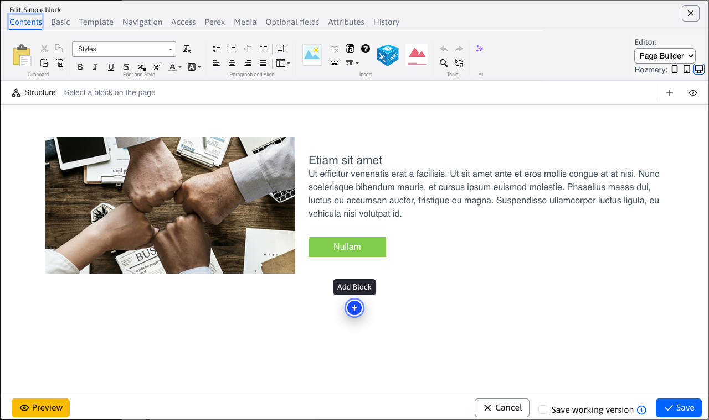
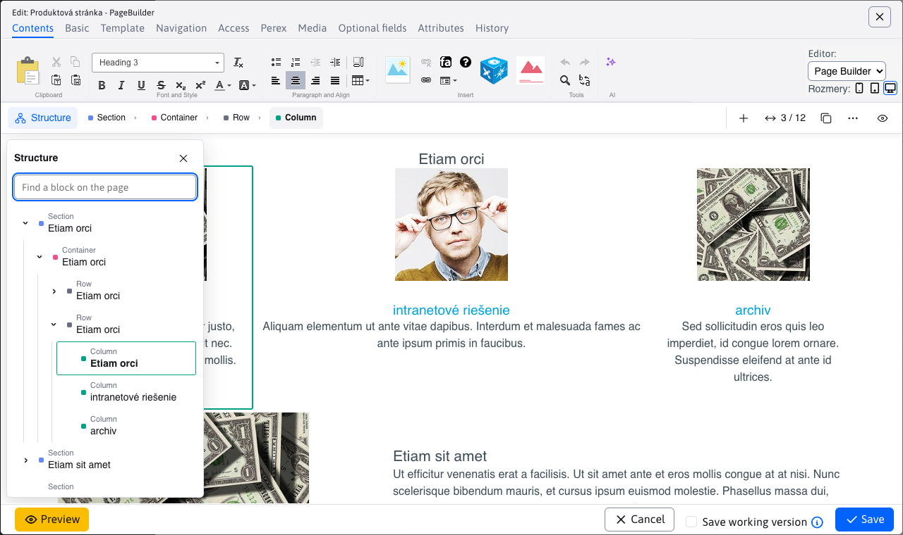
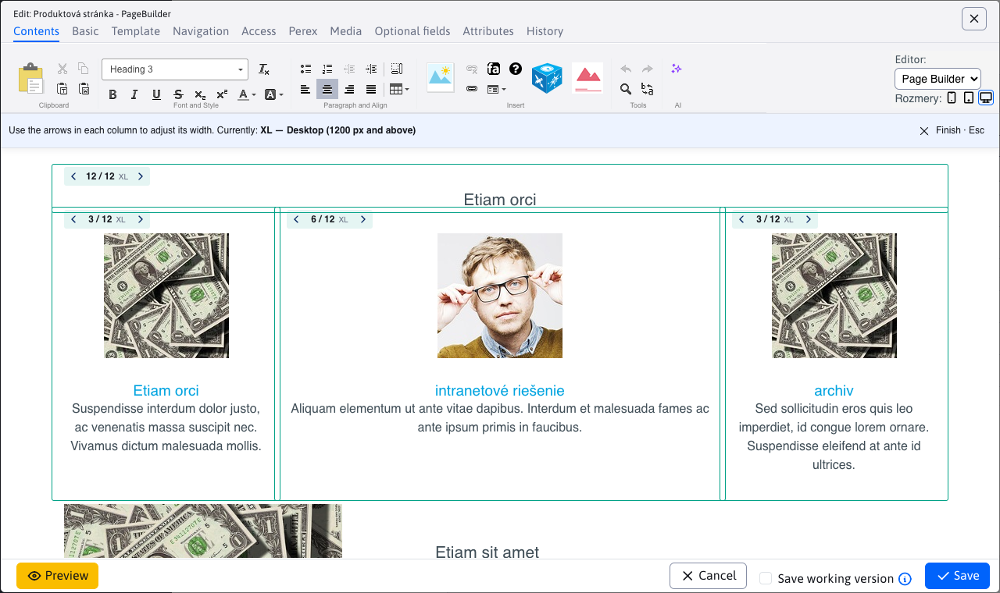
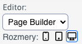

# Page Builder

Page Builder is a special page editing mode. In this mode, the entire page is not edited, but only selected parts of it. Page Builder separates the editing of text/images and the page structure. This prevents you from accidentally deleting structural elements of a web page when editing its text.

    <iframe width="790" height="444" src="https://www.youtube.com/embed/B_m_vPPel80" title="YouTube video player" frameborder="0" allow="accelerometer; autoplay; clipboard-write; encrypted-media; gyroscope; picture-in-picture" allowfullscreen></iframe>

The mode needs to be activated, blocks prepared and templates set up, the procedure is in the [web designer] section (../../frontend/page-builder/README.md).

When you set the Page Builder option for a template, the Page Builder mode will load when you open a web page in the editor.

In the **Editor** selection, you can switch between **Page Builder**, **Standard**, and **HTML** modes. The selected mode is also remembered for the next opened Page Builder pages. To build a page from blocks again, select **Page Builder**.

When you switch, the current content is transferred to the selected editor. For example, you can edit the HTML and continue in the Page Builder. You can save the page changes by clicking the **Save** button.

## Basic work

When using Page Builder, you create a web page from pre-built blocks. When you hover your mouse over the content, a subtle semi-transparent frame appears. It shows the boundaries of the block, which you can click into; the green frame helps you find the parts of the text you want to edit.

Clicking in the text selects a block and allows you to type immediately. The selected block has a more prominent frame and appears in the path in the top bar. Hovering the mouse over another block does not change this selection. As you type, the selection frame becomes thinner and the helper frame under the mouse is hidden.

By default, the color indicates the block type:

- The blue color represents a section - the main building block, usually the entire width of the screen.
- The pink color represents a container - it contains rows with columns and is usually narrower than a section for better readability of texts on the page.
- The gray color represents the row - it organizes the columns in the container.
- Green represents a column or separate editable text. A column typically contains text, images, or applications.
- Orange represents a duplicable item, such as a list item.

The tools for the selected block are in a fixed toolbar below CKEditor. A clickable path, such as **Section › Container › Row › Column**, allows you to select the parent section without searching for frames in the text. On a narrow screen, you can open the list of parent blocks by clicking the button next to the current block type. The toolbar contains options:

- Structure - opens the page block tree.
- Add Block (`+`) - displays places to insert a section, container, or column directly on the page, without the need to first select the relevant block.
- Column width - displays the current width, for example `3 / 12`, and opens its settings for the selected device size.
- Duplicate Next to - inserts a copy immediately after the selected block and marks it.
- More actions (`…`) - opens a menu of other operations with the selected block.
- Frames (eye or layers icon) - toggles the range of frames displayed.

In the **More actions** menu, you can find, depending on the type of block selected:

- Style - setting the background image, colors, alignment, padding and other properties.
- Insert Block Before / Insert Block After - opens the library for the same block type on the selected side of the selection.
- Move Up / Move Down - moves the block one position in the sequence.
- Move / Duplicate - displays available target locations on the page; click to select where to move the block or paste a copy of it. You can cancel the location selection by pressing the **Escape** key.
- Add to Favorites - saves the block among your favorite blocks in the library.
- Delete - deletes the selected block.

The menu contains only the operations supported by the selected type. The regular line is for orientation; the duplicable line and item support moving, duplicating, and deleting. Stand-alone editable text does not have tools for modifying the structure. Moving duplicable elements remains limited to compatible siblings of the same parent.

## Style settings

**More Actions → Style** opens a compact properties window. The name, for example **Column Style**, and the text below it indicate the block being edited. The **Find on Page** button will move the content to that block and briefly highlight it. You can move the window by dragging the header.

The properties are organized into drop-down groups: **Identification**, **Background**, **Visibility**, **Indentation**, **Alignment**, **Dimensions**, **Border**, **Round**, **Shadow**, **Linked Styles**, and **Z-index**. When opened, **Identification** is expanded with the ID, CSS classes, and title. The web designer can customize the list and order of the groups to suit the template.

You can expand multiple groups at the same time. Collapse them does not discard unprocessed values. When scrolling through properties, the header and bottom buttons remain available. You select a background image by clicking the button next to its address. When indenting, framing, and rounding, you can link all four values ​​or pairs; the linked values ​​are taken from the first field of the respective group.

You can see the changes continuously on the page. The **Save** button in this window confirms the style in the page in progress; you can then save the entire page using the main **Save** button in the editor. **Cancel**, the cross in the header, or **Escape** will close the window and revert unconfirmed style changes. **Reset** will remove the user style of the given block so that the template styles can be applied again.

## Inserting blocks

The quickest way to add a block does not require marking an existing section or column:

1. Click **Add Block** (`+`) in the top bar. The tools and path to the block will be temporarily replaced by a blue helper with a location selection prompt and a **Exit · Esc** button.
2. On the page, click the plus sign where you want to insert the new block. Blue bars indicate the insertion of a section, pink bars indicate a container, and green bars indicate a column. The locations are before the first block, between adjacent blocks, and after the last block. The name next to the bar and the button description help you determine the type and position.
3. In the open library, click on the tab of the desired block. The library offers the appropriate type and reminds you of the insertion point at the top. Clicking inserts the block directly; no further confirmation is required. After insertion, the mode is terminated, the new block is highlighted, and you can edit its contents.

You can also open the library for a selected block via **More actions → Insert block before / Insert block after**. It contains the following tabs:

- Basic - simple blocks of various sizes.
- Library - blocks created for your website.
- Favorites - blocks that you have marked as favorites.

The library opens as a narrow window above the page. The header says, for example, **Insert section** and below it the insertion point. You can move the window by dragging the header. You can close it with the cross in the top right or with the **Escape** key.

In the **Library** tab, blocks are grouped into categories with a number of blocks. Click a category to expand it; only one remains open at a time. The tabs display the title and a preview in the original aspect ratio. Click the preview or title to insert the block into the page.

The **Search block…** field filters by name and can be combined with a single label. When filtering, the matching category is left open or the first one with a result is opened. The numbers for categories take the filter into account, the numbers for labels indicate the total number of blocks with the given label. **All** only removes the label and keeps the search text. If nothing is found, the **Clear filters** button removes both the text and the label. When scrolling through the results, the search and labels remain available.

Block names and labels are defined by the web designer in the `pagebuilder.properties` file when [creating blocks](../../frontend/page-builder/blocks.md#block-name-and-labels). They are part of the library of the given template and do not have to change with the administration language. In the **Favorites** tab, you can delete a saved block by clicking the button next to its name; deletion requires confirmation.

An `+` icon is displayed at the bottom of the page to make it easier to add a new section.

When you enable insert mode, temporary spaces are smoothly expanded without moving visible spaces. Column widths are not changed: pluses are displayed in the spaces between them, when there is a line break, and when there is no space above the content. Selection frames and mouseover frames are hidden during selection.

Closing the library will return you to the selected plus. You can exit insert mode by pressing **Exit · Esc** in the helper or the **Escape** key. The spaces will collapse smoothly, the regular bar will be restored, and the focus will return to `+`. Clicking in the content will exit the mode and select the given block. If you have animation restrictions set in your system, showing and hiding will occur immediately. Help strips are not saved or displayed in the preview.

## Page structure and calm display

The **Structure** button opens a tree of blocks with names derived from their contents. You can search for blocks by name or type. Clicking on an item selects the corresponding block, moves the page to its location, and expands a closed branch. Clicking on an item again leaves the branch open; you can use the arrow next to the name to expand or collapse it without changing the selection.

The selected item has a thin border in the color of its type, matching the border on the page. The panel opens above the content and does not change the width or page wrap. On a narrow screen, it closes after selection.

Hidden blocks are marked **Hidden**. Selecting them does not change the visibility or active tab of the page. The tree does not add new names or identifiers to the HTML and does not allow dragging. Use the top bar actions to move.

Use the up and down arrows to navigate the tree. Use the right and left arrows to open and close branches. The **Enter** key or the spacebar selects an item and expands its closed branch. **Escape** closes an open menu or panel, exits width adjustment, or deselects a move or paste location.

The button with the eye icon switches between three modes in sequence:

- **Selected block frame** (default) - highlights the selection and subtly indicates the next block when you hover the mouse.
- **No frames** (crossed out eye) - hides the selection and the auxiliary frames under the mouse.
- **Frames the entire hierarchy of the active block** (layer icon) - also shows the parent section, container, and row. It also shows the hierarchy on hover, with finer lines. It does not highlight common parent blocks twice.

The browser remembers the choice even after reopening the editor. The toolbar, Structure panel, and content wrapping are not changed by switching. Helper frames and controls are not displayed in **Preview** or on the saved page.

## Setting column widths

The editor allows you to set different column widths for mobile, tablet and computer:

1. When selecting **Editor**, select the device size with the icon.
2. Click in the desired column and select **Column Width** from the toolbar, for example `3 / 12`. The tools and path to the block will be replaced by a blue helper, similar to when inserting blocks. It explains the dimension currently being edited, for example **MD — Tablet (768–1199 px)**.
3. Use the arrows inside each column to change its width. The value indicates the number of grid cells; in the default 12-cell grid, `3 / 12` is a quarter and `12 / 12` is a full width. A value of `auto` is also available for automatic adjustment.
4. Exit the mode by pressing the **Exit · Esc** button in the helper or the **Escape** key. The regular toolbar and the original frame settings will be restored.

Green frames during setup indicate all columns in a given container, the width of which can be changed, even if the regular frames are hidden. Controls with a soft green background have a reserved space inside their column above its content. In narrow columns, the value is displayed above the arrows. When the mode is exited, the space for the controls is freed.

You can also switch devices during setup. The drivers and assistant will update and any additional width changes will be applied to the selected device.

The abbreviation next to the width value indicates the device size currently being adjusted. The default settings are:

| Equipment | Marking | Preview width | CSS class |
| --- | --- | --- | --- |
| Computer | `XL` | from 1200 px | `col-xl-` |
| Tablet | `MD` | 768–1199 px | `col-md-` |
| Mobile | without abbreviation | less than 768 px | `col-` |

A template can use its own labels and resolution boundaries. In this case, the assistant displays the label according to the template, for example `SM`, without the default boundaries listed in the table.

    <iframe width="560" height="315" src="https://www.youtube.com/embed/aru-B1vxReo" title="YouTube video player" frameborder="0" allow="accelerometer; autoplay; clipboard-write; encrypted-media; gyroscope; picture-in-picture" allowfullscreen></iframe>

## Column Splitting

You can access the Split Column function by clicking on `+` in the yellow bar and selecting the Block option. Then, in the Basic tab, select the Split Column option. The function allows you to quickly split a column without having to insert a new column and move the content. It will allow you to insert new complex blocks, e.g. into a long text column.
