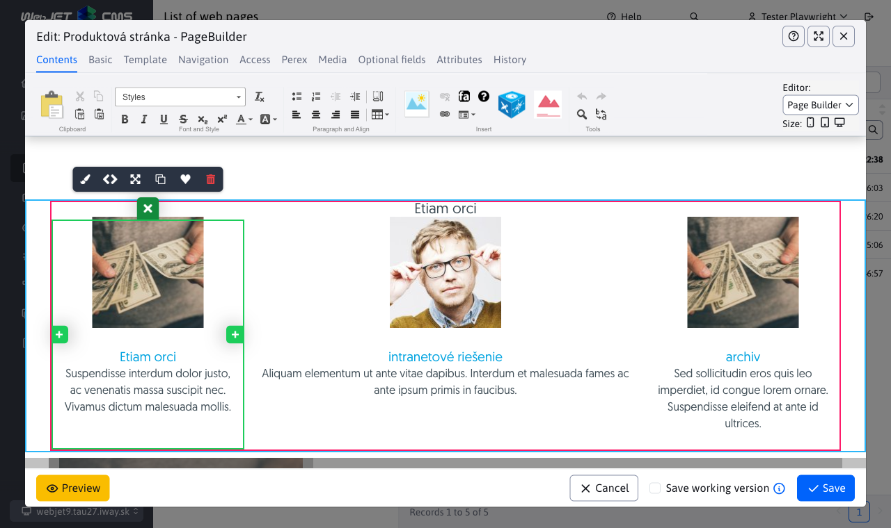

# Page Builder

Page Builder is a special page editing mode. In this mode the whole page is not edited but only selected parts of it. Page Builder separates text/image editing and page structure editing. This prevents you from accidentally deleting structural elements of a web page while editing its text.

  <iframe width="560" height="315" src="https://www.youtube.com/embed/ieaNWY57Exc" title="YouTube video player" frameborder="0" allow="accelerometer; autoplay; clipboard-write; encrypted-media; gyroscope; picture-in-picture" allowfullscreen></iframe>

The mode needs to be activated, blocks need to be prepared and templates need to be set up, the procedure is in the section for [web designer](../../frontend/page-builder/README.md).

When you set the option to use Page Builder for a template, Page Builder mode is loaded when you open a web page in the editor.

If necessary, there is an option in the window to switch the editor to standard mode. Switching from PageBuilder mode to Standard mode is remembered until the page is refreshed again. Also another PageBuilder page will subsequently be displayed in standard mode. You must switch back to PageBuilder mode by toggling the selection box, or by refreshing the entire page.

!>**Warning:** the content of the editors is not synchronized during your edits. They both load the same content only when the window is opened. So you can't start making changes in Page Builder and then switch to the standard editor and make more changes there.

## Setting the width of the columns

The editor allows you to adjust the column widths according to the selected device. In the toolbar, next to the editor type toggle, there is an option to set the size (width) of the device.

- Desktop - is for width greater/equal to 1200 pixels (sets the CSS class `col-xl`).
- Tablet - is designed for width 768-1199 pixels (sets CSS class `col-md`)
- Mobile - is for width less than 768 pixels (sets CSS class `col-`)

  <iframe width="560" height="315" src="https://www.youtube.com/embed/aru-B1vxReo" title="YouTube video player" frameborder="0" allow="accelerometer; autoplay; clipboard-write; encrypted-media; gyroscope; picture-in-picture" allowfullscreen></iframe>

