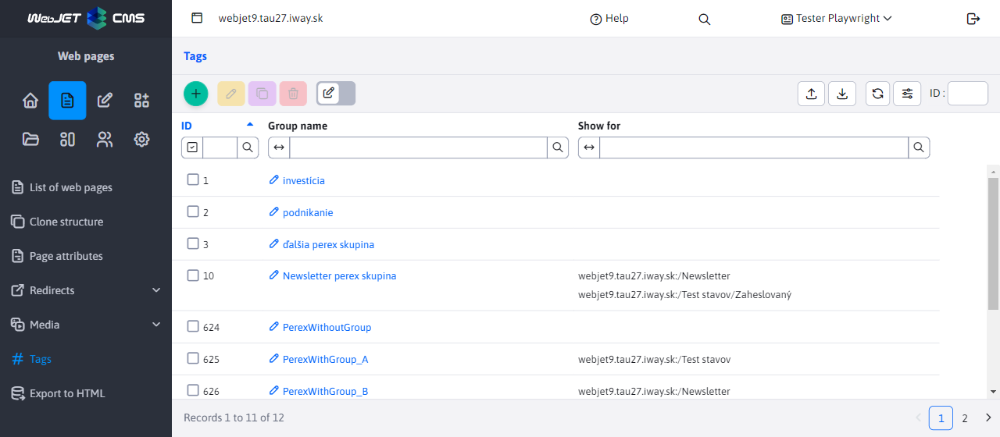
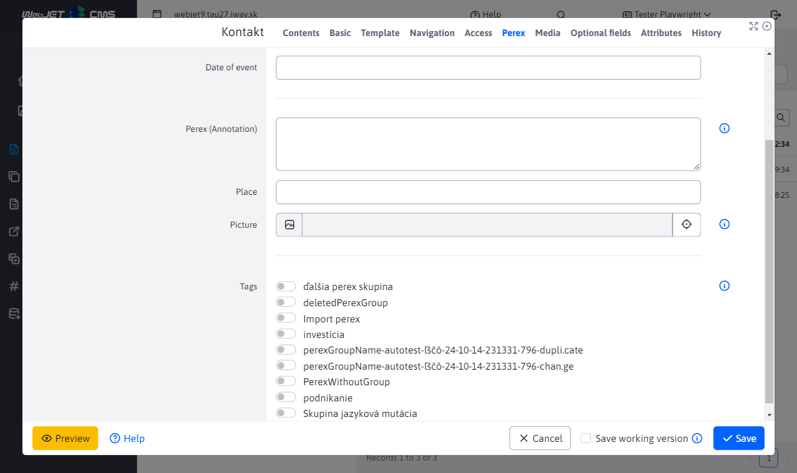

# Tags

With the help of signs (original name **perex groups**) or English `hashtag` you can tag keywords in a web page. In the news app, you can filter news by tags.

You can restrict tags to display only for certain directories of web pages.

To access the menu item Web pages - tags you need to have the right **Website - Brands**, otherwise the menu item will not appear.

Tags are displayed in the page editor in the Perex sheet, where they can be easily assigned to a web page:

