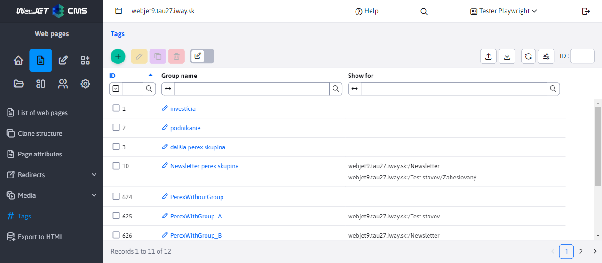
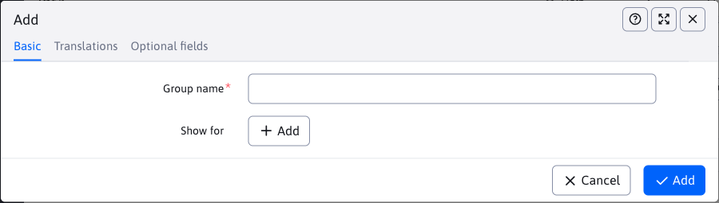
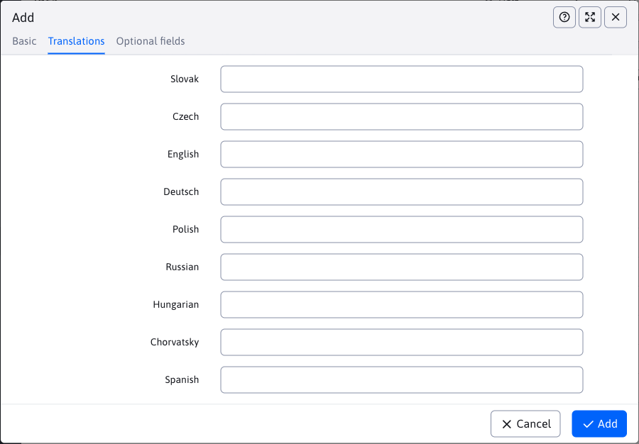
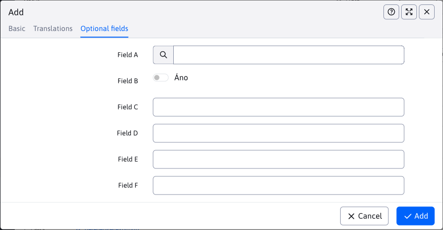
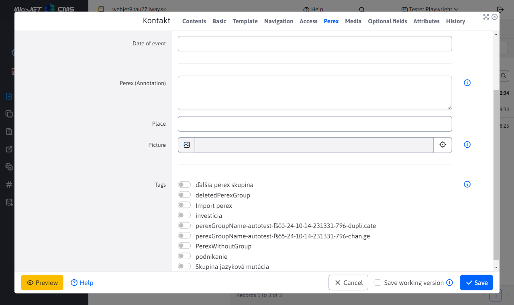
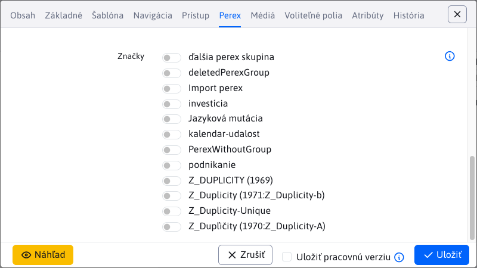

# Brands

You can use tags (original name **perex group**) or English ```hashtag``` to mark keywords on a web page. In the news application, you can filter news by tags.

To access the Web pages - tags menu item, you need to have the **Web pages - Tags** right, otherwise the menu item will not be displayed.



## Branding

The tag creation editor is simple and contains only 2 tabs.

### Basic tab

The card contains the following fields:

- **Group name**, a unique brand name, is required.
- **Show for**, setting the display restriction for tags only for certain website directories.



### Translations tab

The Translations tab is used to **optionally** define the tag name for individual language mutations. If defined, they will be used in the website instead of the **Group Name** value.



### Optional Fields tab

The **Optional Fields** tab contains freely usable fields. For more information on configuring them, see the [optional fields] documentation(../../frontend/webpages/customfields/README.md).



## Website

Tags are displayed in the page editor in the Perex sheet, where they can be easily assigned to a web page:



Tags are displayed as checkboxes by default, but if more than 30 tags are defined, they are displayed as a multiple selection field for clarity. The value 30 can be changed in the conf. variable `perexGroupsRenderAsSelect`.

!> **Warning:** the brand name (or group name) changes depending on the selected language. If such a language mutation exists, it will be displayed. If not, the value from the **Group Name** field will be displayed.

### Duplicate brand names

If you create multiple tags with the same language mutation of the name, in the website editor, when you select a tag, their **ID** and **Group Name** will be displayed for differentiation. If the tag only has a **Group Name** or the language mutation is the same as the **Group Name**, only the **ID** will be displayed.



!> **Warning:** values ​​are compared without the influence of diacritics and upper/lower case letters

### Use

You can use tags, for example, in the news list. Sample news template that displays the name of the perex group of the given news and sets the CSS style `color-ID` to set the color of the perex group based on the group ID. It automatically uses the language variant of the tag (if defined) based on the page language:

```velocity
<section class="md-news-subpage">
    <div class="container">
        #foreach($doc in $news)
            #if ($velocityCount % 3 == 1) <div class="row"> #end
            <div class="col-sm-4 portfolio-item">
                <a href="$context.link($doc)">
                    #foreach($perexGroup in $doc.perexGroupsList)
                        <span class="tag color$perexGroup.perexGroupId">$perexGroup.perexGroupName</span>
                    #end
                </a>
                <h3><a href="$context.link($doc)">$doc.title</a></h3>
                <p>$doc.perexPre</p>
            </div>
            #if ($velocityCount % 3 == 0) </div> #end
        #end
    </div>
</section>
```

