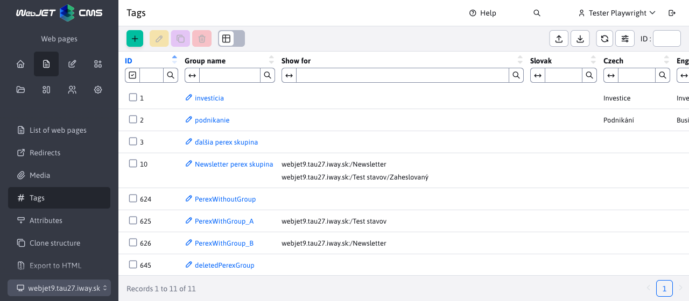
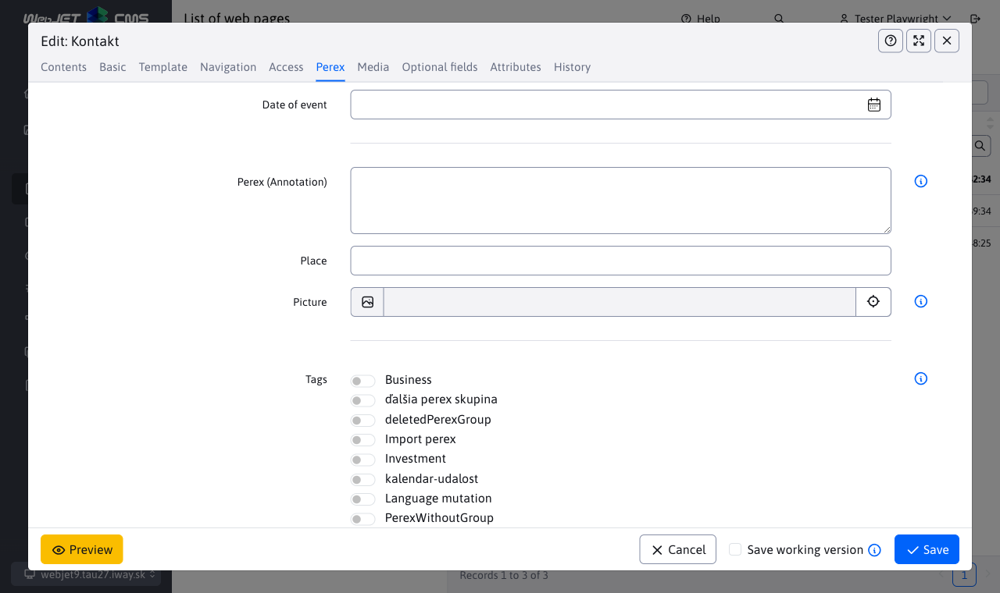

# Tags

With the help of signs (original name **perex groups**) or English `hashtag` you can tag keywords in a web page. In the news app, you can filter news by tags.

To access the menu item Web pages - tags you need to have the right **Website - Brands**, otherwise the menu item will not appear.



## Creating brands

The editor for creating tags is simple and contains only 2 tabs.

### Basic tab

The card contains the following fields:
- **Group name**, a unique brand name, is required.
- **Show for**, set to restrict the display of tags to only certain directories of web pages.


### Translations tab

The translations tab is used for **Optional** defining the brand name for each language mutation. If they are defined, they are used in the web page instead of the value **Group name**.


### Optional Fields tab

Card **Optional fields** contains freely usable fields. For more information on how to configure them, see the documentation [optional fields](../../frontend/webpages/customfields/README.md).


## Web pages

Tags are displayed in the page editor in the Perex sheet, where they can be easily assigned to a web page:



Tags are displayed as checkboxes by default, but if more than 30 tags are defined, they will be displayed as multiple selection fields for clarity. The value 30 can be changed in the conf. variable `perexGroupsRenderAsSelect`.

!> **Warning:** the name of the tag (group perex) varies depending on the language selected. If such a language mutation exists, it will be displayed. If not, the value from the field **Group name**.

### Use

You can use the tags, for example, in the news list. Example of a newsletter template that displays the name of the newsgroup and sets the CSS style according to the group ID. `color-ID` to set the color of the perex group. Automatically uses the language variant of the tag (if defined) according to the page language:

```velocity
<section class="md-news-subpage">
    <div class="container">
        #foreach($doc in $news)
            #if ($velocityCount % 3 == 1) <div class="row"> #end
            <div class="col-sm-4 portfolio-item">
                <a href="$context.link($doc)">
                    #foreach($perexGroup in $doc.perexGroupsList)
                        <span class="tag color$perexGroup.perexGroupId">$perexGroup.perexGroupName</span>
                    #end
                </a>
                <h3><a href="$context.link($doc)">$doc.title</a></h3>
                <p>$doc.perexPre</p>
            </div>
            #if ($velocityCount % 3 == 0) </div> #end
        #end
    </div>
</section>
```


