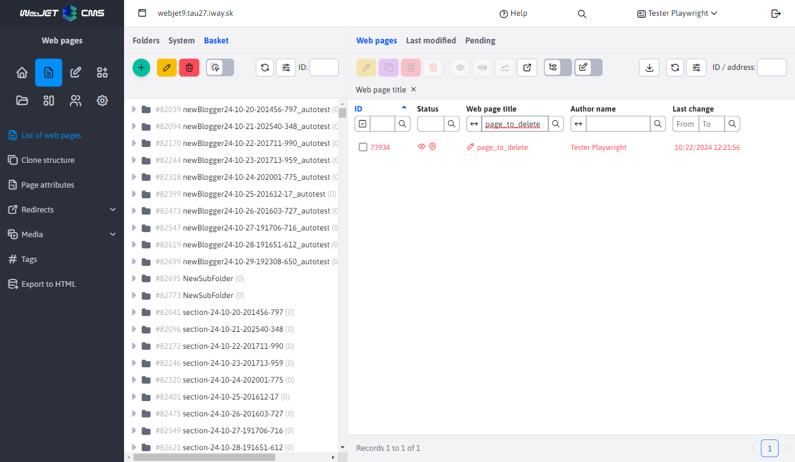
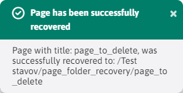
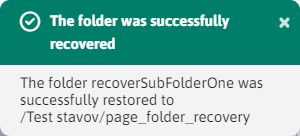

# Recovering from the Recycle Bin

Restoring web pages and folders is a process that can only be performed on those pages/folders that are located in a folder **Basket**. There is a special icon for this action .

Technically, restoring a web page is done by retrieving a version of it from history.

## Website refresh

The restored web page is moved from the Trash folder to the last folder it was in before deletion.

For a successful recovery of the website the following must apply:
- No folder is selected in the Recycle Bin. You can verify this by checking the ID field  where the identifier of the currently selected folder is empty. This is because if the page has been deleted with the entire folder, we have nowhere to restore the page. Therefore, recovery is only allowed for pages that were not deleted with the folder and thus do not fall under any sub-folder of the Trash folder.
- The deleted web page has the previous version in the history list. Such a history version is needed to know where the page was deleted from - what folder it was last in. If the deleted page does not have such a historical version (for example, it is deleted via a data deletion application), restoring the page will not be possible.
- You must have permission to edit the destination folder to which the web page is to be restored. If you do not have this right, the restore will not occur and you will be prompted to contact an administrator who can restore the page.

If all requirements have been met, mark the page by checking the option in the row next to its ID and click . After the restore, you will be informed of the address of the destination folder to which the page has been restored.

## Restore a folder

The restored folder is moved from the Recycle Bin to the last folder, or to `Koreňového priečinka` if the folder has no recorded history. All sub-folders and all pages from those folders will also be restored. Pages will be set to display by page history, or to Yes if the page has no history.

To successfully restore a folder, the following must be true:
- A folder must be selected in the Recycle Bin. You verify this by checking the ID field  where the identifier of the currently selected folder is not empty.

After selecting a folder and pressing the icon  you must first confirm the renewal action.

Confirmation will trigger the renewal action and you will be notified of its successful completion at the end of the renewal action. For a deep structure, the refresh may take several minutes.

### Property to display after refresh

Since we want to restore the web pages that were in the restored folders to their original state, we need to set them to the correct value of the option **View**. Website option **View** was automatically disabled when the folder was deleted, thus hiding the web pages on the web site (this applies to all web pages, even those from directories).

On refresh, the value of the option **View** set according to the following rules:
- the current history record for each web page being refreshed is retrieved, and its value **View** is set according to the pattern from the history
- if there is no current history record for this page, the most recent non-updated history record is used
- if the page has no history, its value **View** is automatically switched on

**Beware of this difference:**

- when the web page is refreshed, the page **CANNOT be renewed** without a record in the history, as we don't know where this page was located.
- when the folder is restored, the web page **CAN be restored** even without a history entry, since we know where it is (its location in the folder being restored is clear) and we use the history entry only to set the value of the option **View**.
