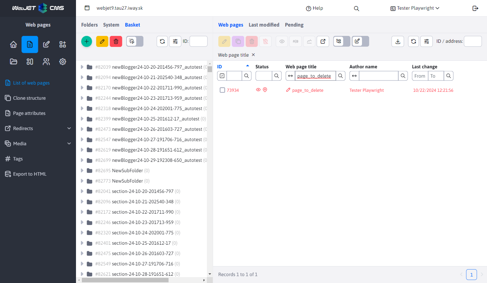
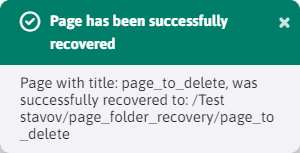
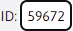
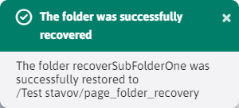

# Restoring from the Recycle Bin

Restoring web pages and folders is a process that can only be performed on those pages/folders that are located in the **Trash** folder. A special icon  is used for this action.

Technically, restoring a website is done by retrieving its version from history.



## Website refresh

The restored web page will be moved from the Trash folder to the last folder it was in before being deleted.

For a successful website refresh, the following must apply:

- No folder is selected in the Recycle Bin. You can verify this by checking that the ID field  where the identifier of the currently selected folder is empty. The reason is that if the page was deleted with the entire folder, then we have nowhere to restore this page. Restoration is therefore only allowed for pages that were not deleted with the folder and therefore do not fall under any subfolder of the Recycle Bin.
- A deleted web page has a previous version in the history list. Such a historical version is needed so that we know where the page was deleted from - in which folder it was last located. If the deleted page does not have such a historical version (for example, it is deleted via a data deletion application), restoring the page will not be possible.
- You must have permission to edit the destination folder to which the website is to be restored. If you do not have this permission, the restoration will not occur and you will be prompted to contact an administrator who can restore the site.

If all requirements have been met, mark the page by checking the option in the row next to its ID and click the . After the recovery, you will be informed of the address of the destination folder to which the page was recovered.



## Restore a folder

The restored folder will be moved from the Trash to the last folder, or to ```Koreňového priečinka``` if the folder has no history. All subfolders and all pages in those folders will also be restored. Pages will be set to display by page history, or to Yes if the page has no history.

To successfully restore a folder, the following must be true:

- A folder in the Recycle Bin must be selected. You can verify this by making sure that the ID field  where the identifier of the currently selected folder is is not empty.

After selecting the folder and pressing the  icon, you must first confirm the recovery action.


Confirming will start the restore action, at the end of which you will be informed of its successful completion. With a deep structure, the restore may take several minutes.



### Show after refresh property

Since we want to restore the web pages that were in the restored folders to their original state, we need to set the **Show** option to the correct value. The **Show** option for web pages was automatically turned off when the folder was deleted, which hid the web pages on the website (this applies to all web pages, including those from directories).

When restored, the value of the **Display** option is set according to the following rules:

- the current history record is obtained for each refreshed web page, and its **Show** value is set according to the pattern from the history
- if there is no current history record for this page, the most recent non-current history record will be used
- if the page has no history records, its value **Show** is automatically turned on

**Watch out for this difference:**

- when restoring a website, the page **CANNOT be restored** without a record in history, as we do not know where the page was located.
- when Restoring a folder, the web page **CAN** be restored even without a record in the history, since we know where it is located (its location in the restored folder is clear) and we use the record from the history exclusively to set the value of the **Show** option.