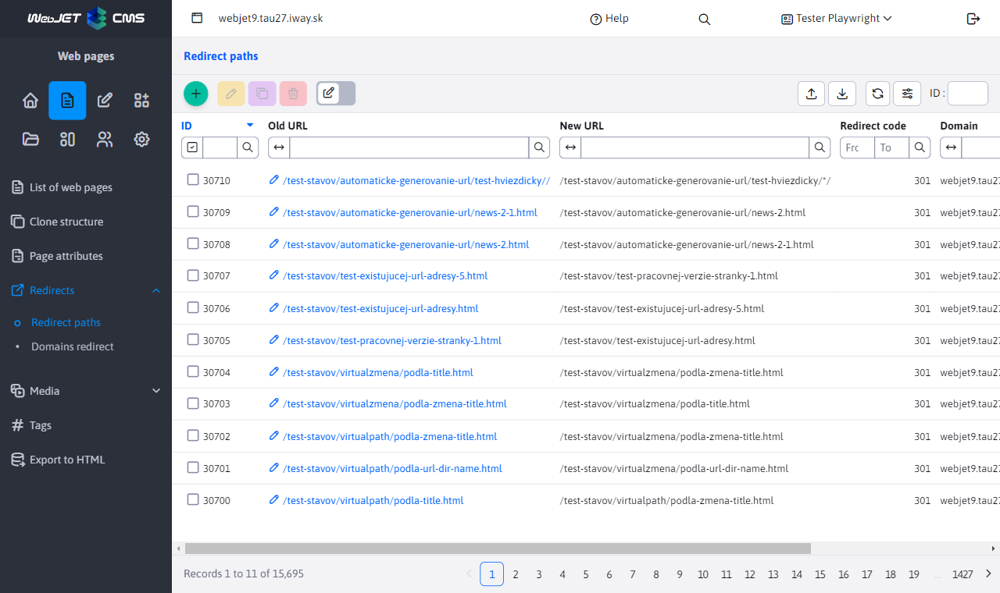
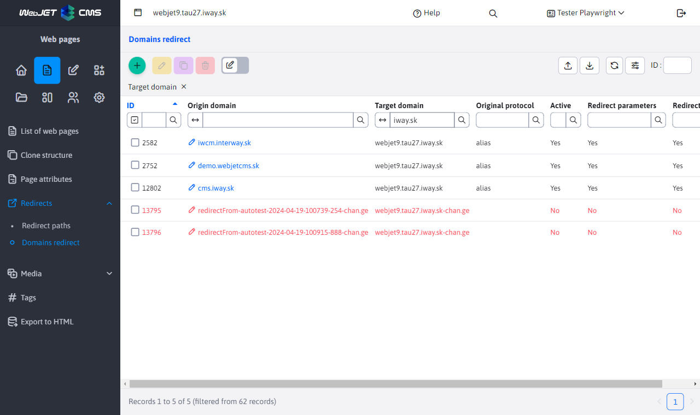
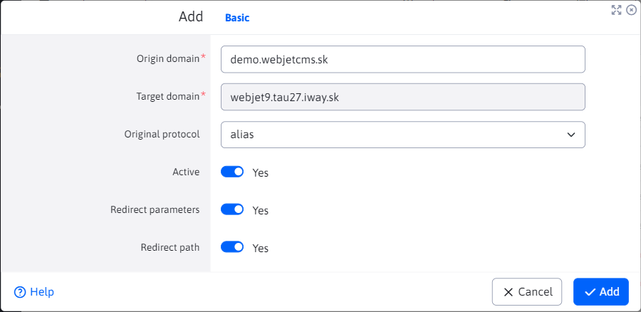

# Redirections

## Road rerouting

Displays a list of existing redirects that will be executed if the specified URL does not exist. Redirects are created automatically when the URL of an existing page changes or when the directory structure changes.

By clicking on the **Add** icon, it is possible to define a new redirect. Redirects including parameters in the URL address are also supported. First, a match including parameters is searched for, if not found, the system tries to find a match without the specified parameters.

The value of the [redirect code](https://developer.mozilla.org/en-US/docs/Web/HTTP/Redirections) field determines the type of redirect, the following codes are most commonly used:

- `301` permanent redirect, search engines should adjust the page address to this new value.
- `302` temporary redirect.

You can also set the validity of the redirect for certain dates, by entering either the start or end dates, or both. Redirects that are no longer valid will be displayed in red in the table. You can enter information about what the redirect is for in the note field.

### Redirects via regular expressions

Regular expressions can be used to set up more complex redirects of entire URL branches (e.g. after migrating an old website). Redirects via regular expressions are specified with the prefix `regexp:`.

The original URL can therefore be entered in the format `regexp:^\/thisiswhere\/oldfiles\/(.+)` which will be correctly translated to the new URL even with the execution/transfer of groups to the new URL in the form `/thisiswhere/myfilesmovedto/$1`

Redirecting, for example, `/thisiswhere/oldfiles/page.html` to `/thisiswhere/myfilesmovedto/page.html` will be performed.

## Domain redirects

In the **Domain Redirections** section, you can define a redirection of requests for the entire domain (e.g. redirecting `domena.sk` to `www.domena.sk`).

In the domain definition dialog box, you can enter the following values:

- **Original domain** - the name of the domain you want to redirect, e.g. `domena.sk`.
- **Target domain** - the name of the domain to which you want to redirect the request, e.g. `www.domena.sk`, we recommend also entering `http/s` prefix `https://www.domena.sk`.
- **Original protocol** - determines which protocol the redirection will be used for:
  - **empty value** - redirection will be used regardless of the protocol.
  - **http** - redirection will only be used if the original protocol is `http` (set if you want to redirect the http version to the secure `https` version, in which case also enter the domain with the `https://` protocol at the beginning in the Target domain field).
  - **https** - redirection will only be used if the original protocol is `https`.
  - **alias** - creates a domain alias - the value entered in the Original domain field will be seen (and processed) internally by WebJET as the domain value in the Target domain field. Use when, for example, you are migrating data from production to test, enter the value in the test environment as the original domain and enter the domain in production (without the http prefix) as the target domain.
- **Active** - redirection will only be used if this box is checked.
- **Redirect parameters** - if checked, the parameters of the original HTTP request will also be added to the redirect, e.g. `?docid=4`.
- **Redirect path** - if checked, the path of the original HTTP request will also be added to the redirect, e.g. `/produkty/webjet/novinky.html`.

