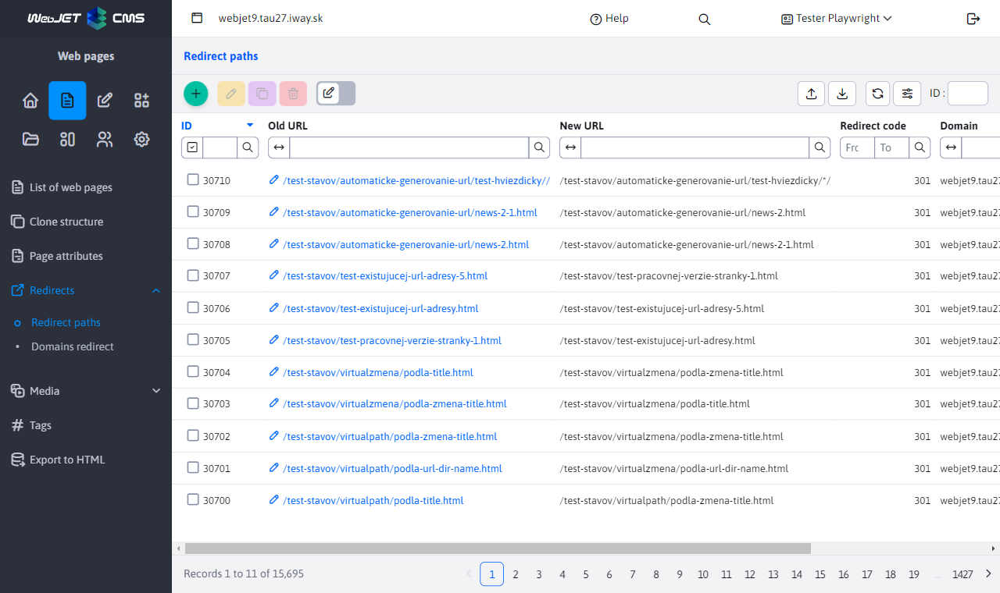
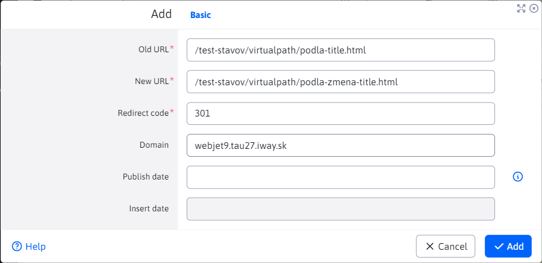
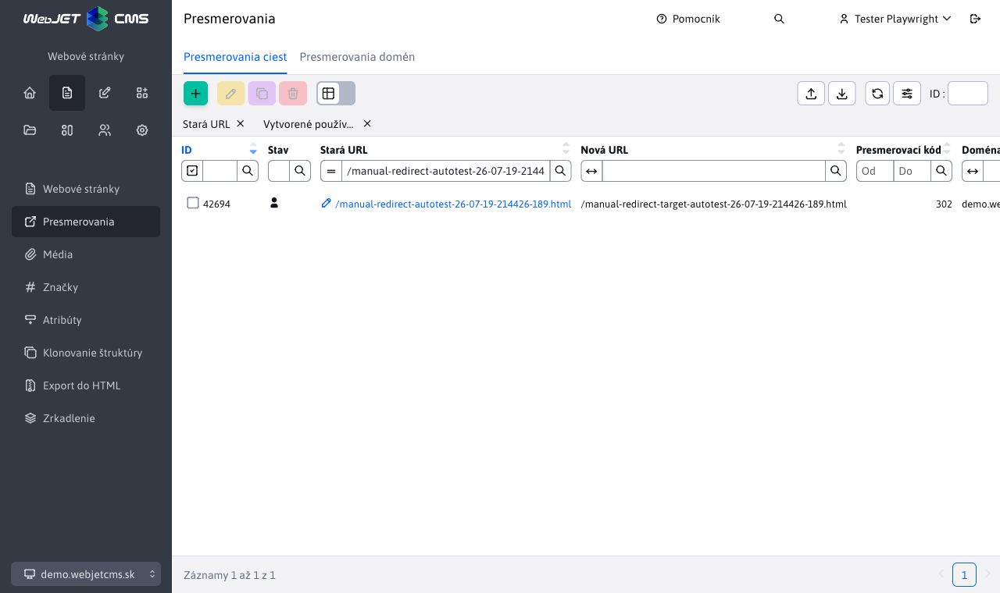
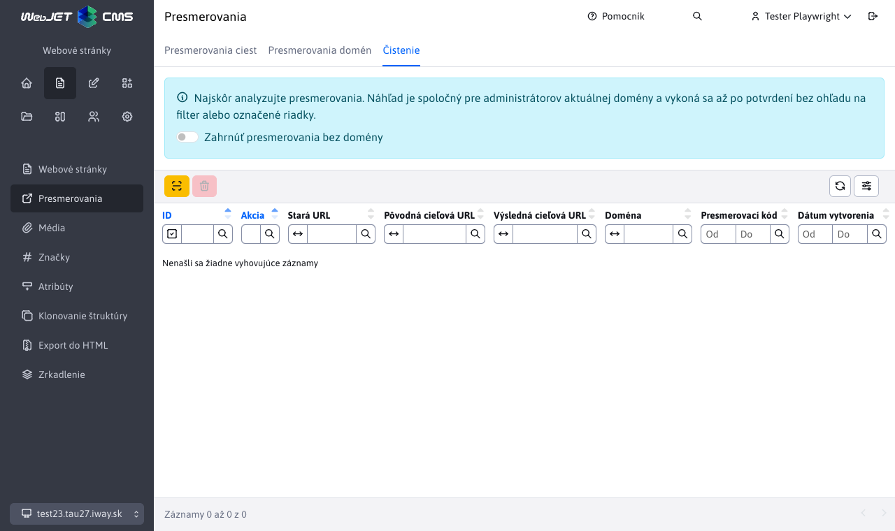
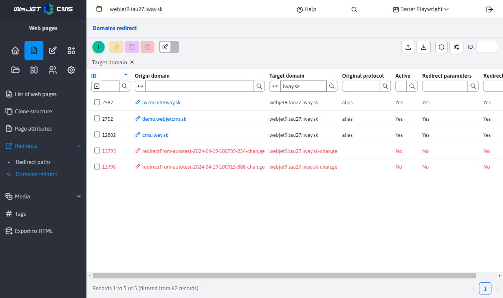
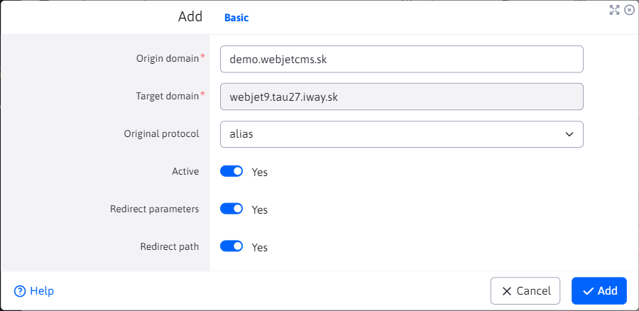

# Redirections

## Road rerouting

Displays a list of existing redirects that will be executed if the specified URL does not exist. Redirects can be created automatically, more in the [Automatic and user-created redirects](#automatic-and-user-created-redirects) section.

By clicking on the **Add** icon, it is possible to define a new redirect. Redirects including parameters in the URL address are also supported. First, a match including parameters is searched for, if not found, the system tries to find a match without the specified parameters.

The value of the [redirect code](https://developer.mozilla.org/en-US/docs/Web/HTTP/Redirections) field determines the type of redirect, the following codes are most commonly used:

- `301` permanent redirect, search engines should adjust the page address to this new value.
- `302` temporary redirect.

You can also set the validity of the redirect for certain dates, by entering either the start or end dates, or both. Redirects that are no longer valid will be displayed in red in the table. You can enter information about what the redirect is for in the note field.

### Automatic and user-created redirects

Redirects are created automatically when the URL of an existing page changes or when the directory structure changes. The automatic creation of redirects is controlled by the configuration variable `editorDisableAutomaticRedirect`:

- `false` - ​​default value, WebJET CMS will automatically create a redirect from the old URL to the new one.
- `true` - ​​automatic creation of redirects is disabled.

Setting the configuration variable does not affect user-created redirects. Automatically created redirects are highlighted in gray in the table. You can use the **User-created** toggle above the table to display only user-created redirects.

!> **Note:** Redirects that existed before the database update are considered to be automatically created. In the redirect editor, you can change the value of the **User-created** field to mark existing redirects as user-created, if necessary.

### Redirects via regular expressions

Regular expressions can be used to set up more complex redirects of entire URL branches (e.g. after migrating an old website). Redirects via regular expressions are specified with the prefix `regexp:`.

The original URL can therefore be entered in the format `regexp:^\/thisiswhere\/oldfiles\/(.+)` which will be correctly translated to the new URL even with the execution/transfer of groups to the new URL in the form `/thisiswhere/myfilesmovedto/$1`

Redirecting, for example, `/thisiswhere/oldfiles/page.html` to `/thisiswhere/myfilesmovedto/page.html` will be performed.

## Cleaning redirects

The **Cleaning** tab allows you to check the redirects of the selected domain, remove unnecessary records, and shorten redirect chains.

The cleanup is done in two steps so that you can preview all proposed changes first:

1. **Redirect Analysis**
2. **Performing cleaning**

!> **Warning:** Only one analysis or cleanup can be running at a time for a domain. If another administrator has already started the operation, the system will not allow another run until the current operation is complete. In this case, a warning will be displayed stating that you must wait for the current operation to complete.

### Redirect analysis

Redirect analysis starts by clicking the button <button class="btn btn-sm btn-warning" type="button"><i class="ti ti-scan"></i></button> in the **Cleaning** section. During the analysis, all existing redirects are evaluated and changes that can be made are suggested.

In the redirect analysis preview, exactly one of the following actions is displayed for each record:

- **Delete old version** - removes the old URL target that has been replaced by a newer target.
- **Delete cycle step** - in a cyclic redirection, for example `/a -> /b -> /a`, deletes the most recently created step that closes the cycle.
- **Delete duplicate** - for identical redirects, it keeps the oldest record and removes newer duplicates.
- **Shorten string** - will only modify the target URL address so that, for example, the string `/a -> /b -> /c` is shortened to `/a -> /c`.

**Ignored redirects:**

- redirects specified via **regular expression** with prefix `regexp:`
- redirects with a set **publishing date**
- redirects with a set **expiration date**

The summary report after analysis also lists the number of such ignored records.

Domainless redirects form a separate group and are never combined with named domain redirects. By default, only the currently selected named domain is analyzed. To include a separate group of domainless redirects in the analysis, select the **Include domainless redirects** option.

The analysis result is saved as a shared plan for the current domain for 60 minutes. Therefore, all administrators with redirect management rights see the same preview, and any of them can perform the cleanup.

### Performing cleaning

The cleaning process is started by clicking the button <button class="btn btn-sm btn-danger" type="button"><i class="ti ti-trash"></i></button> in the **Cleaning** section. The action is available only if **an analysis exists** for the current domain. During execution, changes are saved and redirects are adjusted according to the proposed plan.

The execution uses the exact saved plan without any new analysis. Records that have been deleted or are no longer available are skipped and their number is displayed in the resulting report. If the execution fails, the changes are not saved and the plan remains available for repetition.

## Domain redirects

In the **Domain Redirections** section, you can define a redirection of requests for the entire domain (e.g. redirecting `domena.sk` to `www.domena.sk`).

In the domain definition dialog box, you can enter the following values:

- **Original domain** - the name of the domain you want to redirect, e.g. `domena.sk`.
- **Target domain** - the name of the domain to which you want to redirect the request, e.g. `www.domena.sk`, we recommend also entering `http/s` prefix `https://www.domena.sk`.
- **Original protocol** - determines which protocol the redirection will be used for:
  - **empty value** - redirection will be used regardless of the protocol.
  - **http** - redirection will only be used if the original protocol is `http` (set if you want to redirect the http version to the secure `https` version, in which case also enter the domain with the `https://` protocol at the beginning in the Target domain field).
  - **https** - redirection will only be used if the original protocol is `https`.
  - **alias** - creates a domain alias - the value entered in the Original domain field will be seen (and processed) internally by WebJET as the domain value in the Target domain field. Use when, for example, you are migrating data from production to test, enter the value in the test environment as the original domain and enter the domain in production (without the http prefix) as the target domain.
- **Active** - redirection will only be used if this box is checked.
- **Redirect parameters** - if checked, the parameters of the original HTTP request will also be added to the redirect, e.g. `?docid=4`.
- **Redirect path** - if checked, the path of the original HTTP request will also be added to the redirect, e.g. `/produkty/webjet/novinky.html`.

