# Working in the editor

WebJET includes an intelligent web page editor that gives you the most accurate representation of what the page will look like.

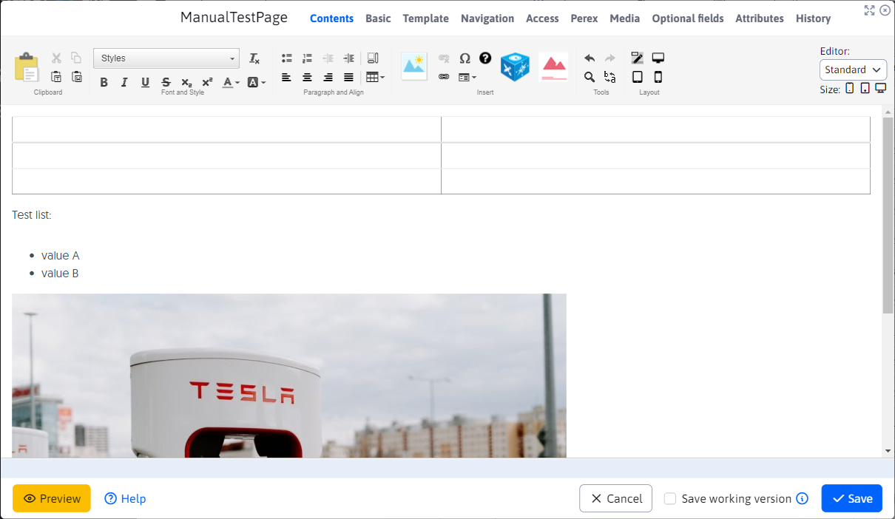

## Working with text (typing / pasting / copying)

When working with text, first of all, you need to be aware of the difference between a paragraph and a collapsed text, i.e. splitting a sentence into another line. You can create individual paragraphs by simply pressing `ENTER`, while wrapping the text using the key combination `SHIFT + ENTER`.

The difference between the two is noticeable mainly because of the greater indentation between paragraphs (as opposed to the indentation of the text). Another important difference is that several text edits (such as creating a heading) are applied to the entire paragraph. If such a paragraph contains a line break, that change is applied to the line break as well.

If you want the text not to break when you type a space, you can insert a space in addition to the normal space **fixed gap**. This may be the case, for example, when writing dates `10. 2. 2009` or various other texts that should not be split into two lines, such as file size `123 kB` or phone number `0905 123 456`. A fixed space is inserted using the key combination CTRL+Spacebar. There is no difference in its appearance, only in its behaviour in relation to the surrounding text at the end of the line.

**You can edit text in the WebJET editor in the following ways**:
- by typing directly into the editor
- by pasting from another document (`DOC`, `PDF`, `XLS`, another website...)

### Insert from another document

**Classic text insertion** from the toolbar using the icon or key combination `CTRL + v`. When you insert text in this way, the text is inserted with the original formatting of the source text. However, this method is undesirable mainly because it leaves the text styling uniform throughout the site according to predefined styles.

**Inserting unformatted text** from the toolbar using the icon or by key combination `CTRL + t` or `CTRL + SHIFT + v`. This method of inserting text will insert text without any formatting, so it is most suitable for inserting plain text.

**Inserting text from `Word` / `Excel` file** from the toolbar using the icon  or by key combination `CTRL + w`. This option inserts the text with the paragraphs and tables preserved, but stripped of all styles from the original document. Unfortunately some browsers have this keyboard shortcut reserved for closing the window/tab, so in that case it is better to insert text via clicking on the toolbar icon rather than via the keyboard shortcut.

### Copying text

Copying text is possible by selecting the text and clicking on the icon  (or key combination `CTRL + c`).

### Cutting out text

To cut the text, select the text and click on the icon  (or key combination `CTRL + x`).

## Working with styles and formatting text

In WebJET, you have a number of predefined styles for headings and for fonts that are used to style the page into an acceptable form. Properly defining headings is also of considerable importance for search engine optimization (`SEO`) and the internal structure of the document.

The predefined headings are always applied to the entire paragraph. To create a heading, click in the desired paragraph you want to make a heading and select the desired heading level from the drop-down menu.

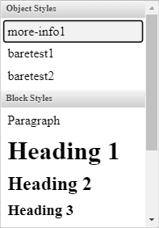

There should always be only one main Heading 1 on each web page, which should start the text. Since this heading is automatically generated from the page title by default on the page (if the template defines it that way), there is no need to insert it into the body of the page. Sections within the page are separated by Heading 2, their sub-sections by Heading 3, etc.

There are other predefined styles in this menu, but their use is based on their name, for example styles containing the text "table" are used only for tables and so on. Clicking into any page text in the editor will automatically set the style used at that cursor position in the Style field. The currently applied style is indicated by an arrow in the left-hand drop-down menu.

If you want to change the style of such text within a paragraph, you must not tag the text. Just click into the text on the page, the color style will be automatically pre-set in the drop-down menu **Style** and then you can change it to another style.

You can also highlight text on the page using predefined styles. In the selection you will find e.g. different types of headings, colour highlights. The use of styles ensures a uniform appearance of the pages.

Another way to format text is by using the following standard tools (applied by marking the text you want to edit):
- , **bold font**
- 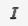, *Italics*
- , <ins>underscore</ins>
- , ~~crossing out~~
- 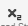, superscript
- 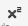, subscript

Formatting text with the text colour tool  and underlining of the text  we recommend not to use it, as it causes graphic inconsistency of the web page and degrades its value within the web site.

## Deleting formatting

To cancel the heading style, click into the heading text and select the first item from the drop-down menu **Section**. Then the heading style should be removed from the text (applies to all styles from the drop-down menu).

If you want to remove common formatting such as bold text or italics from text, there are two ways to do this. Either after selecting the text, click on the formatting tool again until the formatting is removed, or use the universal formatting removal tool 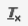

This tool works by selecting the formatted text and clicking  the formatting on the highlighted text is removed. This tool also removes combined formatting on text (e.g. italic and bold text together)

## Lists (bulleted/numbered) and indented text

To create a numbered list, use the icon . To create a bulleted (unnumbered) list, use the .

To create a list from an ordinary paragraph, click in the paragraph and click the icon of the desired list (numbered or bulleted).

If you want to change the bullet type for a numbered list, click in the list item and use the context menu (right mouse click) to go to the list properties where you can choose a different list type.

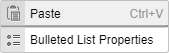

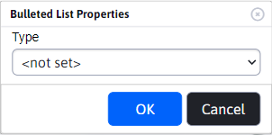

If you want to create a nested list, click in the list item and click the indent icon to the right  create a nested list. You can cancel the nested list by clicking on the indented text icon to the left .

To exit the list, press the key twice `ENTER` at the end of the list.

## File links and file uploads

To create a link to a document/file, select the text to be linked by clicking on the Link icon  or by using the shortcut `CTRL + k`, you will see a dialog box for creating a link:

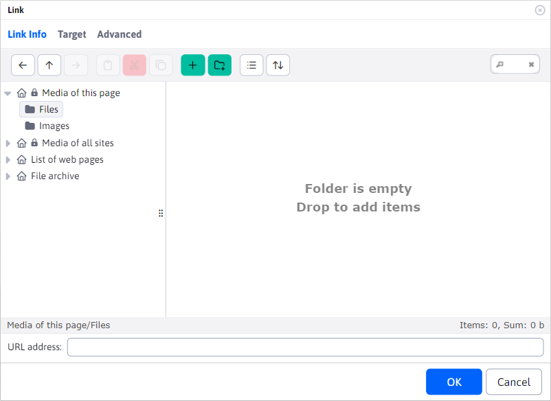

- if the document is **for the current web page only**, you need to select "Media of this page" and in it "Files".
  - You search for a document, click on it, and the link to the document is automatically copied into the URL field.
  - If the required document is not in the list, the function `drag&drop` it is possible to upload a document from your computer
  - Confirm OK to create a link to the file at the selected location.
- if the document **it is not intended only for that page** (the document can also be on another page), it is necessary to select **Media of all sites** and in it the entry **Files**.
  - You will see the directory structure of the directories and files on the server that you are allowed to access.
  - You search the directories for the file you want, click on it and the link to the document is automatically copied into the URL field
  - Confirm OK to create a link to the file at the selected location.

According to the Web Accessibility Guidelines, all downloadable text files on websites should be published mainly in `PDF`. Formats used by the application `Word` a `Excel` (`DOC` a `XLS`) are not satisfactory.

If you have permission to do so, you can also create new sub-directories in a given directory for files by clicking on the icon . File names on the server should be free of spaces, special characters and accented letters.

## Inserting and editing links to other websites

You insert links/references to other pages in the same way as a link to a document/file:

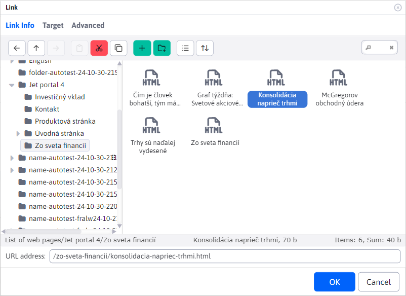

- Select the text (word) to be clickable as a link. Then click on the Link icon  or by using the shortcut `CTRL+ k`. This will open a dialog box in which you need to select **Web pages** and search the tree structure for the page you want to link to. When you click on the page name, the address of the selected page will be copied into the URL address field. By confirming `OK` a link to the selected web page will be created on the page.
- If you want to insert a link to a page located on another website (link to an external website), enter its address directly into the URL address field (including the prefix `https://`). At the same time, the field is automatically changed **Goal** (in the Target tab) to the value **New window (`_blank`)** &#x77;hich will ensure that when you click on this link, the page will open in a new browser window/tab. The  field **Goal** down to the value of **New window (`_blank`)** is also set if you want to create a link to the document for download. If you do not want the link to open in a new window, the parameter **Goal** set to **The same window `_self`**. However, for links to external websites and documents, opening the link in a new window is recommended.

## Buttons

If a link or button is inserted in a web page that has a CSS style set containing an expression `btn-` or CSS style has a value set `display` Containing `block`, thus also for example `inline-block` clicking on such a link in the editor will display the button settings window. In it, you can easily change the button text and set the link after clicking. Alternatively, you can also change the background color, font and corner rounding, but by default we do not recommend changing these values - they should be set according to the CSS styles of the web page.

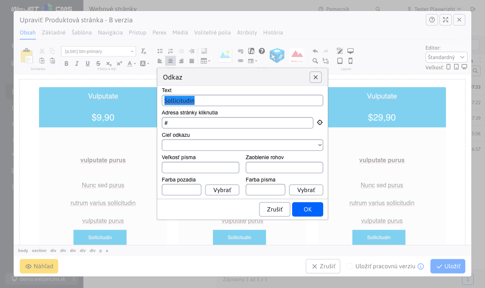

## Inserting images

To insert an image on the page, place the cursor on the row or cell of the table where the image is to be located and click on the icon to insert the image .

To change an existing image, you must first click once on the image you wish to change. Then you need to click on the same insert/change image icon or via the context menu on the **Image properties**. The further procedure is identical in both cases.

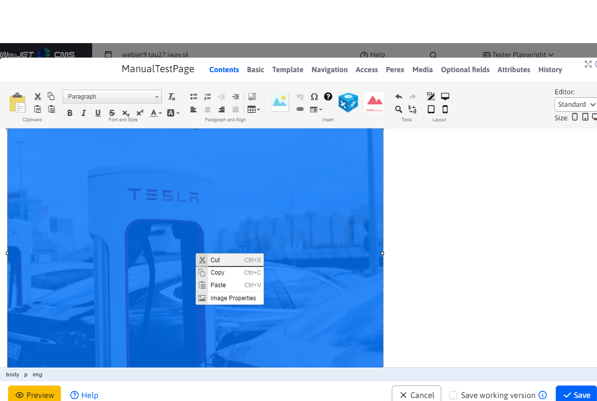

When you click on the icon, you will see a dialog box for inserting an image:

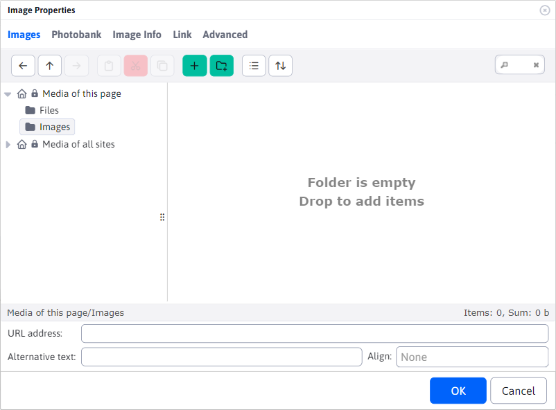

When navigating through the tree structure, only image or video files are shown, other files are filtered.

### Tab Contents

If the image file is already on the server, you can search for it in the directory structure, and clicking on it will automatically enter the location of the image in the URL address field.

For images, it is necessary to define the Alternative text for the image, which is mainly used for communication with visually impaired and blind visitors to the website, or when the user has disabled the display of images on the website. The alternative text should describe what the image is about or what is displayed in the image.

When an image is selected, the width and height fields are automatically filled in to define the current size of the selected image.

### Photobank card

Card **Photobank** allows you to get (download) images from a free online platform [Pixabay](https://pixabay.com). This platform provides an extensive collection of images that is [can be used for free](https://pixabay.com/service/license-summary/).

After entering and searching for a term, you will be offered matching images. The menu contains several pages that you can navigate between.

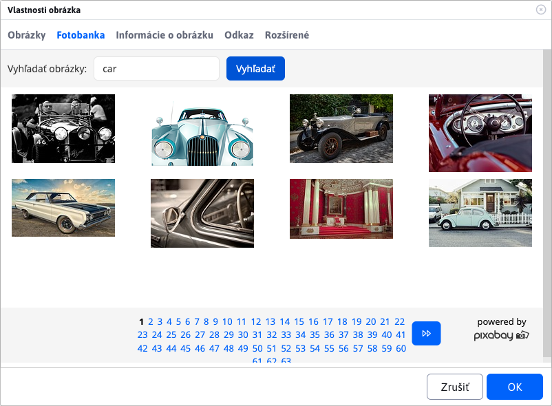

When you click on one of the offered images, a dialog will be displayed, with a preview and the values **width** / **Height** of the image.

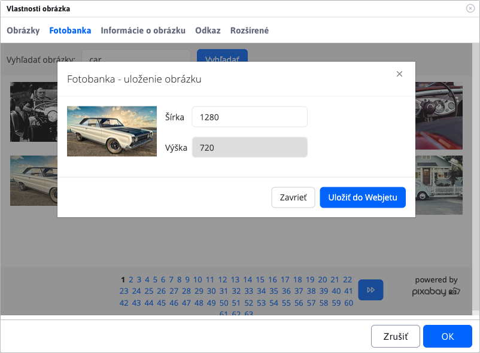

If you wish to change the dimensions of the image, you can adjust the **width** and his **Height** is automatically calculated according to the original image ratio.

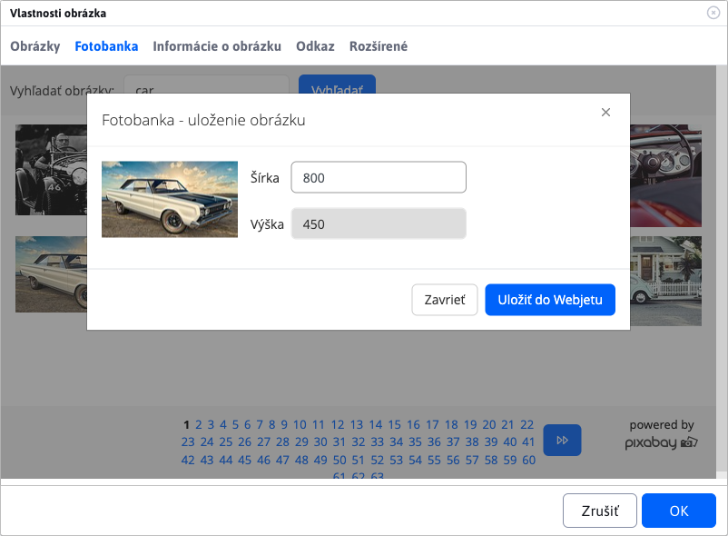

Then click on the button **Save to WebJET** the image is downloaded and saved. The tab is automatically switched to **Table of Contents**, where you have this image immediately available.

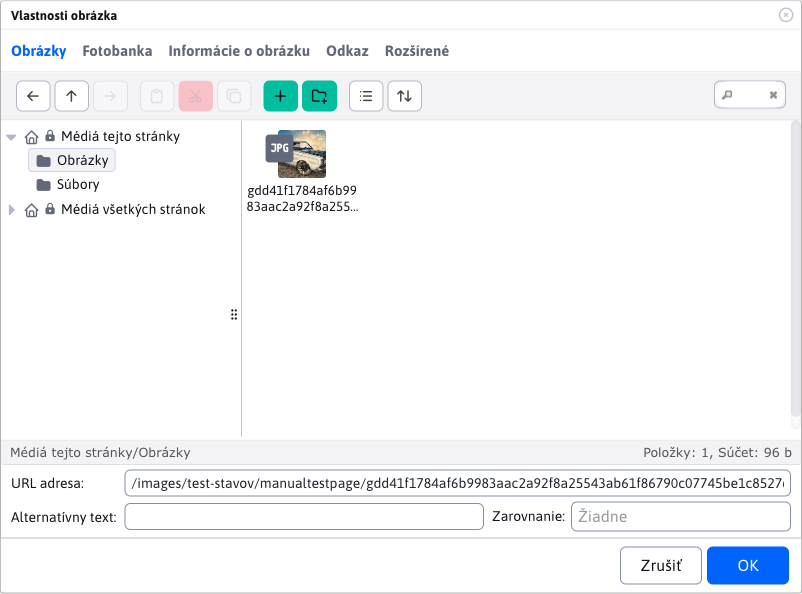

**URL of the image source**

Saved images from **Photobanks** have an automatically filled value **URL of the image source**. You can view/edit this value in [Explorer](../../files/fbrowser/README.md) at the event [Editing files](../../files/fbrowser/file-edit/README.md).

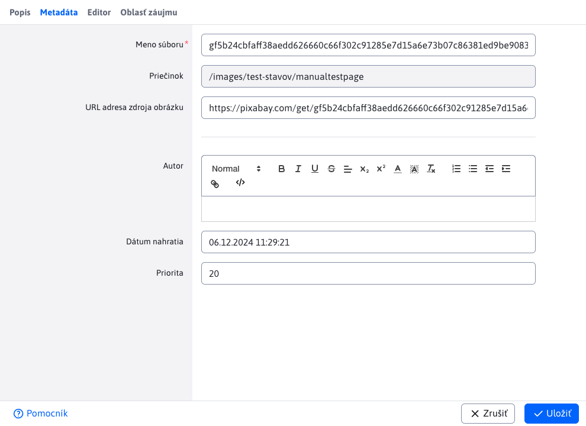

### Video files

You can also insert video files via the image insertion dialog. Either directly from your server by selecting the video file, or enter a link to a web page in the URL field `YouTube/Facebook/TikTok`.

WebJET automatically embeds a video player instead of an image for the video file.

### Editing images

If the image is too big and won't fit on the page, or you need to make other changes to the image, you can use the image editor. Click on the image and then on the pencil icon to open [image editor](../../image-editor/README.md).

## Inserting and editing tables

There are two ways to create a table. Use a predefined styled table, or insert a table by copying from `Word` / `Excel` file.

### Creating a colour table

To create a table, click on the icon **Insert table**, 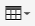:

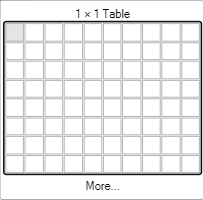

If you need to create a more complex table, you need to click on **Read more** where you will be presented with a dialog for setting up the table:

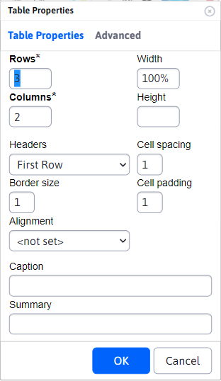

Here you can set the number of columns and rows. If you want the table width to match the content, you don't need to specify the width (delete the pre-filled value). The other parameters should be left with a null value so they don't fight with the preset table style. By confirming `OK` paste the table at the original cursor position.

### Inserting a table from `Word` a `Excel` file

When inserting a table from other applications or documents via a keyboard shortcut `CTRL + v` the system will automatically ask you if you want to clean the table. If you click `OK`, the editor cleans the table of unwanted formatting characters from the original document, but leaves the table structure in its original form.

The table is preserved in the page content even if you use the text insertion tool to insert text from `Word` / `Excel` file (`CTRL + w`) .

### Edit an existing table

If you need to modify an existing table that is on the page, or that you have just inserted in one of the ways mentioned above, there are several tools available to modify it. Right-clicking in any of the table cells will bring up a context menu.

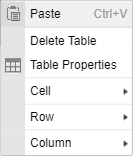

To delete or add another row, use the sub-menu item **Line**.

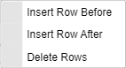

To insert or delete a column, use the sub-menu item **Column**.

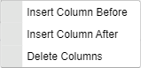

If you want to merge two adjacent cells (within a row), you have to select their contents (if they do not contain any text, first enter any text into the cell to make the cell more visible), right-click on the selected contents and select the sub-menu item **Cell** and in this sub-menu the item **Merge cells**.

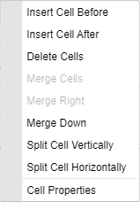

The contents of the cells are then merged into one and you can edit them further.

If you want to remove the original table border, change the cell indentation, or make the table colored, click **Table properties**. You will see a dialog box where you can change various table parameters, except for the number of rows and columns in the table (these are modified as mentioned on the previous page).

If you want the table width to match the content, the table width does not need to be specified (delete the value). If you want the table to be the full width of the page, you can specify a value of 100 percent. Do not specify a height.

If you want to change the alignment of the text in a table cell to center or right, right-click in the cell and select the sub-menu item **Cell** and in this sub-menu the item **Properties of the cell**.

You will see the cell properties dialog where you can set the vertical or horizontal alignment of the text in the cell. Do not change the other parameters in the window.

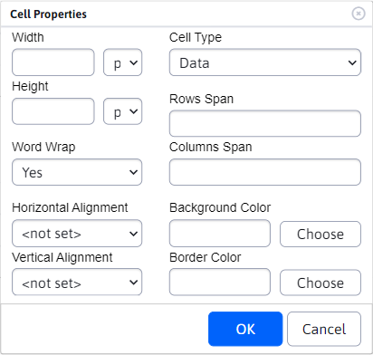

## Inserting an application

To insert an app, click on the blue app cube icon . We will see a dialog box with a list of applications:

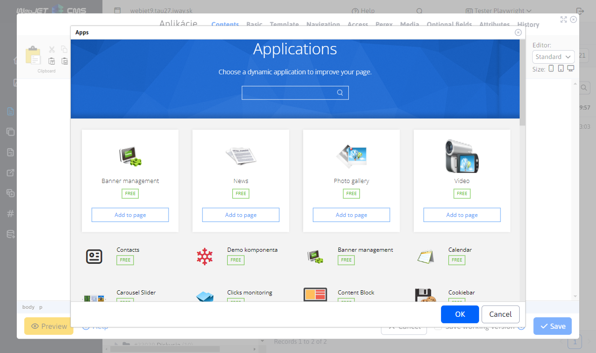

You can enter the name of the app in the search box:

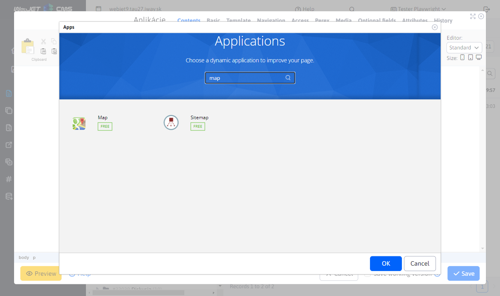

Click on the app name to see details about the app - its description, photos and the option to embed the app in the page:

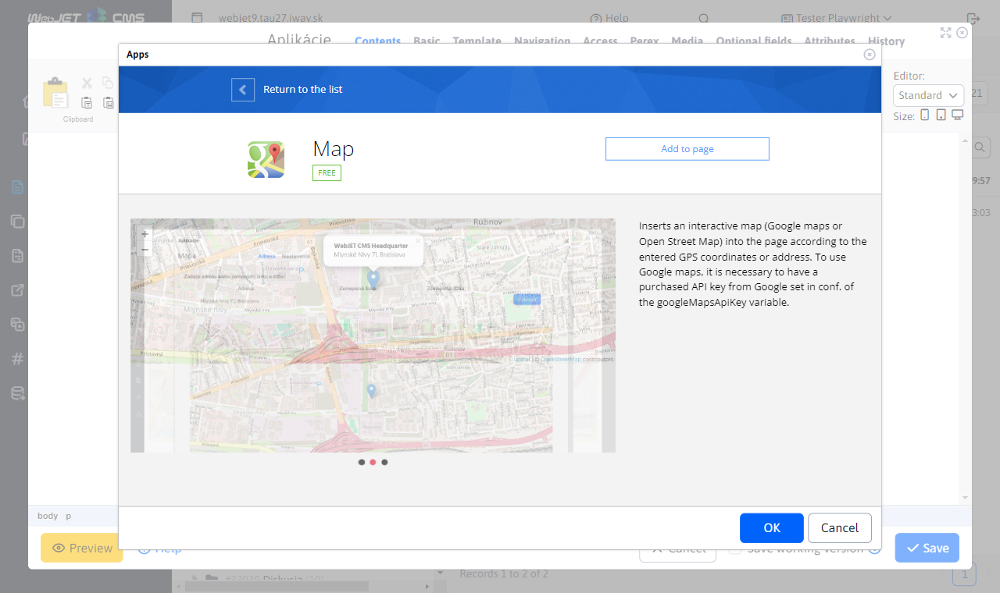

When you click on the "Insert into page" button, the application is inserted into the page and the application settings are displayed:

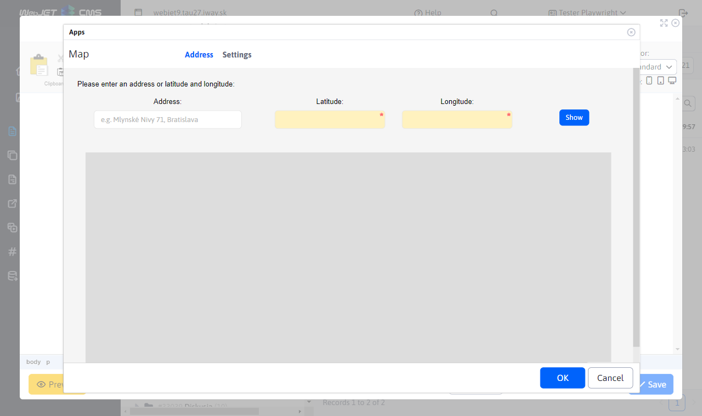

If the app is already embedded in the page, clicking inside the app will bring up the same app settings window. You can easily edit its existing settings.

### Tab view

Most applications include a View tab for common settings (unless this option is turned off in the application for various reasons).

The card contains the parameters:
- View on devices, used for setting up [conditional display application](../../../custom-apps/appstore/README.md#conditional-application-view) on a tablet, phone or standard computer. If no option is selected, the app will be displayed on all devices (just like when all options are selected).
- Logged user - allows to set the application display according to the login status of the website visitor - display always, only if the user is logged in, or if the user is not logged in. In the page editor the application will always be displayed, but in the preview or page view it will be displayed according to the set value.
- Buffer time (minutes) - used to set the amount of time in minutes that the initialized application should be buffered for faster display. For example, the list of news items does not change frequently and loading them is demanding on the database server, so it is advisable to set a value of 30, for example. If an administrator is logged in, the buffer is not used and the current data is always displayed.

## Pre-prepared blocks

The page editor offers the possibility to insert preset blocks (`HTML` objects) per page. E.g. table, text, contact form, etc. You can also insert the content of another page into the current page (e.g. a repeating form).

To view the blocks, click on the icon  in the page editor, which displays a dialog box with block categories.

More information in the app description [pre-prepared blocks](../../apps/htmlbox/README.md).

## Inserting special characters

There may be times when you need to type characters that the Slovak keyboard does not include, such as the Dollar (`$`), Euro (`€`) or a curse word (`@`). To make your work easier, you can insert special characters using the ready module. Click on the icon  you will see a dialog box with a menu of special (but also standard) characters.

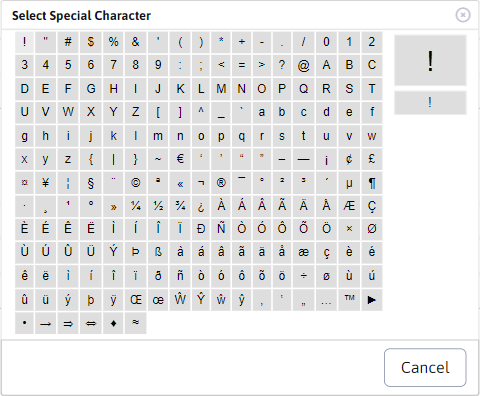

When you click on the desired character, the character will be typed at the cursor position. Special characters are inserted as text, so they have no additional settings.

!> Note: the icon for inserting special characters may be changed to an icon in some cases  for insertion [FontAwesome](../../../frontend/webpages/fontawesome/README.md) Images.
