# Working in the editor

WebJET includes an intelligent web page editor that shows you as faithfully as possible what the page will look like.

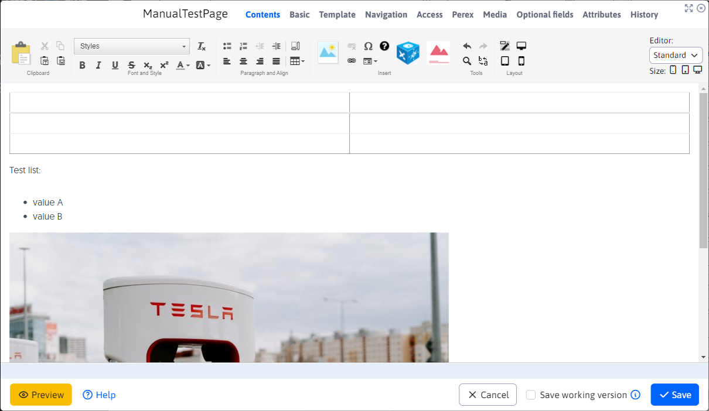

## Working with text (typing/pasting/copying)

When working with text, you must first be aware of the difference between a paragraph and a text break, i.e. dividing a sentence into the next line. You create individual paragraphs by pressing ```ENTER```, while you create a text break using the key combination ```SHIFT + ENTER```.

The difference between them is mainly due to the greater indentation between paragraphs (as opposed to text wrapping). Another important difference is that many text adjustments (such as creating a heading) are applied to the entire paragraph. If such a paragraph contains a line break, the change is also applied to the broken line.

If you want the text not to wrap after typing a space, you can insert a **fixed space** in addition to the normal space. This can happen, for example, when typing dates ```10. 2. 2009``` or various other texts that should not be divided into two lines, such as file sizes ```123 kB``` or phone numbers ```0905 123 456```. A fixed space is inserted with the key combination CTRL+Space. It does not differ in appearance, the only difference is its behavior towards the surrounding text at the end of the line.

**You can edit text in the WebJET editor in the following ways**:

- by typing directly into the editor
- by pasting from another document (```DOC```, ```PDF```, ```XLS```, another website...)

### Paste from another document

**Classic text insertion** from the toolbar using the icon or the key combination ```CTRL + v```. When inserting text in this way, the text is also inserted with the original formatting of the source text. However, this method is undesirable mainly because it leaves the text styling uniform throughout the website according to predefined styles.


**Insert unformatted text** from the toolbar using the  icon or the ```CTRL + t``` or ```CTRL + SHIFT + v``` key combination.
This method of inserting text inserts text without any formatting, so it is most suitable for inserting regular text.

**Inserting text from ```Word``` / ```Excel``` file** from the toolbar using the  icon or the ```CTRL + w``` key combination.
This option will insert text with paragraphs and tables preserved, but stripped of all styles from the original document. Unfortunately, some browsers have this shortcut reserved for closing a window/tab, so in
In this case, it is better to insert text by clicking on the icon in the toolbar rather than using a keyboard shortcut.

### Copying text

Copying text is possible by selecting the text and clicking the  icon (or by pressing the key combination ```CTRL + c```).

### Cut text

You can cut text by selecting the text and clicking the  icon (or using the key combination ```CTRL + x```).

## Working with styles and text formatting

WebJET provides a number of predefined styles for headings and fonts that are used to style a page in an acceptable way. Correctly defining headings is also of great importance for search engine optimization (```SEO```) and the internal structure of the document.

Predefined headings always apply to the entire paragraph. To create a heading, click in the desired paragraph that you want to make a heading from and select the desired heading level from the drop-down menu.


There should always be only one main Heading 1 on each web page, which should be the starting point of the text. Since this heading is automatically generated from the page title on the standard page (if the template defines it), it is not necessary to insert it into the body of the page. Sections within a page are separated by Heading 2, their sub-sections by Heading 3, etc.

There are also other predefined styles in this menu, but their use is based on their name, for example, styles containing the text "table" are used only for tables and the like. By clicking on any text on the page in the editor, the Style field will automatically set the style used at the given cursor position. The currently used style is highlighted by highlighting its name. Selecting an already set style again will remove this style. More information is available in the [Web Designer Manual](../../../frontend/examples/template-bare/README.md#zoznam-štýlov-pre-editor).

If you want to change the style of such text within a paragraph, you must not select the text. Simply click into the text on the page, the color style will automatically be preset in the **Style** drop-down menu, and you can then change it to a different style.

You can also highlight text on the page using predefined styles. The selection includes, for example, different types of headings, color highlighting. Using styles ensures a uniform appearance of the pages.

Another way to format text is by using the following standard tools (they are applied by selecting the text you want to edit):

- , **bold font**
- 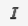, *italics*
- ,<ins> underline</ins>
- , ~~strikethrough~~
- 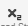, <sub>superscript</sub>
- 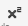, <sup>subscript</sup>

We recommend not using text formatting using the text color change tool 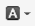 and text undercoloring tool 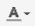, as it causes graphic inconsistency on the web page and degrades its value within the website.

## Removing formatting

To remove a heading style, click in the heading text and select the first item **Paragraph** from the drop-down menu. The heading style should then be removed from the text (applies to all styles from the drop-down menu).

If you want to remove common formatting from text, such as bold or italics, you can do this in two ways. Either select the text and click on the formatting tool again until the formatting is removed, or use the universal formatting removal tool 

This tool works by selecting formatted text and clicking  to remove the formatting from the selected text. This tool also removes combined formatting from text (e.g. italics and bold text together)

## Lists (bulleted/numbered) and text indentation

To create a numbered list, use the  icon.
To create a bulleted (unnumbered) list, use the  icon.

To create a list from a regular paragraph, click in the paragraph and click the icon for the desired list (numbered or bulleted).

If you want to change the bullet type for a numbered list, click on the list item and use the context menu (right-click) to access the list properties, where you can choose a different list type.

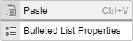

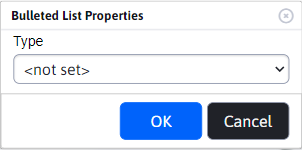

If you want to create a nested list, click in the list item and click the right indent icon  to create a nested list. You can cancel the nested list by clicking the left indent icon .

To end the list creation, press the ```ENTER``` key twice at the end of the list.

## File links and file uploads

To create a link to a document/file, select the text that should be the link, click the Link icon 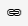 or use the shortcut ```CTRL + k```, a dialog box for creating a link will appear:

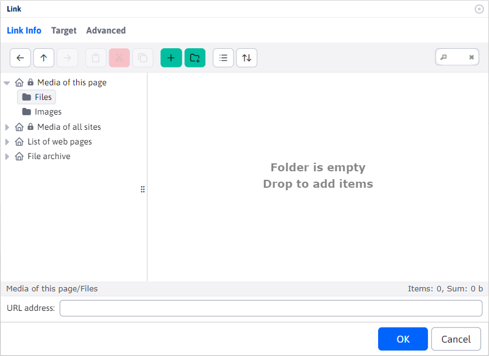

- if the document is **intended only for the current web page**, it is necessary to select the item “Media of this page” and then the item “Files”.
  - You search for a document, click on it, and the link to the document is automatically copied into the URL field.
  - If the required document is not in the list, you can use the ```drag&drop``` function to upload a document from your computer.
  - Confirm OK, which will create a link to the file at the marked location.

- if the document **is not intended only for a given page** (the document may also be located on another page), it is necessary to select the **Media of all pages** item and then the **Files** item.
  - You will be shown the directory structure of directories and files on the server to which you are allowed access.
  - Search for the desired file in the directories, click on it and the link to the document will be automatically copied to the URL field
  - Confirm OK, which will create a link to the file at the marked location.

According to the website accessibility guideline, all downloadable text files found on websites should be published primarily in the ```PDF``` format. The formats used by the ```Word``` and ```Excel``` (```DOC``` and ```XLS```) application are not compliant.

If you have permission, you can also create new sub-directories in the given file directory by clicking on the  icon.
File names on the server should not contain spaces, special characters, or accented letters.

## Inserting and editing links to other websites

You insert links to other pages in a similar way to a link to a document/file:

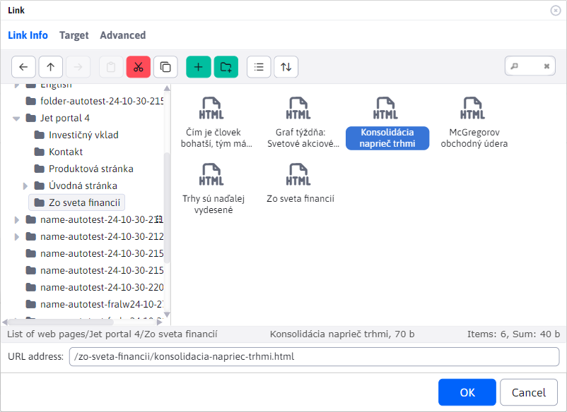

- Select the text (word) that should be clickable as a link. Then click on the Link icon  or use the shortcut ```CTRL+ k```. A dialog box will open in which you need to select the **Web pages** item and in the tree structure find the page you want to create a link to. After clicking on the page name, the address of the selected page will be copied to the URL address field. By confirming ```OK```, a link to the selected web page will be created on the page.

- If you want to insert a link to a page located on another website (link to an external website), enter its address directly into the URL address field (also with the prefix ```https://```). At the same time, the **Target** field (in the Target tab) will automatically change to **New window (```_blank```)**, which will ensure that when you click on this link, the page will open in a new browser window/tab. The **Target** field is also set to **New window (```_blank```)** if you want to create a link to a downloadable document. If you do not want the link to open in a new window, the **Target** parameter should be set to **Same window ```_self```**. However, for links to external websites and documents, opening the link in a new window is recommended.

## Buttons

If a web page contains a link or button that has a CSS style set to contain the expression `btn` (settable via the configuration variable `ckeditor_button_baseClass`), clicking on such a link will display a button settings window in the editor. In it, you can easily change the button text and set the link after clicking, the button style, and so on.

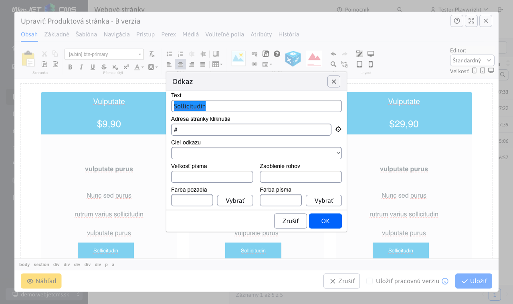

In the advanced tab, you can set additional attributes such as element ID, title, description for readers (aria-label), and the like.

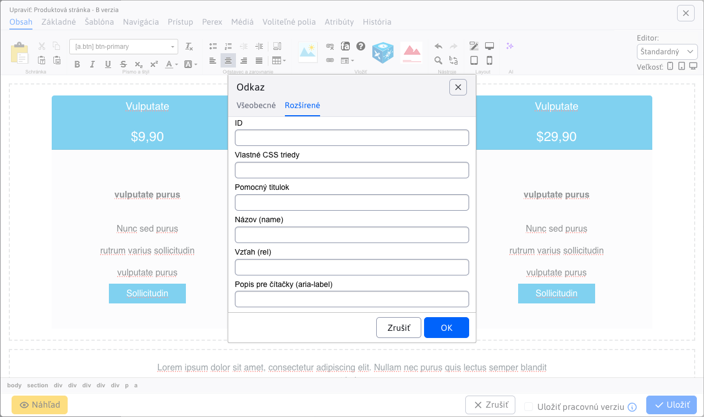

Similarly, there is a dialog box for buttons (element `button`) also with SVG icon support. You insert it by clicking on the menu selection menu for inserting a form and then the Button option. More information is in the [web designer section](../../../frontend/setup/ckeditor.md#button).

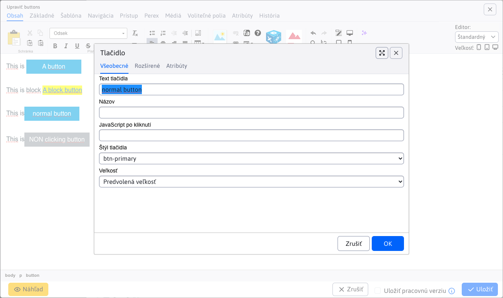

## Inserting images

To insert an image into a page, place the cursor on the row or table cell where the image should be located and click the image insertion icon .

If you want to change an existing image, you must first click once on the image you wish to change. Then you must click on the same icon to insert/change image or via the context menu on the item **Image properties**. The further procedure is identical in both cases.

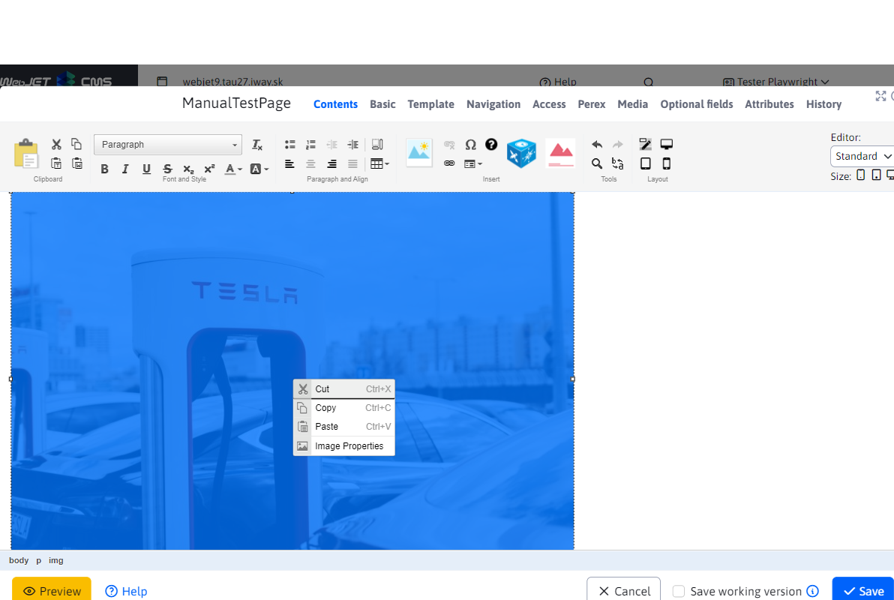

After clicking on the icon, a dialog box for inserting an image will appear:

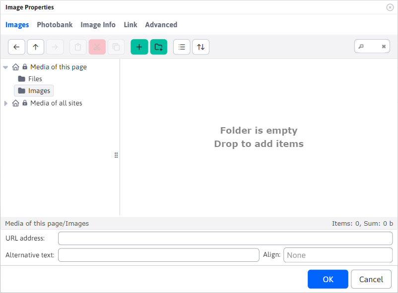

When navigating through the tree structure, only image or video files are displayed, other files are filtered.

### Contents tab

If the image file is already on the server, you can browse to it in the directory structure and clicking on it will automatically enter the image location in the URL field.

For images, it is also necessary to define Alternative text for the image, which is mainly used for communication with visually impaired and blind website visitors, or when the user has disabled the display of images on websites. Alternative text should describe what the image is about or what is shown in it.

After selecting an image, the width and height fields are automatically filled in, defining the current size of the selected image.

### Photobank card

The **Photo Bank** tab allows you to obtain (download) images from the free online platform [Pixabay](https://pixabay.com). This platform provides a large collection of images that are [free to use](https://pixabay.com/service/license-summary/).

After entering and searching for a term, you will be offered matching images. The menu contains several pages that you can browse between.

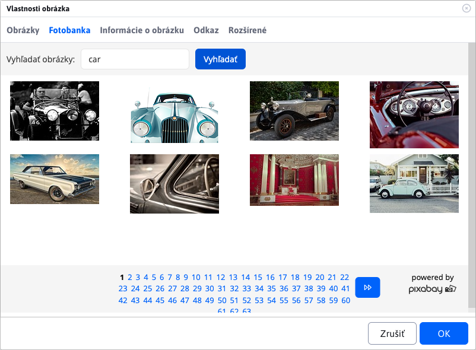

After clicking on one of the offered images, a dialog will appear with a preview and the **width** / **height** values ​​of the given image.

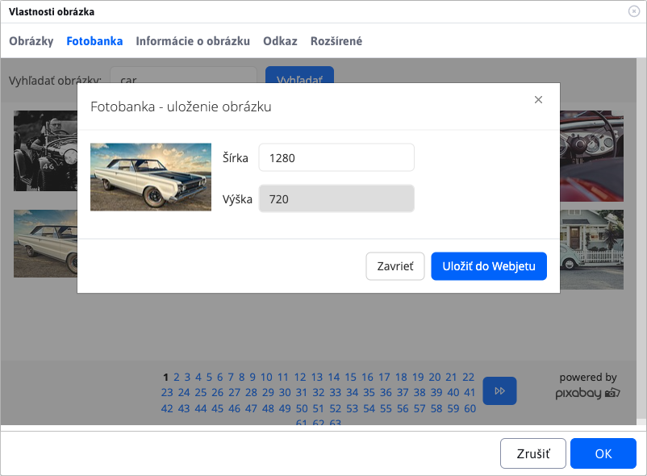

If you wish to change the dimensions of the image, you can adjust the **width** value and its **height** will be automatically calculated based on the original aspect ratio of the image.

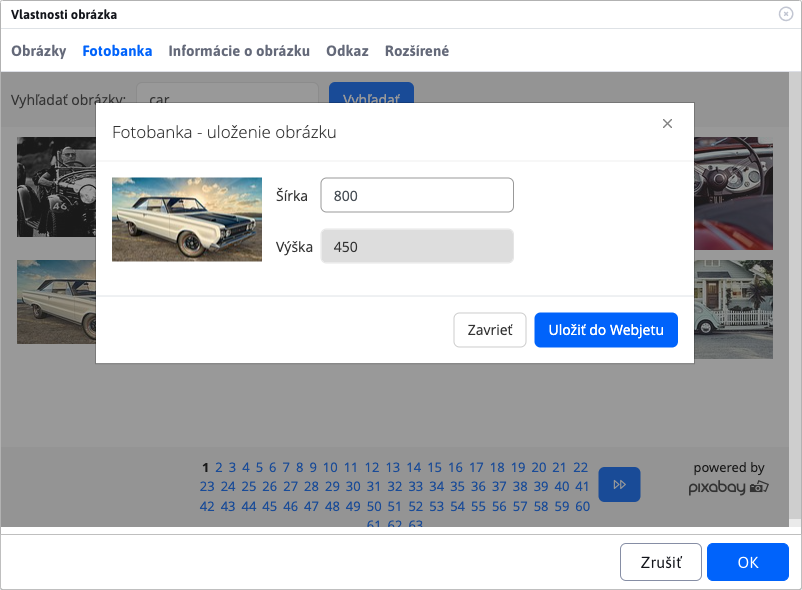

Then, after clicking the **Save to WebJET** button, the image will be downloaded and saved. The tab will automatically switch to **Content**, where you will have the image immediately available.

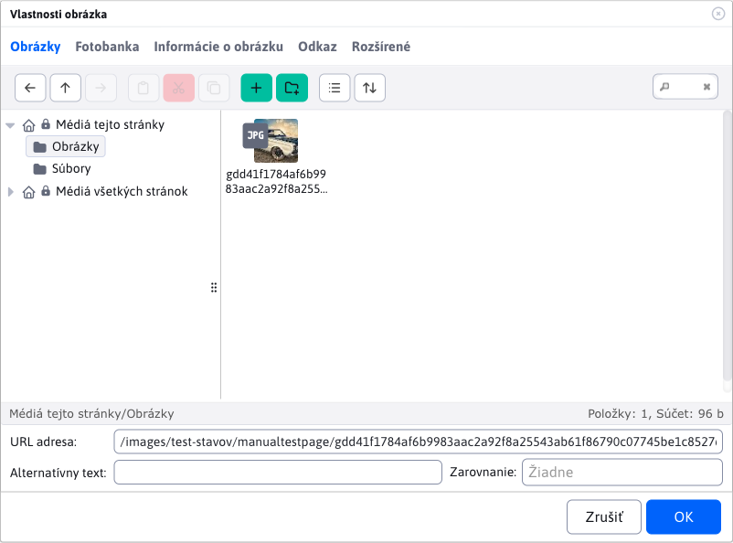

**Image source URL**

Saved images from **Photo Bank** have the value **Image source URL** automatically filled in. You can view/edit this value in the [Explorer](../../files/fbrowser/README.md) section under the [Edit files](../../files/fbrowser/file-edit/README.md) action.

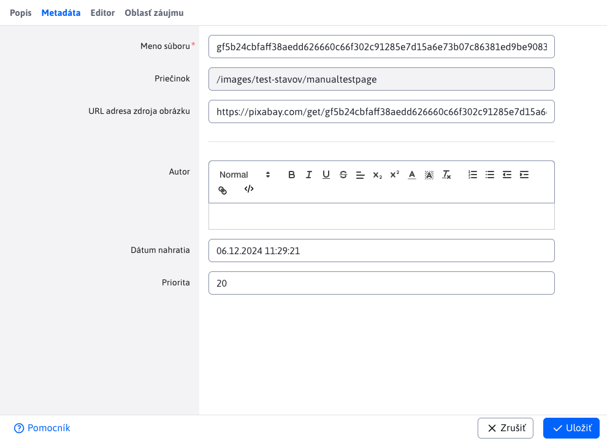

### Video files

You can also insert video files through the image insertion dialog box. Either directly from your server by selecting a video file, or by entering a link to the website `YouTube/Facebook/TikTok` in the URL address field.

WebJET automatically inserts a video player instead of an image for a video file.

### Image editing

If the image is too large to fit on the page, or you need to make other changes to the image, you can use the image editor. Click on the image and then on the pencil icon to open the [image editor](../../image-editor/README.md).

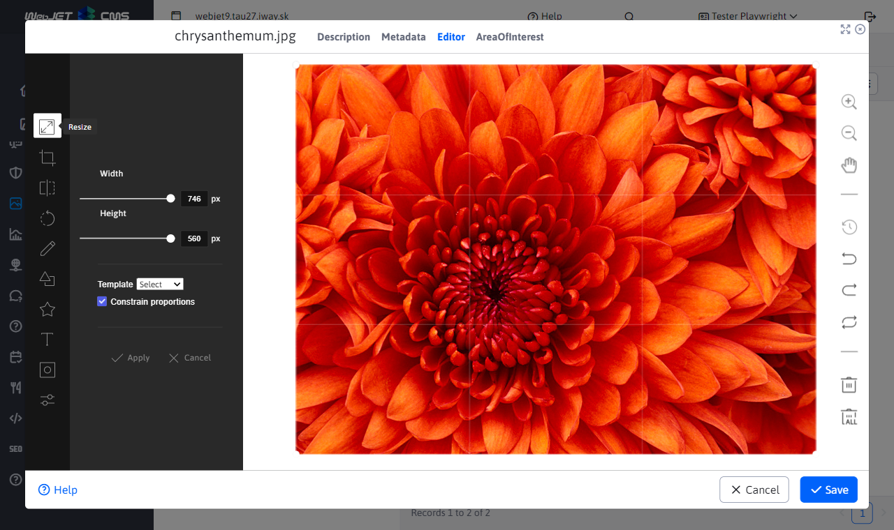

## Inserting and editing tables

There are two ways to create a table. Use a predefined styled table, or insert a table by copying it from a ```Word``` / ```Excel``` file.

### Creating a color table

You can create a table by clicking on the **Insert Table** icon, 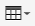:

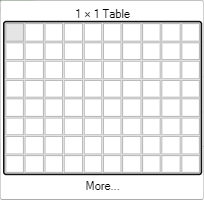

If you need to create a more complex table, you need to click **More** where you will see a dialog box for setting up the table:

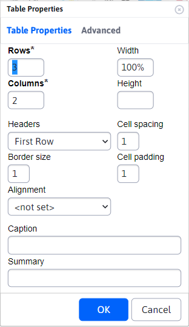

Here you can set the number of columns and rows. If you want the table to fit the width of the content, you do not need to enter the width (delete the pre-filled value). The other parameters should be left with a zero value so that they do not conflict with the preset table style. Confirming ```OK``` will insert the table at the original cursor position.

### Inserting a table from ```Word``` and ```Excel``` file

When inserting a table from other applications or documents via the keyboard shortcut ```CTRL + v```, the system automatically asks you if you want to clean the table. If you click ```OK```, the editor will clean the table from unwanted formatting characters from the original document, but will leave the table structure in its original form.

The table will remain in the page content even if you use the text insertion tool from the ```Word``` / ```Excel``` file (```CTRL + w```) 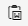.

### Editing an existing table

If you need to modify an existing table that is on the page, or that you have just inserted there using one of the methods mentioned above, you have several tools available to edit it. Right-clicking on any of the table cells will display a context menu.

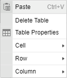

To delete or add another line, use the **Line** submenu.

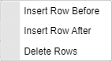

To insert or delete a column, use the **Column** submenu.

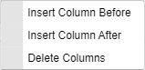

If you want to merge two adjacent cells (within a row), you must select their contents (if they do not contain any text, first enter any text into the cell to make the cell more clearly marked), right-click on this selected content and select the **Cell** submenu item and in this submenu the **Merge cells** item.

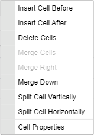

The cell contents are then merged into one and you can edit it further.

If you want to remove the original table border, change the cell indentation, or make the table colored, click **Table Properties**. A dialog box will appear where you can change various table parameters except the number of rows and columns in the table (these are adjusted as mentioned on the previous page).


If you want the table to fit the content, you don't need to enter the table width (delete the value). If you want the table to fill the entire width of the page, you can enter a value of 100 percent. Do not enter the height.

If you want to change the alignment of the text in a table cell to center or right, right-click in the cell and select the **Cell** submenu, and in this submenu, the **Cell Properties** item.

The Cell Properties dialog box will appear, where you can set the vertical or horizontal alignment of the text in the cell. Do not change the other parameters in the window.

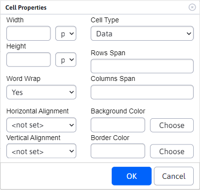

## Embedding an application

To insert an application, click on the blue cube application icon . A dialog box with a list of applications will appear:

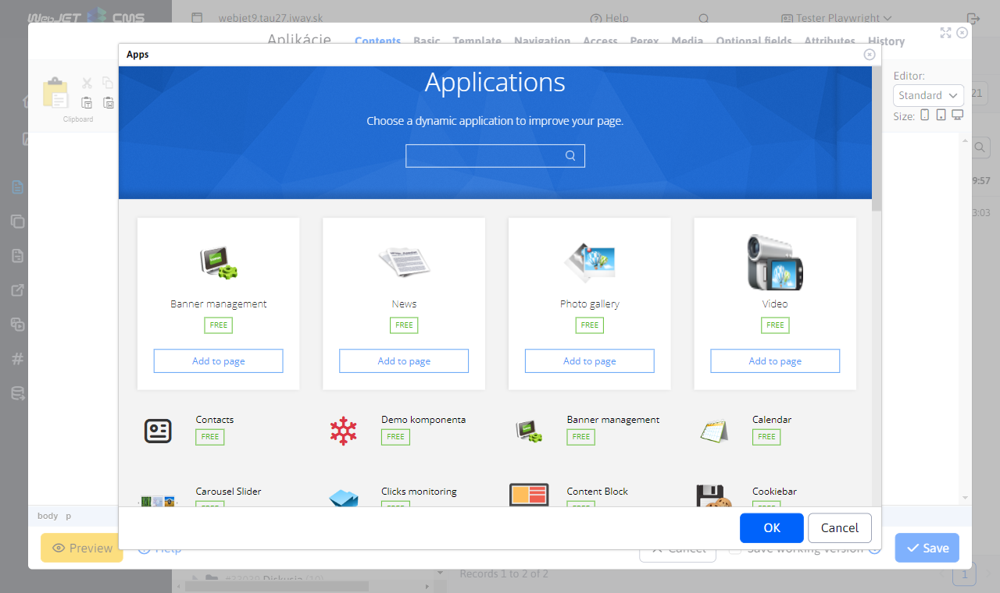

You can enter the name of the application in the search:

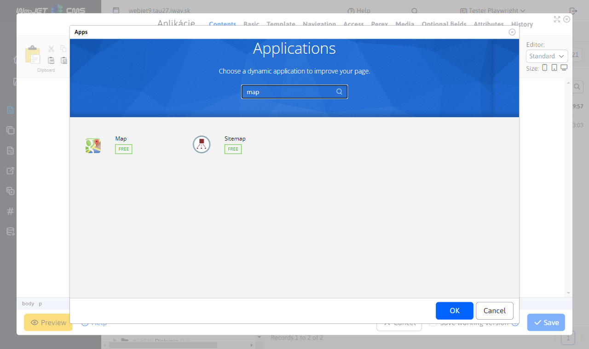

After clicking on the application name, details about the application will be displayed - its description, photos and the option to embed the application into the page:

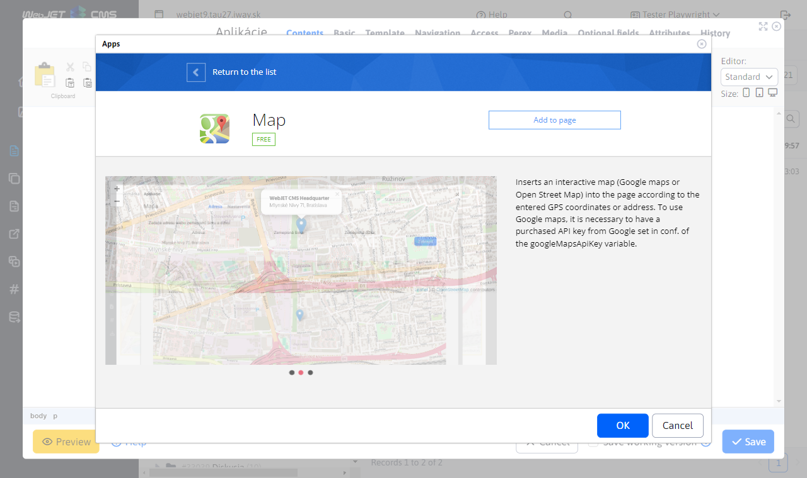

When you click the "Insert into Page" button, the application is inserted into the page and the application settings are displayed:

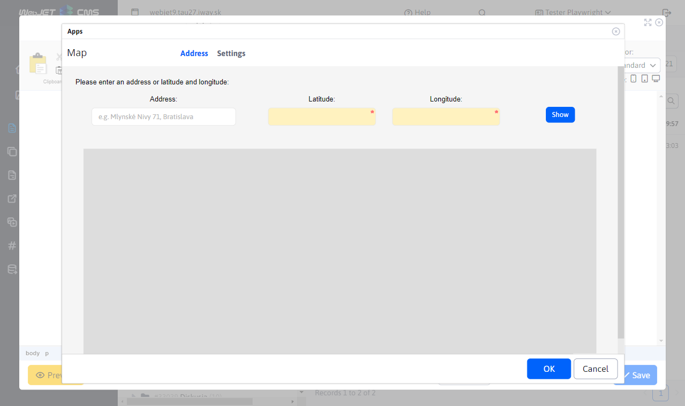

If the application is already embedded in the page, clicking inside the application will display the same application settings window. You can easily edit its existing settings.

### Display tab

Most applications include a Display tab for common settings (unless this option is disabled in the application for various reasons).


The card contains the following parameters:

- Display on devices, used to set [conditional display of the application](../../../custom-apps/appstore/README.md#conditional-display-of-application) on devices such as tablet, phone or standard computer. If no option is selected, the application will be displayed on all devices (the same as when all options are selected).
- Logged in user - allows you to set the application display according to the login status of the website visitor - display always, only if the user is logged in, or if they are not logged in. In the page editor, the application is always displayed, but in the preview or page view it is displayed according to the set value.
- Cache time (minutes) - is used to set the time in minutes for which the initialized application should be stored in the cache for faster display. For example, the news list does not change often and loading it is demanding on the database server, so it is advisable to set the value, for example, to 30. If the administrator is logged in, the cache will not be used and the current data will always be displayed.

**Style** - the section contains settings for wrapping the application output into a `div` container. You can set, for example, the application's indentation on the page, width or various display styles, as well as information for a reader for visually impaired visitors:

- CSS class - selection of CSS classes from a predefined list (e.g. `container`, `mt-2`, `w-100`). The list of available classes is configurable via the configuration variable `appWrapperClasses` (comma-separated list). The configuration variable supports two writing formats:
  - simple format - just the CSS class name, e.g. `container,mt-2,w-100` - ​​the class name is displayed directly in the editor.
  - format with translation key - `prekladový_kľúč:css_trieda`, e.g. `apps.wrapper.container:container` - the editor displays the translated text according to the administration language (e.g. "Container"), but only the CSS class value is inserted into the HTML. The translation key is searched for in the translated texts.
  - both formats can be combined in one list, e.g. `apps.wrapper.container:container,mt-2,apps.wrapper.w-75:w-75`.
- ID - setting the HTML `id` attribute for the wrapping `div` element.
- Title - setting the HTML `title` attribute for the wrapping `div` element.
- `Aria Label` - ​​setting the `aria-label` attribute for the wrapper `div` element, which serves to improve accessibility for screen readers.

If any of these values ​​are set, the application output is automatically wrapped in a `div` element with the specified attributes. The application preview in the editor displays information about the set attributes.

## Pre-prepared blocks

The page editor offers the ability to insert predefined blocks (```HTML``` objects) into a page. For example, a table, text, contact form, etc. You can also insert content from another page into the current page (e.g. a repeating form).

To view blocks, click the  icon in the page editor, which will display a dialog box with block categories.

More information in the application description [pre-made blocks](../../apps/htmlbox/README.md).

## Inserting special characters

There may be cases when you need to type characters that the Slovak keyboard does not contain, for example, the Dollar sign (```There may be cases when you need to type characters that the Slovak keyboard does not contain, for example, the Dollar sign (``), Euro (```€```) or at sign (```@```). To make your work easier, you can insert special characters using a ready-made module. By clicking on the 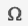 icon, a dialog box with a menu of special (and standard) characters will appear.

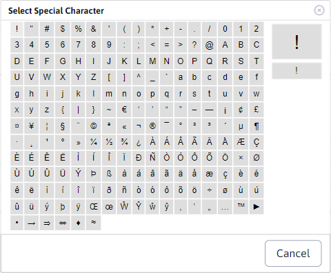

After clicking on the desired character, that character will be written at the cursor position. Special characters are inserted as text, so they have no additional settings.

!> Warning: the icon for inserting special characters may in some cases be changed to the  icon for inserting [FontAwesome](../../../frontend/webpages/fontawesome/README.md) images.

## Inserting text in hard-to-reach places

Sometimes it is difficult to place the cursor, for example, after the last paragraph or image. In such a situation, the editor displays a so-called help line. This allows you to insert empty text, an image, an application or a block. In the case of Page Builder, after clicking, it allows you to insert a prepared block into the page.

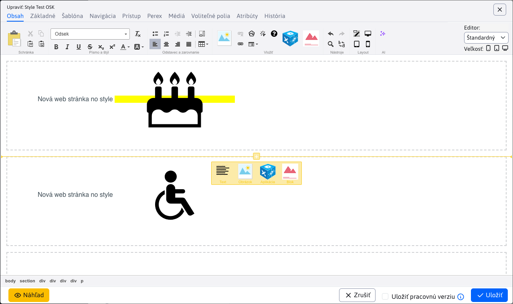

Similarly, sometimes it is a problem to insert the cursor after the last SVG icon, bold text, etc. In such a case, the editor displays an icon behind the element to move the cursor to the given location. Sometimes the move may not succeed on the first click, we recommend that you first click anywhere in the text and then click the icon to move the cursor.


## Page content change detection

The page editor includes a mechanism that detects changes to page content. If you click the Cancel button to close the window while changes have been made to the page content, you will see a dialog box warning you that the changes have not been saved. Click OK to close the window without saving your changes, or click Cancel to return to the page editor.

After opening a page in the editor, the current page content is retrieved after 5 seconds (to allow time for all scripts and application previews to load) and this is then compared to the current content when the Cancel button is clicked. This means that correct detection works after 5 seconds from opening the page in the editor.