# Password protected pages

With password-protected pages, it is possible to define a section of a website that can only be accessed by entering a username and password - sometimes referred to as the members' section or the controlled access section. It is possible to define multiple user groups and thus define several different parts of the web site accessible to users in different groups. One part of the site can be available only for Clients and another for Business Partners.

## Defining groups

First you need to define the user groups. The list of user groups is available in the left menu under `Používatelia` Like `Skupiny používateľov`.

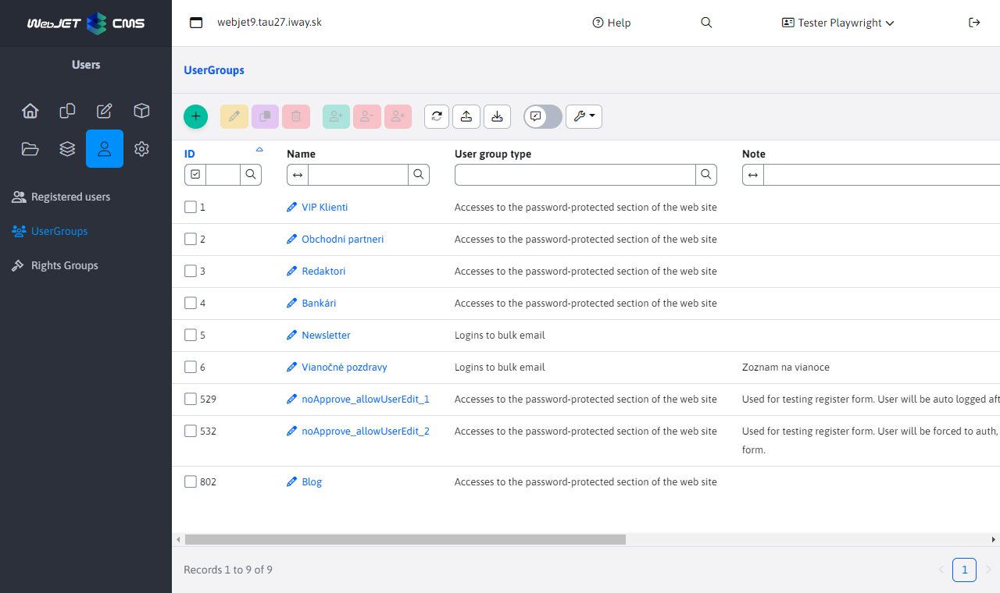

The system distinguishes between two types of groups:
- Accesses to the password-protected section of the website - group for password-protected pages
- Bulk email subscription - group for email distribution list

We are further interested in the type of **Accesses to the password-protected section of the website**. You can set properties in the editor:
- Name - unique name of the group.
- User group type - the type of group we mentioned above.
- Note - any note.
- Requires approval - if checked, after registering a user to this group, an email will first be sent to the administrator to approve the registration. The user will be created in the database, but will not have the Approved option selected and will not be able to log in.
- Allow adding/removing from the group by the user - if selected, the user will be able to add/remove the group by himself when registering or in his profile/settings. Usually used for bulk email groups, so that the user themselves can set what email groups they will be subscribed to. The option should also be selected for groups to the passworded section that the user can register to. For example, a user registers to the Customer group which has the option enabled, but the Wholesale group does not have this option and only the administrator can assign the group to the customer.
- Require email address validation - if set, the user will be sent an email after registration with a link to click to validate the email address.
- Email text page ID - the page ID of the email text that will be sent to the user after approval. Typically this is a welcome email.

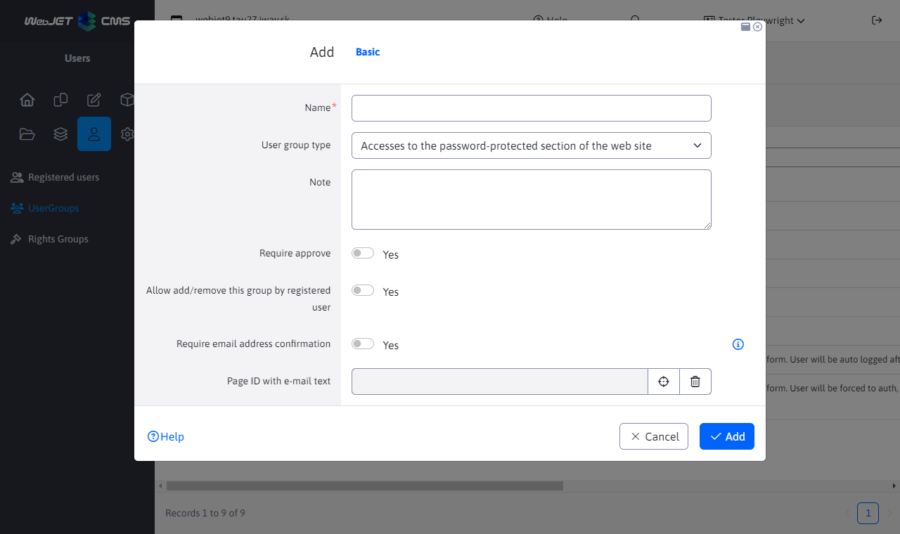

You can use the Logged In User application to insert fields into the email text page that are replaced with user-supplied values, similar to defining [bulk email](../apps/dmail/campaings/README.md#karta---základné). In addition to the above fields, you can enter additional fields:
- `!APPROVER_USER_NAME!` - the full name of the approver.
- `!APPROVER_USER_PHONE!` - telephone contact details of the approver.
- `!APPROVER_USER_EMAIL!` - the email address of the approver.
- `!LOGGED_USER_PASSWORD!` - the entered password can only be used for immediate approval (when the password is still available from the registration form) or when you click on the button for approval with the generation of a new password.

## Login dialogue page

WebJET will display a standard login dialog if you are accessing a password-protected site. However, you can create and use a special page with appropriate text and design for login.

Create a new page (it doesn't matter where it is, it can be either in the main directory or in the directory you want to password protect) and insert the Login User->Login Form application into the page. The name of the page is also arbitrary. Thus, the content of the page will be the code `!INCLUDE(/components/user/logon.jsp)!`which represents the registration form.

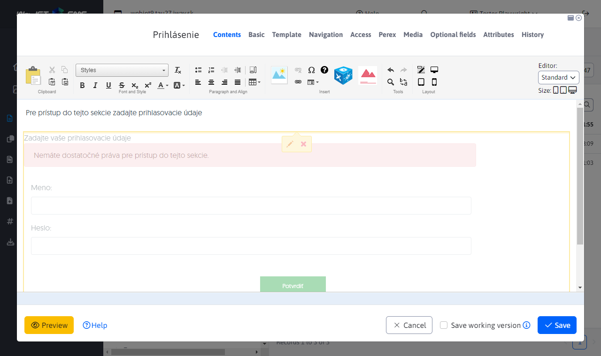

Save the page and make a note of its ID. You can add some more explanatory text to the page or a link to the registration page.

## Registration page

If you want visitors to have the option to register, create a page and insert the Logged in User->Registration Form application into it. The content of the page will then be the code `!INCLUDE(/components/user/newuser.jsp, ...)!` which represents the registration form.

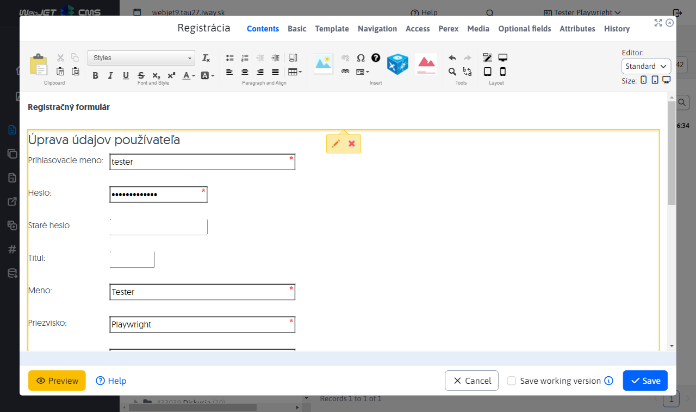

When editing the registration form, you can set the form's sleeping behavior in addition to the form's appearance. The most important parameters are:
- **Displayed fields** a **Required fields**to set the appearance of the form itself and which fields are required.
- **The email address must be unique**if selected, the system will check if the user with the specified email address is not already registered, and if so, re-registration will be rejected.
- **DocID of the page that will be displayed after successful registration**, enter here the ID of the page that contains the text about the successful registration.
- **Notification of registration will be sent to your e-mail**if selected, a notification will be sent to this email every time a new user registers (if empty, no notifications will be sent).
- **Require email address confirmation**, verification of the email address by the user or approval by an administrator will be required. For more information on this, please see [Types of verification](#typy-overení).

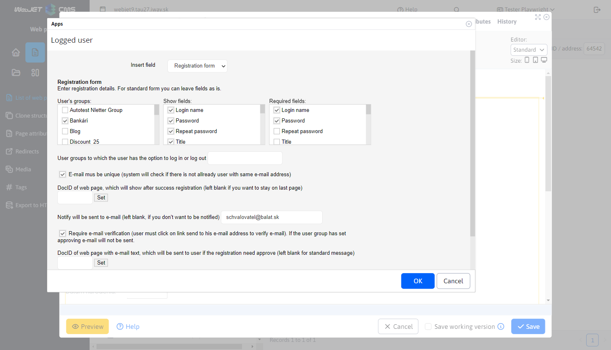

## Defining available pages/folders

For proper functioning it is necessary to define pages or folders that should be accessible only after entering the password. If you password a folder, all pages in that folder will be passworded. However, this does not apply to subfolders and pages within subfolders.

Click on WEB Pages->List of web pages and navigate to the folder you want to password protect. Click on Edit Folder and there in the Access tab, select the groups for which the folder should be accessible.

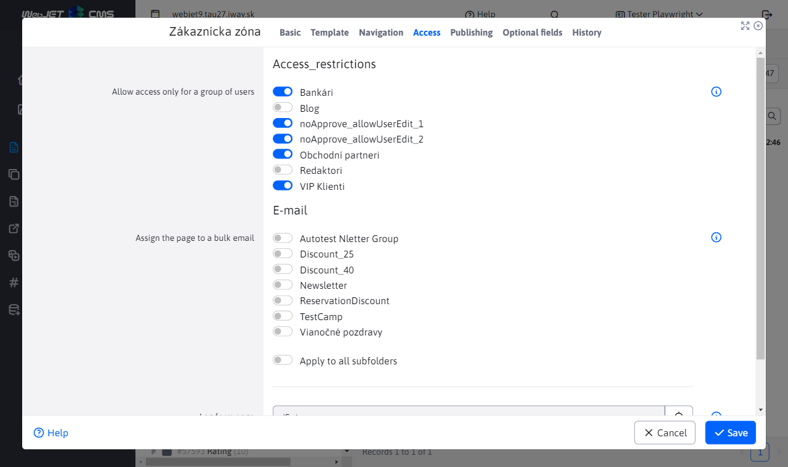

The list of folders for which the Users group is used is displayed when editing the group in the tab `Priečinky`.

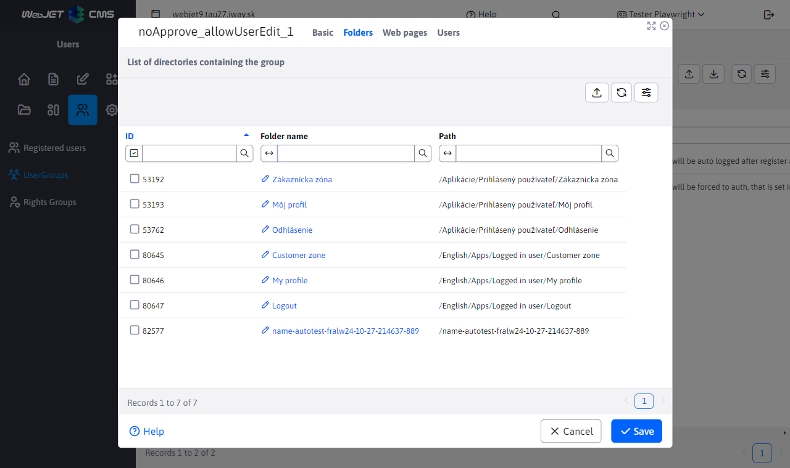

You can set a page ID for the folder with a special login form. If it is not set, a simple/standard login form will be displayed. You can set the page to either a folder that is passworded, or preferably the root folder, since the page ID of the login form page is searched recursively up to the root folder until it is found. So, in this field, enter the ID of the page where you put the application `/components/user/logon.jsp`, or click the Select Page button to select a page from the list.

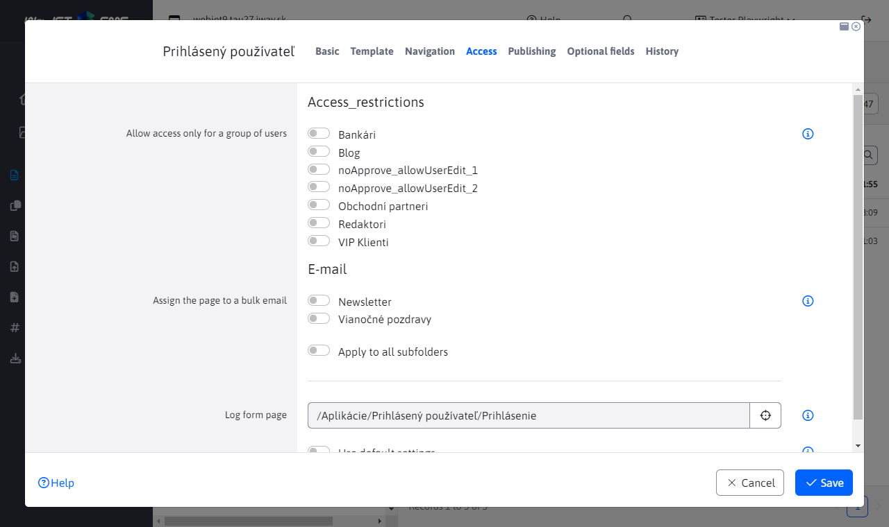

If you want to password-protect only a specific page, open the page in the editor and click the Access tab to select the groups for which the page should be available.

The list of websites for which the User Group is used is displayed when editing the group in the tab `Web stránky`.

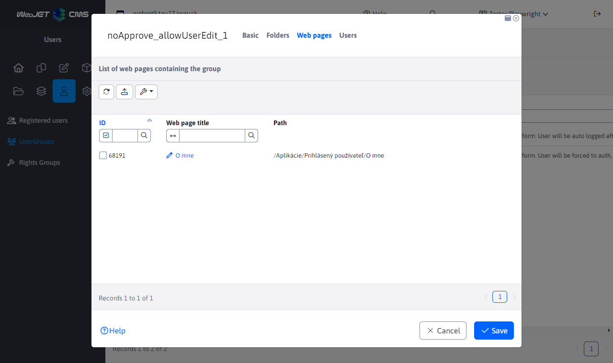

## Types of verification

Based on the settings of the registration form and the selected user groups, there are 3 ways to register.

Before explaining the different registration methods, we must mention the relationship between the parameters **Requires approval** a **Allow adding/removing from a group by the user themselves** when editing a user group. If the option **Allow adding/removing from a group by the user themselves** is not selected, the required approval for the group is ignored. In principle, there is no need to approve a user group that the user cannot add anyway.

### Immediate approval

Immediate approval of a new registered user only occurs if:

1.  the registration form does NOT have an option selected **Require email address confirmation**

2.  user groups in the form DO NOT have the option selected **Requires approval**

3.  user groups in the form HAVE the option selected **Allow adding/removing from a group by the user themselves**

If these requirements are met, the user will be automatically approved and logged in immediately after registration. Also, the user will receive an email of successful registration, which will contain the user's login name and password.

**Warning:** If the user group requires approval but does not have add/remove from the group enabled by the user, the parameter **Requires approval** will be ignored even if he is elected and instant approval takes place.
**Warning:** If the parameter **Allow adding/removing from a group by the user themselves** is not selected for a user group, the group will not be added to the user, even if the registration itself is successful. This may result in a situation where the user is not added to any group and is unable to log in to the passworded section (registration is successful and no error is reported, but logging in is not possible).
### Confirmation of email address

There may be situations where the user is asked to first verify their email by using the link sent to that email. Without verification, he/she will not be able to log in. This situation occurs if:

1.  the registration form HAS an option selected **Require email address confirmation**

2.  user groups in the form DO NOT have the option selected **Requires approval**

3.  user groups in the form HAVE the option selected **Allow adding/removing from a group by the user themselves**

If these requirements are met, an email will be sent to the user's email address with a link that they will need to click to verify. After successful authentication, the user will be able to log in to the passworded section and will also receive a successful registration email containing the user's login name but not the password.

**Warning:** If the parameter **Allow adding/removing from a group by the user themselves** is not selected for a user group, the group will not be added to the user, even if the registration itself is successful. This may result in a situation where the user is not added to any group and is unable to log in to the passworded section (registration is successful and no error is reported, but logging in is not possible).
### Approval by the administrator

There may be situations where a user must be approved before being added to a user group. In this case, he will not be able to log in until the administrator approves him. This situation occurs if:

1.  parameter **Require email address confirmation** will be of any value. Group approval has higher priority, so email approval will be ignored

2.  user groups in the form HAVE the option selected **Requires approval**

3.  user groups in the form HAVE the option selected **Allow adding/removing from a group by the user themselves**

Approval of user registration (approval of adding to a user group) is done in the `Zoznam používateľov`.

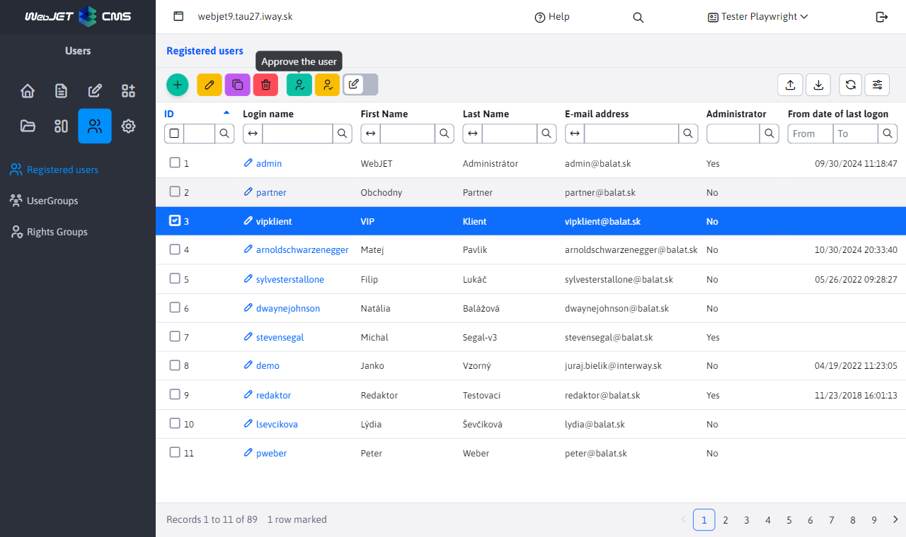

Approval can be done:
- using the button 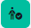 in the toolbar, where users in the highlighted rows will be approved. After this approval, the user will be able to log in to the passworded section and will also receive a successful registration email containing the user's login name.
- using the button  in the toolbar, where users in the highlighted rows and their password will be changed to a randomly generated one. After this verification, the user will be able to log into the passworded section and will also receive a successful registration email containing the user's login name and the newly GENERATED password.
**Warning:** If the user group requires approval but does not have add/remove from the group enabled by the user, the parameter **Requires approval** will be ignored even if it is selected and the type of approval will take place depending on the value of the parameter **Require email address confirmation**.
