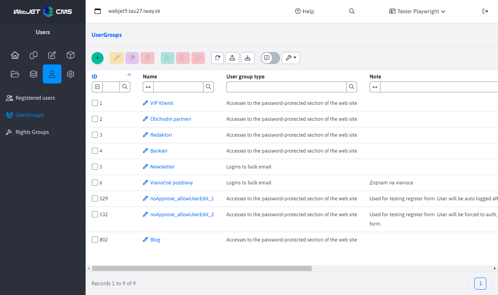
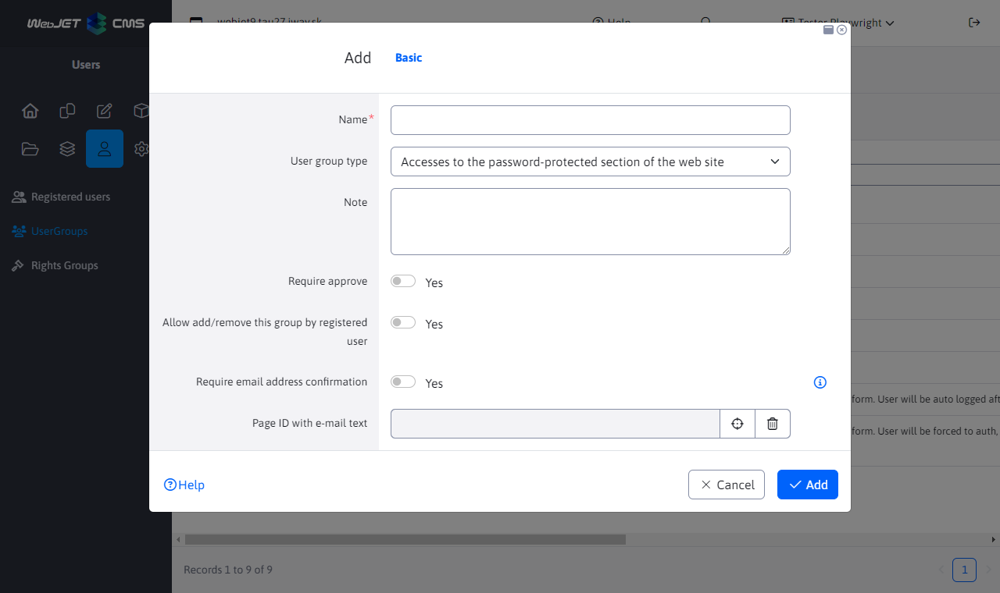
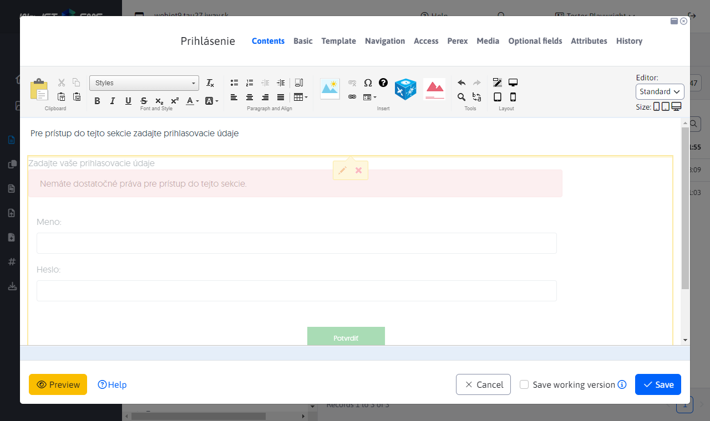
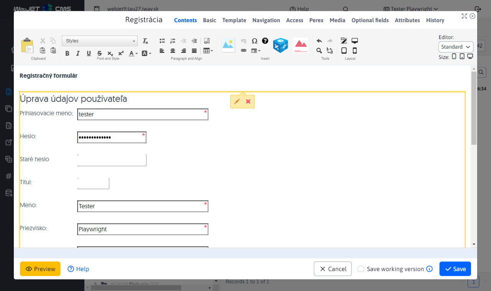
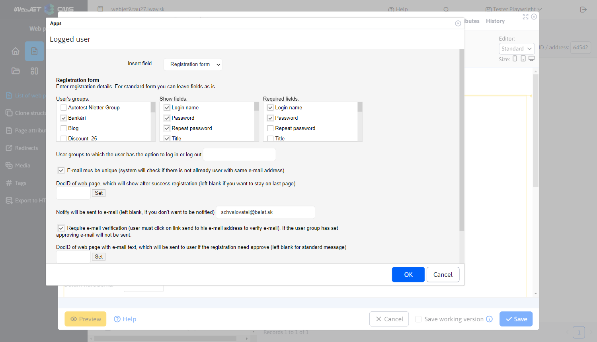
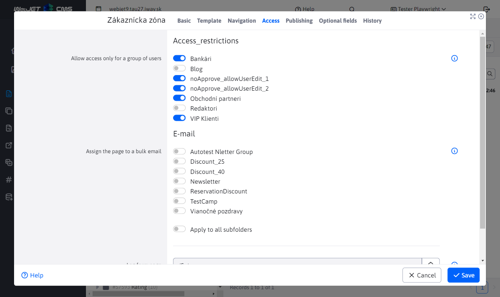
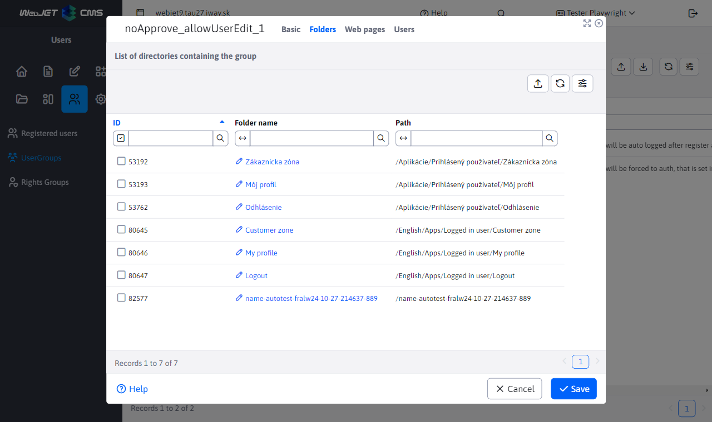
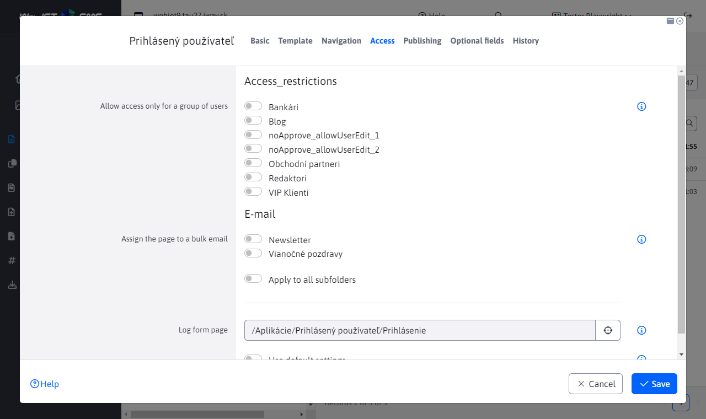
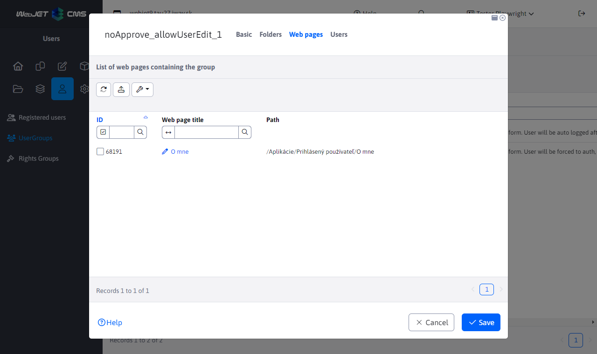
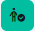

# Password-protected pages

With password protected pages, it is possible to define a part of the website that is only accessible after entering a name and password - sometimes referred to as a member section or a section with controlled access. It is possible to define multiple user groups and thus define several different parts of the website available to users in different groups. One part of the website can be accessible only to Clients and another to Business Partners.

## Defining groups

First, you need to define user groups. The list of user groups is available in the left menu in the **Users** section as **User Groups**.



The system distinguishes two types of groups:

- Access to the password-protected section of the website - group for password-protected pages
- Bulk email subscription - a group for a distribution list for sending emails

We are also interested in the type **Access to password-protected sections of the website**. In the editor, you can set the properties:

- Name - unique name of the group.
- User group type - the group type we mentioned above.
- Note - any note.
- Requires approval - if checked, after registering a user in this group, an email will first be sent to the administrator to approve the registration. The user will be created in the database, but will not have the Approved option selected and will not be able to log in.
- Allow users to add/remove from groups - if selected, the user will be able to add/remove the group themselves when registering, or in their profile/settings. It is usually used for groups for mass email, so that the user can set which email groups they will be logged into. The option must also be selected for groups for a password-protected section that the user can register to. For example, a user registers to the Customer group, which has the option enabled, but the Wholesale group does not have this option and only the administrator can assign the group to the customer.
- Require email address confirmation - if set, the user will be sent an email after registration with a link that they will need to click to verify the validity of their email address.
- Page ID with email text - Page ID with email text that will be sent to the user after approval. Typically this is a welcome email.



It is possible to insert fields into the email body page using the Logged in User application, which will be replaced with values ​​entered by the user, similar to how you define a [bulk email](../apps/dmail/campaings/README.md#basic). In addition to the fields listed above, additional fields can be entered:

- `!APPROVER_USER_NAME!` - ​​full name of the approver.
- `!APPROVER_USER_PHONE!` - ​​telephone contact for the approver.
- `!APPROVER_USER_EMAIL!` - ​​approver's email address.
- `!LOGGED_USER_PASSWORD!` - ​​the entered password can only be used with immediate approval (when the password is still available from the registration form) or when clicking the approval button with the generation of a new password.

## Login dialog page

WebJET displays a standard login dialog when you access a password-protected site. However, you can create and use a special page with appropriate text and design for login.

Create a new page (it doesn't matter where it will be located, it can be either in the main directory or in the directory you want to password protect) and insert the application Logged in User->Login Form into the page. The name of the page is also arbitrary. So the content of the page will be the code ```!INCLUDE(/components/user/logon.jsp)!```, which represents the login form.



Save the page and note its ID. You can add some explanatory text to the page, or a link to the registration page.

## Registration page

If you want visitors to be able to register, create a page and insert the Logged-in User->Registration Form application into it. The content of the page will be the code ```!INCLUDE(/components/user/newuser.jsp, ...)!``` , which represents the registration form.



When editing a registration form, you can set not only the appearance of the form but also its sleeping behavior. The most important parameters are:

- **Displayed fields** and **Required fields**, which set the appearance of the form itself and which fields are required.
- **Email address must be unique**, if the option is selected, the system will check whether the user with the entered email address is already registered, and if so, re-registration will be rejected.
- **DocID of the page that will be displayed after successful registration**, enter the ID of the page that contains the text about successful registration here.
- **Registration notification will be sent to email**, if the option is selected, a notification will be sent to this email address every time a new user registers (if the value is empty, notifications will not be sent).
- **Require email address confirmation**, the email address will be required to be verified by the user or approved by the administrator. For more information, see the [Verification Types](#verification-types) section.



## Defining available pages/folders

For proper functioning, it is necessary to define pages or folders that should only be accessible after entering a password. If you password protect a folder, all pages in this folder will be password protected. However, this does not apply to subfolders and pages in subfolders.

Click on the WEB Pages->Website List menu and go to the folder you want to password protect. Click on Edit Folder and there, in the Access tab, select the groups for which the folder should be accessible.



The list of folders for which the User Group is used is displayed when editing the group in the **Folders** tab.



You can set the ID of the page with a special login form for the folder. If it is not set, a simple/standard login form will be displayed. You can set the page either to a folder that is password protected, or preferably to the root folder, because the ID of the page with the login form is searched recursively up to the root folder until it is found. So enter the ID of the page into which you inserted the `/components/user/logon.jsp` application in this field, or click the Select page button to select it from the list.



If you want to password protect only a specific page, open it in the editor and click the Access tab, then select the groups for which the page should be accessible.

The list of websites for which the User Group is used is displayed when editing the group in the **Websites** tab.



## Types of verifications

Based on the registration form settings and selected user groups, we distinguish 3 registration methods.

Before explaining the individual registration methods, we must mention the relationship between the parameters **Requires approval** and **Allow users to add/remove from group** when editing a user group. If the option **Allow users to add/remove from group** is not selected, the required approval for the group is ignored. In principle, it is not necessary to approve a user group that the user cannot add anyway.

### Instant approval

Immediate approval of a new registered user only occurs in the following cases:

1. registration form DOES NOT have the **Require email address confirmation** option selected
2. user groups in the form DO NOT have the **Requires approval** option selected
3. user groups in the form HAVE the option **Allow users to add/remove from group** selected

If these requirements are met, the user will be automatically approved after registration and immediately logged in. The user will also receive an email about successful registration, which will contain the user's login name and password.

!>**Note:** If a user group requires approval but does not allow users to add/remove from the group themselves, the **Requires Approval** parameter will be ignored even if selected and immediate approval will occur.

!>**Warning:** If the parameter **Allow users to add/remove from group** is not selected for a user group, the group will not be added to the user, even if the registration itself is successful. The result may be a situation where no group is added to the user and they will not be able to log in to the password-protected section (registration will be successful and will not report any error, but login will not be possible).

### Email address confirmation

There may be situations where the user will be prompted to first verify their email using a link sent to this email. Without verification, they will not be able to log in. This situation occurs if:

1. the registration form HAS the option **Require email address confirmation** selected
2. user groups in the form DO NOT have the **Requires approval** option selected
3. user groups in the form HAVE the option **Allow users to add/remove from group** selected

If these requirements are met, an email will be sent to the user's provided email address with a link that they will need to click to verify. After successful verification, the user will be able to log in to the password-protected section and will also receive an email about successful registration, which will contain the user's login name but not the password.

!>**Warning:** If the parameter **Allow users to add/remove from group** is not selected for a user group, the group will not be added to the user, even if the registration itself is successful. The result may be a situation where no group is added to the user and they will not be able to log in to the password-protected section (registration will be successful and will not report any error, but login will not be possible).

### Administrator approval

There may be situations where a user must be approved before being added to a user group. In such a case, the user will not be able to log in until the administrator approves them. This situation occurs if:

1. **Require email address confirmation** parameter will have any value. Group approval has higher priority, so email approval will be ignored
2. user groups in the form HAVE the **Requires approval** option selected
3. user groups in the form HAVE the option **Allow users to add/remove from group** selected

User registration approval (admission to a user group) is done in the **User List** section.


Approval can be done:

- using the  button in the toolbar, where the users in the marked rows will be approved. After this approval, the user will be able to log in to the password-protected section and will also receive an email about successful registration, which will contain the user's login name.
- using the  button in the toolbar, where users in the marked lines and their password will be changed to a randomly generated one. After this verification, the user will be able to log in to the password-protected section and will also receive an email about successful registration, which will contain the user's login name and newly GENERATED password.

!>**Note:** If a user group requires approval but does not allow users to add/remove from the group themselves, the **Requires approval** parameter will be ignored even if selected and the type of approval will be performed depending on the value of the **Require email address confirmation** parameter.