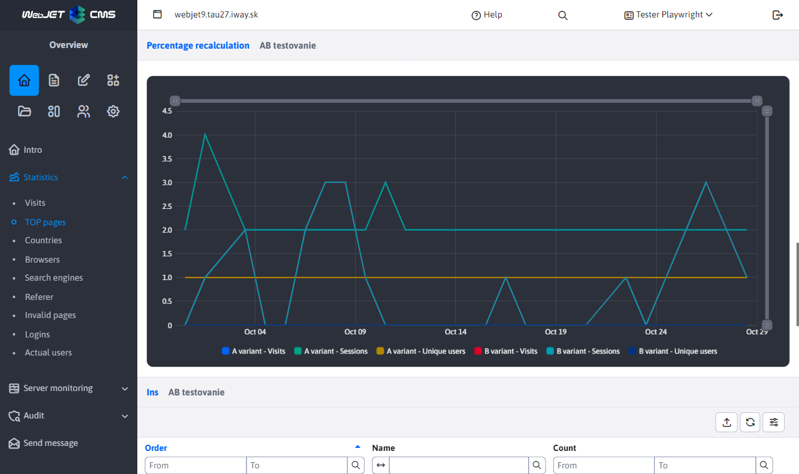
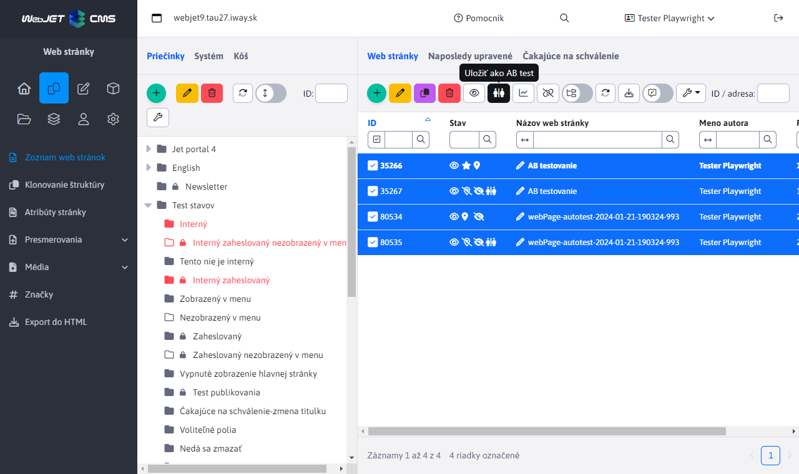

# Information for the trader - year 2024

This file contains descriptions of WebJET CMS features shipped in 2024 from a sales perspective. New entries are added to the top (below this introduction), so the newest features are always at the top.

---

## MultiWeb — manage multiple websites in one installation

WebJET CMS features **MultiWeb** mode, which allows you to run **several completely separate websites within a single installation**. Each domain outwardly behaves as an independent installation — it has its own content, its own users, its own templates, and its own email campaigns. Visitors and editors of individual domains are unaware that a common system is running "under the hood".

This solution is ideal for organizations that need to operate **several smaller websites with central administration**. A typical example is a **web agency** that creates and manages sites for its clients — each client has its own website with its own content and users, but the agency has everything in one system. It is equally beneficial for **state organizations and institutions** that need to operate websites for subordinate organizations, regional branches or projects. Instead of dozens of separate installations, a single one is enough, which dramatically reduces operation and maintenance costs.

The key advantage is that **security updates and improvements are applied to all domains at once** in one step. There is no need to update each site separately, which saves time and eliminates the risk of any site being left out of date. The management of individual sites is **fully separated** — editors of one domain do not have access to the content of another domain, email campaigns are separated by domain, and user accounts are independent.

**Main benefits:**

- **Lower operating costs**: One installation instead of dozens of separate systems means significantly lower hosting, maintenance and administration costs.
- **Central Security Updates**: Updating one system secures all domains at once — no website is left vulnerable.
- **Completely separate content management**: Each domain has its own users, templates, email campaigns, and media files — editors on one domain cannot see content on another.
- **Easy scalability**: Adding a new domain doesn't require a new installation — just set it up in your existing system.
- **Full control management domain**: The administrator has access to configuration, translation keys, automated tasks, and other global settings from one place.
- **Customizable**: Each domain can have its own visual style, templates, and settings, so websites don't have to look the same.

Detailed documentation: [MultiWeb — installation and configuration](../../install/multiweb/README.md)

## AB testing of websites — optimize conversions based on data

WebJET CMS offers **an updated application for AB testing**, which allows you to easily compare two versions of a website and find out which one achieves better results. The principle is simple — you create a B version of the page with one click, edit it, for example, the title, image or layout of elements, and the system automatically displays both versions to visitors in the set ratio. The visitor still sees the same URL address — he does not know about the test. Based on real data from visitors, you can then decide which version of the page performs better.

The application also supports so-called **split tests** — a more comprehensive testing in which the visitor sees a consistent version of the website throughout the entire visit. If the B version is generated on the first access, all other pages with the B version will also be displayed in the B variant. This is key for testing larger changes, such as a different layout of the entire website or a different navigation flow.

AB test management is **fully integrated into the WebJET CMS administration**. The editor has a clear list of all running tests, statistics with **automatic ratio conversion** (if the A/B ratio is not 50:50, the system will recalculate the values ​​so that they are comparable), and configuration of test parameters — including the ratio of version display, cookie validity, and other settings. Everything is available directly from the system interface without the need for external tools.

**Main benefits:**

- **Data-driven decisions**: Instead of guessing, you can measure exactly which version of your page drives more conversions — whether it's a form fill, a button click, or a purchase completion.
- **Easy test creation**: A version of the page is created with one click directly in the editor — no need to copy content manually or use external tools.
- **Automatic display of versions**: WebJET itself ensures the alternation of A and B versions in a set ratio, the visitor sees the same URL address and is unaware of the test.
- **Split tests for complex changes**: When testing larger changes (such as a complete redesign), the visitor sees a consistent version across the entire website.
- **Clear statistics with recalculation**: Even with an uneven A/B ratio, the system automatically recalculates the values ​​to make the comparison correct and fair.
- **Flexible configuration**: Setting the version ratio, test cookie validity, the possibility of activation only for logged in users, and other parameters directly in the administration.

Detailed documentation: [AB testing of websites](../../redactor/apps/abtesting/README.md)
